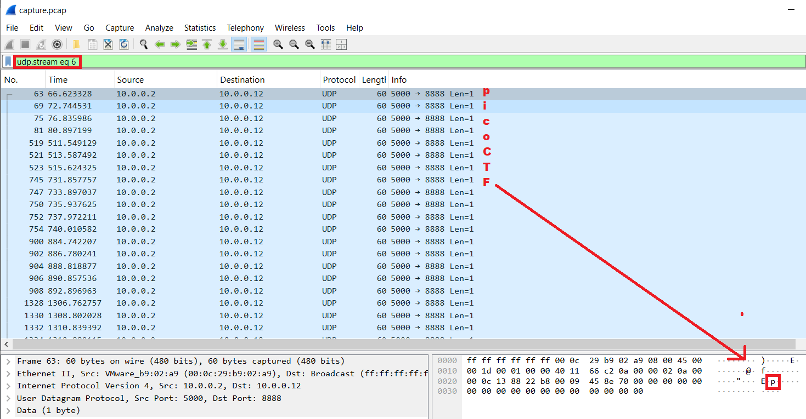

# picoGym Level 30: shark on wire 1
Source: https://play.picoctf.org/practice/challenge/30

## Goal
We found this packet capture. Recover the flag.<br>
https://jupiter.challenges.picoctf.org/static/483e50268fe7e015c49caf51a69063d0/capture.pcap

## What I learned
```
Stream Identifiers
    tcp.stream eq 0 → TCP conversations (HTTP, FTP, SSH) in stream 0
    udp.stream == 5 → UDP conversations (DNS, VoIP, TFTP) in UDP stream 5
    rtp.stream → RTP streams (audio/video in VoIP calls)

Youtube Solution w/ scapy: https://youtu.be/sm6do94cvEY?t=200
```

## Solution
```
https://webshell.picoctf.org/

# Start at Statistics
# Noticed alot of udp activity 

# Check if flag is all one packet or not
Filter: tcp contains "picoCTF" ⌨️
Result: None
Filter: udp contains "picoCTF" ⌨️
Result: None

Filter: udp
Right click on first udp → Follow → UDP Stream ❤️                       Analyze → Follow → UDP Stream ❤️❤️❤️  
Note: Press up or down on stream or
Note: Filter: udp.stream eq 5 ⌨️
picoCTF{StaT31355_636f6e6e} 🔐
```



## Flag
picoCTF{StaT31355_636f6e6e}

## Continue
[Continue](./picoGym0084.md)