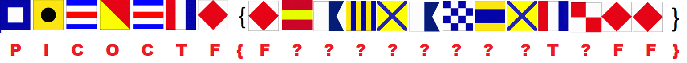
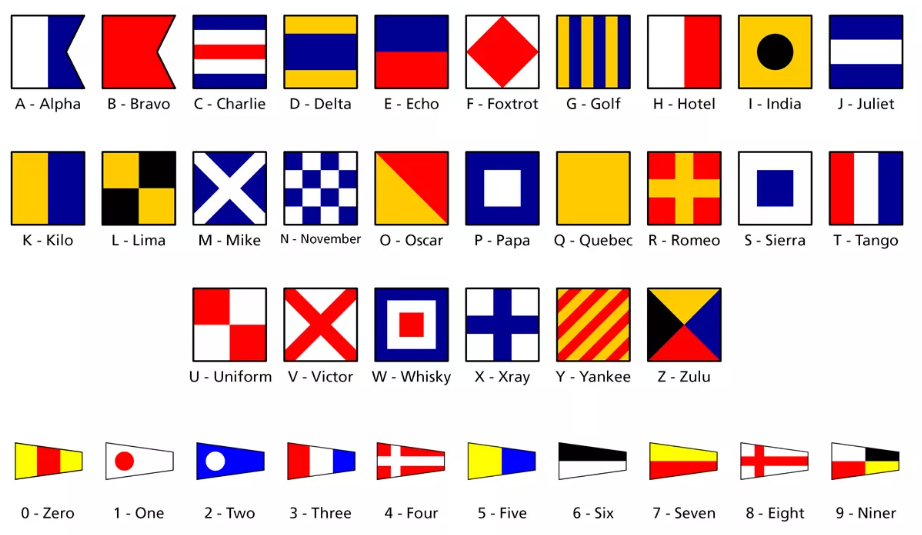
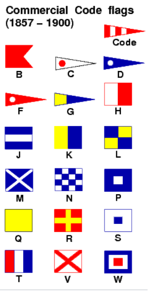
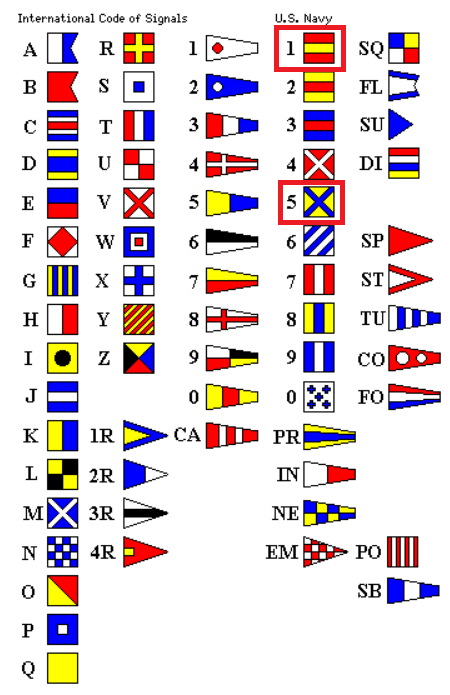

# picoGym Level 31: Flags
Source: https://play.picoctf.org/practice/challenge/31

## Goal
What do the flags mean?<br>
https://jupiter.challenges.picoctf.org/static/fbeb5f9040d62b18878d199cdda2d253/flag.png<br>







## What I learned
```
Substitution Cipher

Google: Blue Flag White Square Meaning
https://www.nps.gov/articles/000/signal-flags-activity.htm

International Code of Signals (ICS) flags used in maritime communication and each flag corresponds to a letter or a number

Google: ICS Wikipedia
https://en.wikipedia.org/wiki/International_Code_of_Signals
```

## Solution
```
https://webshell.picoctf.org/

AsianHacker-picoctf@webshell:~$ cd /tmp/ ⌨️
AsianHacker-picoctf@webshell:/tmp$ wget https://jupiter.challenges.picoctf.org/static/fbeb5f9040d62b18878d199cdda2d253/flag.png ⌨️
--2025-09-05 01:01:42--  https://jupiter.challenges.picoctf.org/static/fbeb5f9040d62b18878d199cdda2d253/flag.png
Resolving jupiter.challenges.picoctf.org (jupiter.challenges.picoctf.org)... 3.131.60.8
Connecting to jupiter.challenges.picoctf.org (jupiter.challenges.picoctf.org)|3.131.60.8|:443... connected.
HTTP request sent, awaiting response... 200 OK
Length: 43257 (42K) [application/octet-stream]
Saving to: 'flag.png'

flag.png                                                   100%[======================================================================================================================================>]  42.24K  --.-KB/s    in 0.01s   

2025-09-05 01:01:42 (3.09 MB/s) - 'flag.png' saved [43257/43257]
AsianHacker-picoctf@webshell:/tmp$ file flag.png 
flag.png: PNG image data, 1642 x 1095, 8-bit/color RGB, non-interlaced
# Dam useless to view png thru terminal ⚠️

# Research and Google
PICOCTF{F?AG?AND?TUFF}

# More Research (Harder to search now)
Google: site:quadibloc.com ICS Signal flags
http://www.quadibloc.com/other/flaint.htm
PICOCTF{F1AG5AND5TUFF} 🔐
```



## Flag
PICOCTF{F1AG5AND5TUFF}

## Continue
[Continue](./picoGym0021.md)