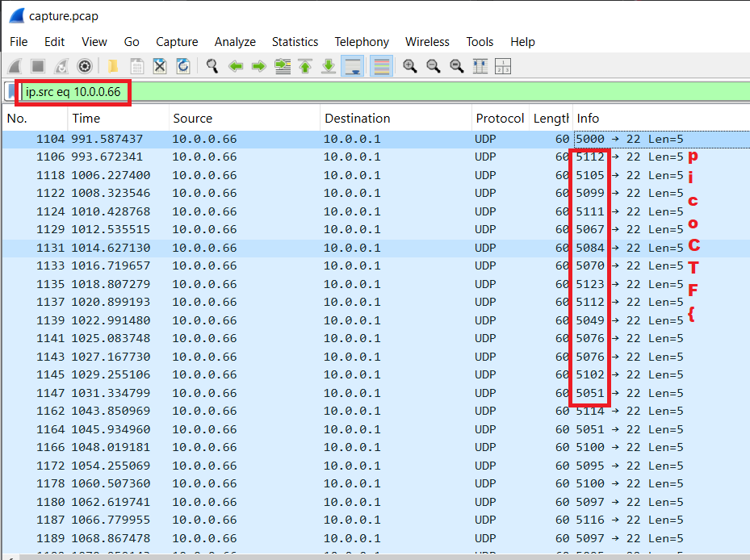

# picoGym Level 84: shark on wire 2
Source: https://play.picoctf.org/practice/challenge/84

## Goal
We found this packet capture. Recover the flag that was pilfered from the network.<br>
https://jupiter.challenges.picoctf.org/static/b506393b6f9d53b94011df000c534759/capture.pcap

## What I learned
```
sed
tshark
```

## Solution
```
https://webshell.picoctf.org/

# Start at Statistics
udp used alot
Right Click: Apply as Filter → Selected ❤️

Filter: udp contains "picoCTF" ⌨️
50	61.045583	10.0.0.2	10.0.0.29	UDP	62	5000 → 8990 Len=20
52	63.149043	10.0.0.8	10.0.0.29	UDP	82	5000 → 8990 Len=40
56	67.336637	10.0.0.2	10.0.0.29	UDP	62	5000 → 8990 Len=20
58	69.432626	10.0.0.8	10.0.0.29	UDP	82	5000 → 8990 Len=40
62	73.616850	10.0.0.2	10.0.0.29	UDP	62	5000 → 8990 Len=20
67	75.708789	10.0.0.8	10.0.0.29	UDP	82	5000 → 8990 Len=40
73	79.893171	10.0.0.2	10.0.0.29	UDP	62	5000 → 8990 Len=20
75	81.988688	10.0.0.8	10.0.0.29	UDP	82	5000 → 8990 Len=40
79	86.176981	10.0.0.2	10.0.0.29	UDP	62	5000 → 8990 Len=20
81	88.268727	10.0.0.8	10.0.0.29	UDP	82	5000 → 8990 Len=40
85	92.456675	10.0.0.2	10.0.0.29	UDP	62	5000 → 8990 Len=20
87	94.553369	10.0.0.8	10.0.0.29	UDP	82	5000 → 8990 Len=40
91	98.745157	10.0.0.2	10.0.0.29	UDP	62	5000 → 8990 Len=20
93	100.837284	10.0.0.8	10.0.0.29	UDP	82	5000 → 8990 Len=40
100	105.008809	10.0.0.2	10.0.0.29	UDP	62	5000 → 8990 Len=20
102	107.101165	10.0.0.8	10.0.0.29	UDP	82	5000 → 8990 Len=40
107	111.303767	10.0.0.2	10.0.0.29	UDP	62	5000 → 8990 Len=20
114	113.397050	10.0.0.8	10.0.0.29	UDP	82	5000 → 8990 Len=40

Filter: udp.stream eq 32 ⌨️
1104	991.587437	10.0.0.66	10.0.0.1	UDP	60	5000 → 22👀 Len=5

Right Click Copy Byte as Hex + ASCII Dump
0000   ff ff ff ff ff ff 00 0c 29 b9 02 a9 08 00 45 00   ........).....E.
0010   00 21 00 01 00 00 40 11 66 89 0a 00 00 42 0a 00   .!....@.f....B..
0020   00 01 13 88 00 16 00 0d 8f 0c 73 74 61 72 74 00   ..........start.👀
0030   00 00 00 00 00 00 00 00 00 00 00 00               ............

Filter: udp.port == 22 ⌨️

Method 1: manual
AsianHacker-picoctf@webshell:~$ python3 -c "print(''.join(chr(i) for i in [112,105,99,111,67,84,70,123,112,49,76,76,102,51,114,51,100,95,100,97,116,97,95,118,49,97,95,115,116,51,103,48,125]))" ⌨️
picoCTF{p1LLf3r3d_data_v1a_st3g0} 🔐

Method 2: tshark extract ports
AsianHacker-picoctf@webshell:~$ wget https://jupiter.challenges.picoctf.org/static/b506393b6f9d53b94011df000c534759/capture.pcap ⌨️
--2025-09-17 07:46:21--  https://jupiter.challenges.picoctf.org/static/b506393b6f9d53b94011df000c534759/capture.pcap
Resolving jupiter.challenges.picoctf.org (jupiter.challenges.picoctf.org)... 3.131.60.8
Connecting to jupiter.challenges.picoctf.org (jupiter.challenges.picoctf.org)|3.131.60.8|:443... connected.
HTTP request sent, awaiting response... 200 OK
Length: 112318 (110K) [application/octet-stream]
Saving to: 'capture.pcap'

capture.pcap                                       100%[=============================================================================================================>] 109.69K  --.-KB/s    in 0.05s   

2025-09-17 07:46:21 (2.21 MB/s) - 'capture.pcap' saved [112318/112318]

AsianHacker-picoctf@webshell:~$ tshark -r capture.pcap -T fields -e udp.port -Y "udp.port == 22" ⌨️
5000,22
5112,22
5105,22
5099,22
5111,22
5067,22
5084,22
5070,22
5123,22
5112,22
5049,22
5076,22
5076,22
5102,22
5051,22
5114,22
5051,22
5100,22
5095,22
5100,22
5097,22
5116,22
5097,22
5095,22
5118,22
5049,22
5097,22
5095,22
5115,22
5116,22
5051,22
5103,22
5048,22
5125,22
5000,22
AsianHacker-picoctf@webshell:~$ tshark -r capture.pcap -T fields -e udp.port -Y "udp.port == 22" | sed 's/,22//g' | sed 's/^5//g' | sed 's/000//g' | sed 's/^0//g' ⌨️

112
105
99
111
67
84
70
123
112
49
76
76
102
51
114
51
100
95
100
97
116
97
95
118
49
97
95
115
116
51
103
48
125
https://cyberchef.io/#recipe=From_Decimal('Line%20feed',false)&input=MTEyCjEwNQo5OQoxMTEKNjcKODQKNzAKMTIzCjExMgo0OQo3Ngo3NgoxMDIKNTEKMTE0CjUxCjEwMAo5NQoxMDAKOTcKMTE2Cjk3Cjk1CjExOAo0OQo5Nwo5NQoxMTUKMTE2CjUxCjEwMwo0OAoxMjU ⌨️

Method 3: Grab all port numbers and convert them to ASCII
# pip install scapy
from scapy.all import *

flag = ""

packets = rdpcap('capture.pcap')
for packet in packets:
    # if the packet is a UDP packet going to point 22
    if UDP in packet and packet[UDP].dport == 22:
        flag += chr(packet[UDP].sport - 5000)
print("Flag: {}".format(flag))
```



## Flag
picoCTF{p1LLf3r3d_data_v1a_st3g0}

## Continue
[Continue](./picoGym0115.md)