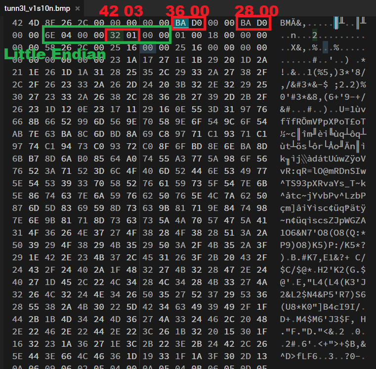

# picoGym Level 112: tunn3l v1s10n
Source: https://play.picoctf.org/practice/challenge/112

## Goal
We found this file. Recover the flag.<br>
https://mercury.picoctf.net/static/7b2d7c26630e977197022d0af09e3aeb/tunn3l_v1s10n

## What I learned
```
Corrupted Data
Hint: tunnel vision (size issue: need zoom out)

BMP_file_format: https://en.wikipedia.org/wiki/BMP_file_format
Photopea: https://www.photopea.com/ ⭐⭐⭐
Hex Editor Online: https://hexed.it/ ⭐⭐⭐⭐⭐
bvi <file> ⭐⭐⭐⭐⭐
    :set memmove ❤️❤️❤️❤️❤️
```

## Solution
```
https://webshell.picoctf.org/

AsianHacker-picoctf@webshell:~$ wget https://mercury.picoctf.net/static/7b2d7c26630e977197022d0af09e3aeb/tunn3l_v1s10n ⌨️
--2025-09-16 18:35:11--  https://mercury.picoctf.net/static/7b2d7c26630e977197022d0af09e3aeb/tunn3l_v1s10n
Resolving mercury.picoctf.net (mercury.picoctf.net)... 18.189.209.142
Connecting to mercury.picoctf.net (mercury.picoctf.net)|18.189.209.142|:443... connected.
HTTP request sent, awaiting response... 200 OK
Length: 2893454 (2.8M) [application/octet-stream]
Saving to: 'tunn3l_v1s10n'

tunn3l_v1s10n                                              100%[======================================================================================================================================>]   2.76M  1.83MB/s    in 1.5s    

2025-09-16 18:35:13 (1.83 MB/s) - 'tunn3l_v1s10n' saved [2893454/2893454]

AsianHacker-picoctf@webshell:~$ file tunn3l_v1s10n ⌨️
tunn3l_v1s10n: data
AsianHacker-picoctf@webshell:~$ exiftool tunn3l_v1s10n ⌨️ 
ExifTool Version Number         : 12.40
File Name                       : tunn3l_v1s10n
Directory                       : .
File Size                       : 2.8 MiB
File Modification Date/Time     : 2021:03:15 18:24:47+00:00
File Access Date/Time           : 2025:09:16 18:35:17+00:00
File Inode Change Date/Time     : 2025:09:16 18:35:13+00:00
File Permissions                : -rw-rw-r--
File Type                       : BMP
File Type Extension             : bmp
MIME Type                       : image/bmp
BMP Version                     : Unknown (53434)
Image Width                     : 1134 👀
Image Height                    : 306 👀
Planes                          : 1
Bit Depth                       : 24
Compression                     : None
Image Length                    : 2893400
Pixels Per Meter X              : 5669
Pixels Per Meter Y              : 5669
Num Colors                      : Use BitDepth
Num Important Colors            : All
Red Mask                        : 0x27171a23
Green Mask                      : 0x20291b1e
Blue Mask                       : 0x1e212a1d
Alpha Mask                      : 0x311a1d26
Color Space                     : Unknown (,5%()
Rendering Intent                : Unknown (826103054)
Image Size                      : 1134x306
Megapixels                      : 0.347

AsianHacker-picoctf@webshell:~$ python3 -c 'print(hex(1134))' ⌨️
0x46e 👀
AsianHacker-picoctf@webshell:~$ python3 -c 'print(hex(306))' ⌨️
0x132 👀 ❤️❤️❤️❤️❤️
AsianHacker-picoctf@webshell:~$ strings tunn3l_v1s10n | grep "picoCTF" ⌨️

# Check Magic Byte: https://en.wikipedia.org/wiki/List_of_file_signatures
AsianHacker-picoctf@webshell:~$ xxd -g 1 tunn3l_v1s10n | head -n 10 ⌨️
00000000: 42 4d 8e 26 2c 00 00 00 00 00 ba d0 00 00 ba d0  BM.&,........... 👀
00000010: 00 00 6e 04 00 00 32 01 00 00 01 00 18 00 00 00  ..n...2.........
00000020: 00 00 58 26 2c 00 25 16 00 00 25 16 00 00 00 00  ..X&,.%...%.....
00000030: 00 00 00 00 00 00 23 1a 17 27 1e 1b 29 20 1d 2a  ......#..'..) .*
00000040: 21 1e 26 1d 1a 31 28 25 35 2c 29 33 2a 27 38 2f  !.&..1(%5,)3*'8/
00000050: 2c 2f 26 23 33 2a 26 2d 24 20 3b 32 2e 32 29 25  ,/&#3*&-$ ;2.2)%
00000060: 30 27 23 33 2a 26 38 2c 28 36 2b 27 39 2d 2b 2f  0'#3*&8,(6+'9-+/
00000070: 26 23 1d 12 0e 23 17 11 29 16 0e 55 3d 31 97 76  &#...#..)..U=1.v
00000080: 66 8b 66 52 99 6d 56 9e 70 58 9e 6f 54 9c 6f 54  f.fR.mV.pX.oT.oT
00000090: ab 7e 63 ba 8c 6d bd 8a 69 c8 97 71 c1 93 71 c1  .~c..m..i..q..q.
AsianHacker-picoctf@webshell:~$ mv tunn3l_v1s10n tunn3l_v1s10n.bmp ⌨️
AsianHacker-picoctf@webshell:~$ sz tunn3l_v1s10n.bmp ⌨️

# Browser: https://www.photopea.com/
notaflag{sorry}

# Hex Editor Online: https://hexed.it/
# Modify Corrupt BMP with working BMP (easier) or file format (harder)
# Look at Header Line (Good)
# Modify 1st line
# Modify 2nd line height, Note: if higher than set amount will give corrupt file
picoCTF{qu1t3_a_v13w_2020} 🔐
```



## Flag
picoCTF{qu1t3_a_v13w_2020}

## Continue
[Continue](./picoGym0053.md)