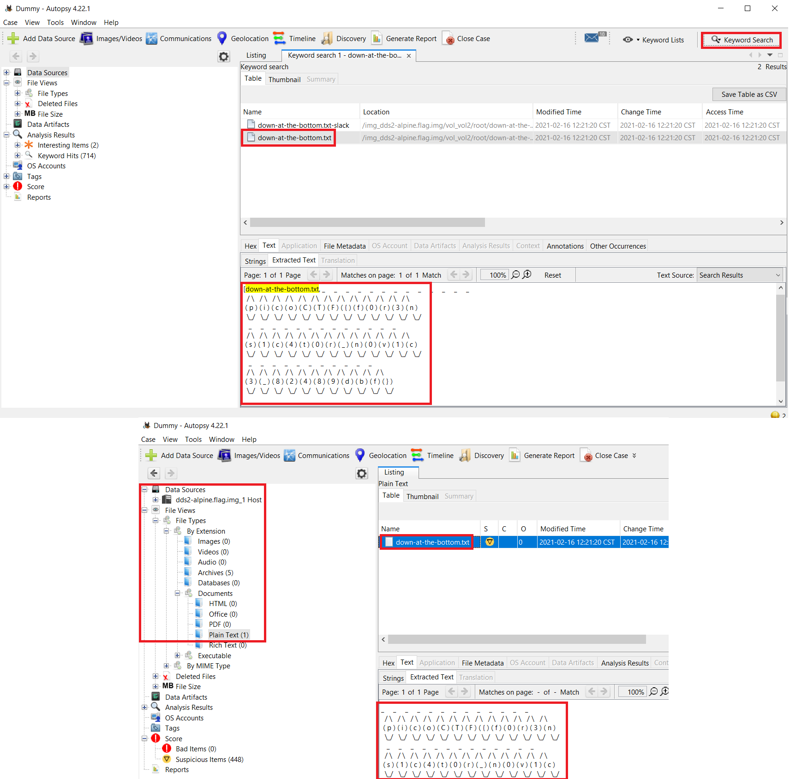

# picoGym Level 0137: Disk, disk, sleuth! II
Source: https://play.picoctf.org/practice/challenge/137

## Goal
All we know is the file with the flag is named <b>down-at-the-bottom.txt</b>

## What I learned
```
Autopsy: https://www.autopsy.com/download/
SleuthKit: https://wiki.sleuthkit.org/index.php?title=TSK_Tool_Overview
fls -r -p -o 2048 dds2-alpine.flag.img | grep down-at-the-bottom.txt
    -r  recursive scan entire disk image
    -p  prints full path 
    -o  offset of the partition
```



## Solution
```
https://webshell.picoctf.org/

AsianHacker-picoctf@webshell:~$ cd /tmp/ ⌨️
AsianHacker-picoctf@webshell:/tmp$ wget https://mercury.picoctf.net/static/9061ae8456a4ff51098c5183d910a080/dds2-alpine.flag.img.gz ⌨️
--2025-08-18 14:06:44--  https://mercury.picoctf.net/static/9061ae8456a4ff51098c5183d910a080/dds2-alpine.flag.img.gz
Resolving mercury.picoctf.net (mercury.picoctf.net)... 18.189.209.142
Connecting to mercury.picoctf.net (mercury.picoctf.net)|18.189.209.142|:443... connected.
HTTP request sent, awaiting response... 200 OK
Length: 29770579 (28M) [application/octet-stream]
Saving to: 'dds2-alpine.flag.img.gz'

dds2-alpine.flag.img.gz                                    100%[======================================================================================================================================>]  28.39M  1.82MB/s    in 16s     

2025-08-18 14:06:59 (1.82 MB/s) - 'dds2-alpine.flag.img.gz' saved [29770579/29770579]

AsianHacker-picoctf@webshell:/tmp$ gunzip dds2-alpine.flag.img.gz ⌨️ 
AsianHacker-picoctf@webshell:/tmp$ mmls dds2-alpine.flag.img ⌨️
DOS Partition Table
Offset Sector: 0
Units are in 512-byte sectors

      Slot      Start        End          Length       Description
000:  Meta      0000000000   0000000000   0000000001   Primary Table (#0)
001:  -------   0000000000   0000002047   0000002048   Unallocated
002:  000:000   0000002048👀 0000262143   0000260096   Linux (0x83)
AsianHacker-picoctf@webshell:/tmp$ fls -r -p -o 2048 dds2-alpine.flag.img | grep down-at-the-bottom.txt ⌨️
r/r 18291👀:    root/down-at-the-bottom.txt
AsianHacker-picoctf@webshell:/tmp$ icat -o 2048 dds2-alpine.flag.img 18291 ⌨️
   _     _     _     _     _     _     _     _     _     _     _     _     _  
  / \   / \   / \   / \   / \   / \   / \   / \   / \   / \   / \   / \   / \ 
 ( p ) ( i ) ( c ) ( o ) ( C ) ( T ) ( F ) ( { ) ( f ) ( 0 ) ( r ) ( 3 ) ( n )
  \_/   \_/   \_/   \_/   \_/   \_/   \_/   \_/   \_/   \_/   \_/   \_/   \_/ 
   _     _     _     _     _     _     _     _     _     _     _     _     _  
  / \   / \   / \   / \   / \   / \   / \   / \   / \   / \   / \   / \   / \ 
 ( s ) ( 1 ) ( c ) ( 4 ) ( t ) ( 0 ) ( r ) ( _ ) ( n ) ( 0 ) ( v ) ( 1 ) ( c )
  \_/   \_/   \_/   \_/   \_/   \_/   \_/   \_/   \_/   \_/   \_/   \_/   \_/ 
   _     _     _     _     _     _     _     _     _     _     _  
  / \   / \   / \   / \   / \   / \   / \   / \   / \   / \   / \ 
 ( 3 ) ( _ ) ( 8 ) ( 2 ) ( 4 ) ( 8 ) ( 9 ) ( d ) ( b ) ( f ) ( } ) 👀
  \_/   \_/   \_/   \_/   \_/   \_/   \_/   \_/   \_/   \_/   \_/ 
AsianHacker-picoctf@webshell:/tmp$ whatis tr
tr (1)               - translate or delete characters
tr (1posix)          - translate characters
AsianHacker-picoctf@webshell:/tmp$ echo "_ _ _ _ _ _ _ _ _ _ _ _ _ / \ / \ / \ / \ / \ / \ / \ / \ / \ / \ / \ / \ / \ ( p ) ( i ) ( c ) ( o ) ( C ) ( T ) ( F ) ( { ) ( f ) ( 0 ) ( r ) ( 3 ) ( n ) \_/ \_/ \_/ \_/ \_/ \_/ \_/ \_/ \_/ \_/ \_/ \_/ \_/ _ _ _ _ _ _ _ _ _ _ _ _ _ / \ / \ / \ / \ / \ / \ / \ / \ / \ / \ / \ / \ / \ ( s ) ( 1 ) ( c ) ( 4 ) ( t ) ( 0 ) ( r ) ( _ ) ( n ) ( 0 ) ( v ) ( 1 ) ( c ) \_/ \_/ \_/ \_/ \_/ \_/ \_/ \_/ \_/ \_/ \_/ \_/ \_/ _ _ _ _ _ _ _ _ _ _ _ / \ / \ / \ / \ / \ / \ / \ / \ / \ / \ / \ ( 3 ) ( _ ) ( 8 ) ( 2 ) ( 4 ) ( 8 ) ( 9 ) ( d ) ( b ) ( f ) ( } )  \_/ \_/ \_/ \_/ \_/ \_/ \_/ \_/ \_/ \_/ \_/" | tr -d '()_/\\ ' ⌨️❤️
picoCTF{f0r3ns1c4t0rn0v1c382489dbf} 🔐

# Note: tr -d '\n': delete newline characters from stream
AsianHacker-picoctf@webshell:/tmp$ echo "_ _ _ _ _ _ _ _ _ _ _ _ _ / \ / \ / \ / \ / \ / \ / \ / \ / \ / \ / \ / \ / \ ( p ) ( i ) ( c ) ( o ) ( C ) ( T ) ( F ) ( { ) ( f ) ( 0 ) ( r ) ( 3 ) ( n ) \_/ \_/ \_/ \_/ \_/ \_/ \_/ \_/ \_/ \_/ \_/ \_/ \_/ _ _ _ _ _ _ _ _ _ _ _ _ _ / \ / \ / \ / \ / \ / \ / \ / \ / \ / \ / \ / \ / \ ( s ) ( 1 ) ( c ) ( 4 ) ( t ) ( 0 ) ( r ) ( _ ) ( n ) ( 0 ) ( v ) ( 1 ) ( c ) \_/ \_/ \_/ \_/ \_/ \_/ \_/ \_/ \_/ \_/ \_/ \_/ \_/ _ _ _ _ _ _ _ _ _ _ _ / \ / \ / \ / \ / \ / \ / \ / \ / \ / \ / \ ( 3 ) ( _ ) ( 8 ) ( 2 ) ( 4 ) ( 8 ) ( 9 ) ( d ) ( b ) ( f ) ( } )  \_/ \_/ \_/ \_/ \_/ \_/ \_/ \_/ \_/ \_/ \_/" | grep -o '[A-Za-z0-9{}]*' | tr -d '\n' ⌨️
picoCTF{f0r3ns1c4t0rn0v1c382489dbf} 🔐

# Substitute [ ] for /empty/
AsianHacker-picoctf@webshell:/tmp$ echo "_ _ _ _ _ _ _ _ _ _ _ _ _ / \ / \ / \ / \ / \ / \ / \ / \ / \ / \ / \ / \ / \ ( p ) ( i ) ( c ) ( o ) ( C ) ( T ) ( F ) ( { ) ( f ) ( 0 ) ( r ) ( 3 ) ( n ) \_/ \_/ \_/ \_/ \_/ \_/ \_/ \_/ \_/ \_/ \_/ \_/ \_/ _ _ _ _ _ _ _ _ _ _ _ _ _ / \ / \ / \ / \ / \ / \ / \ / \ / \ / \ / \ / \ / \ ( s ) ( 1 ) ( c ) ( 4 ) ( t ) ( 0 ) ( r ) ( _ ) ( n ) ( 0 ) ( v ) ( 1 ) ( c ) \_/ \_/ \_/ \_/ \_/ \_/ \_/ \_/ \_/ \_/ \_/ \_/ \_/ _ _ _ _ _ _ _ _ _ _ _ / \ / \ / \ / \ / \ / \ / \ / \ / \ / \ / \ ( 3 ) ( _ ) ( 8 ) ( 2 ) ( 4 ) ( 8 ) ( 9 ) ( d ) ( b ) ( f ) ( } )  \_/ \_/ \_/ \_/ \_/ \_/ \_/ \_/ \_/ \_/ \_/" | sed 's/[()_|\/\\ -]//g' ⌨️
picoCTF{f0r3ns1c4t0rn0v1c382489dbf} 🔐
```

## Flag
picoCTF{f0r3ns1c4t0rn0v1c382489dbf}

## Continue
[Continue](./picoGym0285.md)