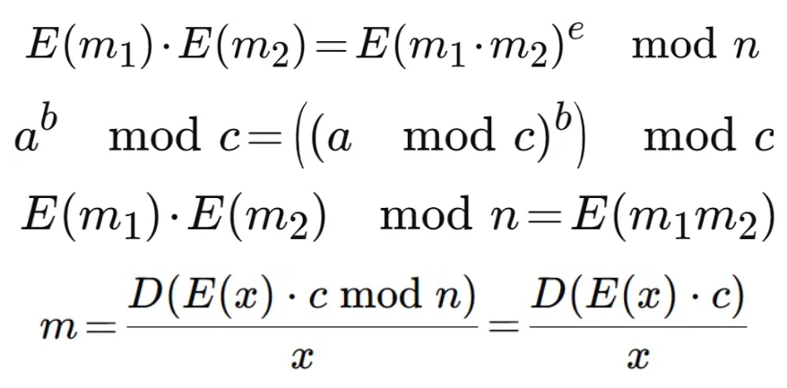

# picoGym Level 154: No Padding, No Problem ⚠️⚠️⚠️⚠️⚠️ Fix Method 3 and 4 Later
Source: https://play.picoctf.org/practice/challenge/154

## Goal
Oracles can be your best friend, they will decrypt anything, except the flag's ciphertext.<br>
How will you break it? Connect with<br>
nc mercury.picoctf.net 28517

## What I learned
```
pwntools    store and manipulate given data and enter data on nc connection

https://dotblogs.com.tw/kevintan1983/2010/10/05/18116

unpadded RSA is homomorphic
Homomorphic Property of RSA: RSA encryption is homomorphic with respect to multiplication
    encrypt(m1) * encrypt(m2) = ((m1**e) * (m2**e)) mod n = (m1 * m2)**e mod n = encrypt(m1 * m2)
    c * x = encrypt(m) * encrypt(2) = encrypt(m * 2)
```



## Solution
```
https://webshell.picoctf.org/

AsianHacker-picoctf@webshell:~$ nc mercury.picoctf.net 28517 ⌨️
Welcome to the Padding Oracle Challenge
This oracle will take anything you give it and decrypt using RSA. It will not accept the ciphertext with the secret message... Good Luck!

n: 66090259813342656313982216946716685556950155874954439935420423416531456369992766162948171021845738442936129127168695324832926104709442319370604578128511499597692271321383518874614407001345879801050724830217677110156242974336797640808816345352608944246136121490076579835182699279498186631679748489974512456519
e: 65537
ciphertext: 44728632824760808397662697984650139662133894220534032977789431496913745620129525959596521093125355049048909771069796642658197703552075924869627787813544650630813953188421509576266384502472606590229102457784768323006578284871636652092721682146407182161718030849148256099834893176296452268520532347572018129752

Give me ciphertext to decrypt: 11111111111111111111111111111111111111111111111111111111111111111111 ⌨️
Here you go: 45132756591589748210472325389013597643745427303261951951957974926427949676675114129467072464276515700052200735795070064457844950764385548181653613614664308108910521948835009037671947670398558390405466623352744816981582760185334830222999119642202786095651850105183465049496563501974948770137191650686597186927

Method 1:
AsianHacker-picoctf@webshell:~$ cat pythonScript.py ⌨️
from pwn import *
import binascii

r = remote('mercury.picoctf.net', 28517)
r.recvlines(4)

r.recvuntil(b'n: ')
n = int(r.recvline().strip())

r.recvuntil(b'e: ')
e = int(r.recvline().strip())

r.recvuntil(b'ciphertext: ')
c = int(r.recvline().strip())

# Calculate payload
payload = c * pow(2,e,n)
r.sendlineafter(b'Give me ciphertext to decrypt: ', str(payload))

r.recvuntil(b'Here you go: ')
doubled_plain = int(r.recvline().strip())
print("Doubled Plain:", doubled_plain)

# Calculate plain text
plain_hex = hex(doubled_plain // 2)[2:]  # Remove '0x' prefix
plain_bytes = bytes.fromhex(plain_hex)
print("Plain Text Hex:", plain_hex)
print("Plain Text:", plain_bytes.decode())

r.close()

AsianHacker-picoctf@webshell:~$ python3 pythonScript.py ⌨️
[+] Opening connection to mercury.picoctf.net on port 28517: Done
/home/AsianHacker-picoctf/pythonScript.py:18: BytesWarning: Text is not bytes; assuming ASCII, no guarantees. See https://docs.pwntools.com/#bytes
  r.sendlineafter(b'Give me ciphertext to decrypt: ', str(payload))
Doubled Plain: 580550060391700078946913236734911770139931497702556153513487440893406629034802718534645538074938502890769281669222390720762
Plain Text Hex: 7069636f4354467b6d347962335f54683073655f6d337335346733735f3472335f646966757272656e745f343030353533347d
Plain Text: picoCTF{m4yb3_Th0se_m3s54g3s_4r3_difurrent_4005534} 🔐
[*] Closed connection to mercury.picoctf.net port 28517

Method 2:
AsianHacker-picoctf@webshell:~$ cat pythonScript.py ⌨️
from Crypto.Util.number import *
from pwn import *
from decimal import *
import re

getcontext().prec = 1000

conn = remote('mercury.picoctf.net', 28517)
raw_text = conn.recvuntil('Give me ciphertext to decrypt:').decode()

print(raw_text)

m = re.search(r"n: ([0-9]+)\ne: ([0-9]+)\nciphertext: ([0-9]+)", raw_text)
n = int(m[1])
e = int(m[2])
c = int(m[3])

to_decrypt = c * pow(2, e, n) % n

conn.send(str(to_decrypt) + '\r\n')

print("Sent:", to_decrypt)

result = conn.recvline().decode()

print(result)

m = re.search(r"([0-9]+)", result)
result = int(Decimal(m[1]) / 2)

print(hex(result))
print('Result:', long_to_bytes(result))

AsianHacker-picoctf@webshell:~$ python pythonScript.py ⌨️
[+] Opening connection to mercury.picoctf.net on port 28517: Done
/home/AsianHacker-picoctf/pythonScript.py:9: BytesWarning: Text is not bytes; assuming ASCII, no guarantees. See https://docs.pwntools.com/#bytes
  raw_text = conn.recvuntil('Give me ciphertext to decrypt:').decode()
Welcome to the Padding Oracle Challenge
This oracle will take anything you give it and decrypt using RSA. It will not accept the ciphertext with the secret message... Good Luck!

n: 68429227904166871075186263684124697388760638628031789714311788504169497732389356575489199325446419129358400753521749431220692763048624218796024039017659315860089066232373651490773227619001569855840073161956098225843258502481100716675591056007381016160108280686949607263676432645701299056516171294428687762579
e: 65537
ciphertext: 48773669866991158889941158023070795714346930252686709798144629302928906475345011345287791367767962306421065508566988482103874216209919019687372454720204629694113968233489265924025070684179496539661805077309190621279085320153266898793501248867199695565562222046914550565888597053058909319819158824619034661510

Give me ciphertext to decrypt:
/home/AsianHacker-picoctf/pythonScript.py:20: BytesWarning: Text is not bytes; assuming ASCII, no guarantees. See https://docs.pwntools.com/#bytes
  conn.send(str(to_decrypt) + '\r\n')
Sent: 43077588277709039805819349278559882989189241078591123228858955007281002915933031995517004631242177108199396481787626922805756429183244564810118625799139932635694079552200623337363278559929892953892582639331601769628281009751095786420686311568991231864151457438479316495219075070780152460969381762874208194225
 Here you go: 580550060391700078946913236734911770139931497702556153513487440893406629034802718534645538074938502890769281669222390720762

0x7069636f4354467b6d347962335f54683073655f6d337335346733735f3472335f646966757272656e745f343030353533347d
Result: b'picoCTF{m4yb3_Th0se_m3s54g3s_4r3_difurrent_4005534}' 🔐
[*] Closed connection to mercury.picoctf.net port 28517

Method 3: (Wrong Logic Fix Later) ⚠️⚠️⚠️⚠️⚠️
def encrypt(m,e,n):
    return pow(m,e,n)

def is_equal() -> None:
    p=3
    q=7

    #to get n multiply two primes
    n=p*q

    # get e pick a number 1 < e < f(n), with f representing euler's totient function
    # e must also me coeprime to f(n) meaning gcf((fn), e) = 1
    e=5
    m1=23423423
    m2=68784572

    # if true no assert msg
    assert (encrypt(m1,e,n)*encrypt(m2,e,n))%n==encrypt(m1*m2,e,n)

def get_flag() -> None:
    n= 66090259813342656313982216946716685556950155874954439935420423416531456369992766162948171021845738442936129127168695324832926104709442319370604578128511499597692271321383518874614407001345879801050724830217677110156242974336797640808816345352608944246136121490076579835182699279498186631679748489974512456519
    e=65537
    c= 44728632824760808397662697984650139662133894220534032977789431496913745620129525959596521093125355049048909771069796642658197703552075924869627787813544650630813953188421509576266384502472606590229102457784768323006578284871636652092721682146407182161718030849148256099834893176296452268520532347572018129752

    m2 = 71995441349479405174150238573347268764033401827677332885098064079848037794250711545135940345912821630380354561806095800953927401810043168331542699870491049386252060892238394824625131979503501184517522594418859451822891627902734851875184842064466901694815570008383925978013017741187189549161004235507156345173

    m = (pow(4, e, n) * c) % n
    # pass m to the server aka D
    # what i got back from the server 1161100120783400157893826473469823540279862995405112307026974881786813258069605437069291076149877005781538860580400921108980
    d = 1161100120783400157893826473469823540279862995405112307026974881786813258069605437069291076149877005781538860580400921108980
    print(bytearray.fromhex(format(d // 4, "x")).decode())

if __name__ == "__main__":
    is_equal()
    get_flag()
AsianHacker-picoctf@webshell:~$ python3 pythonScript.py 
picoCTF{m4yb3_Th0se_m3s54g3s_4r3_difurrent_5814368}

Method 4: (Wrong Logic Fix Later) ⚠️⚠️⚠️⚠️⚠️
AsianHacker-picoctf@webshell:~$ vi pythonScript.py
AsianHacker-picoctf@webshell:~$ cat pythonScript.py 
#!/usr/bin/env python3
from pwn import *           # pwntools library for remote exploitation
import binascii

# Connect to the remote RSA challenge server
r = remote("mercury.picoctf.net", 2671)

# Receive modulus n
print(r.recvuntil("n:"))   # Wait until "n:" is received
n = int(r.recvline())      # Read the next line and convert to integer
print(n)

# Receive public exponent e
print(r.recvuntil("e:"))
e = int(r.recvline())
print(e)

# Receive ciphertext c
print(r.recvuntil("ciphertext:"))
c = int(r.recvline())
print(c)

# Server asks what we want to decrypt
print(r.recvuntil("to decrypt:"))

# ================= Exploit idea =================
# RSA is multiplicative: (m1 * m2)^e = (m1^e * m2^e) mod n
# If we send (2^e * c), the server will decrypt:
#   (2^e * c)^d = 2^(ed) * c^d
# Since ed ≡ 1 (mod φ(n)), 2^(ed) ≡ 2 (mod n)
# So the result will be 2 * plaintext.
# =================================================

# Compute c' = (2^e mod n) * c mod n
r.sendline(str(pow(2, e, n) * c))

# Receive the decrypted value (which equals 2*plaintext)
print(r.recvuntil("you go:"))
p2 = int(r.recvline())
print(p2)

# Divide by 2 to recover the original plaintext
print(p2 // 2)

# Convert plaintext integer to hex string
st = "{:x}".format(p2 // 2)

# Decode hex into ASCII text (the flag)
print(binascii.unhexlify(st))
AsianHacker-picoctf@webshell:~$ chmod +x pythonScript.py 
AsianHacker-picoctf@webshell:~$ ./pythonScript.py 
[+] Opening connection to mercury.picoctf.net on port 2671: Done
/home/AsianHacker-picoctf/./pythonScript.py:9: BytesWarning: Text is not bytes; assuming ASCII, no guarantees. See https://docs.pwntools.com/#bytes
  print(r.recvuntil("n:"))   # Wait until "n:" is received
b'Welcome to the Padding Oracle Challenge\nThis oracle will take anything you give it and decrypt using RSA. It will not accept the ciphertext with the secret message... Good Luck!\n\n\nn:'
112558695734069386560525720974158553702738391119101212139395093468647845414890692567651386942369791801041157596662559220502337364885323957894975945750775847400353794373958720078075608261363173785494129896728086349089221326500543505333455932985484847097494334629219772728114896664396232108815937560202548415993
/home/AsianHacker-picoctf/./pythonScript.py:14: BytesWarning: Text is not bytes; assuming ASCII, no guarantees. See https://docs.pwntools.com/#bytes
  print(r.recvuntil("e:"))
b'e:'
65537
/home/AsianHacker-picoctf/./pythonScript.py:19: BytesWarning: Text is not bytes; assuming ASCII, no guarantees. See https://docs.pwntools.com/#bytes
  print(r.recvuntil("ciphertext:"))
b'ciphertext:'
58680262664323781158300881083559757129564325967282740553949924983020690928717174089082822890824961340770928377763038429146688383041533240750749328534684802807643947708697468387546432621689234467765312079429906505567243277077811191381172706280482119795156410120789891268965686400831742130095689018654609041
/home/AsianHacker-picoctf/./pythonScript.py:24: BytesWarning: Text is not bytes; assuming ASCII, no guarantees. See https://docs.pwntools.com/#bytes
  print(r.recvuntil("to decrypt:"))
b'\n\nGive me ciphertext to decrypt:'
/home/AsianHacker-picoctf/./pythonScript.py:35: BytesWarning: Text is not bytes; assuming ASCII, no guarantees. See https://docs.pwntools.com/#bytes
  r.sendline(str(pow(2, e, n) * c))
/home/AsianHacker-picoctf/./pythonScript.py:38: BytesWarning: Text is not bytes; assuming ASCII, no guarantees. See https://docs.pwntools.com/#bytes
  print(r.recvuntil("you go:"))
b' Here you go:'
580550060391700078946913236734911770139931497702556153513487440893406629034802718534645538074938502890769430290200460554490
290275030195850039473456618367455885069965748851278076756743720446703314517401359267322769037469251445384715145100230277245
b'picoCTF{m4yb3_Th0se_m3s54g3s_4r3_difurrent_5814368}' 
[*] Closed connection to mercury.picoctf.net port 2671
```

## Flag
picoCTF{m4yb3_Th0se_m3s54g3s_4r3_difurrent_4005534}

## Continue
[Continue](./picoGym0038.md)