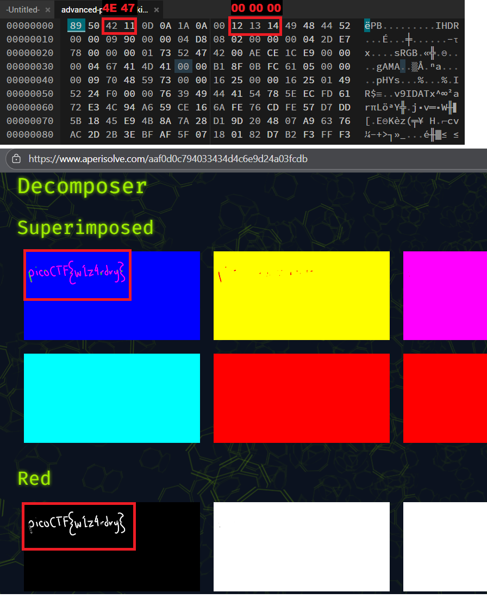

# picoGym Level 205: advanced-potion-making
Source: https://play.picoctf.org/practice/challenge/205

## Goal
Ron just found his own copy of advanced potion making, but its been corrupted by some kind of spell. Help him recover it!<br>
https://artifacts.picoctf.net/picoMini+by+redpwn/Forensics/advanced-potion-making/advanced-potion-making

## What I learned
```
https://en.wikipedia.org/wiki/PNG#Examples

https://hexed.it/
Aperi’Solve: https://www.aperisolve.com/
```

## Solution
```
https://webshell.picoctf.org/

AsianHacker-picoctf@webshell:~$ cd /tmp/ ⌨️
AsianHacker-picoctf@webshell:/tmp$ wget https://artifacts.picoctf.net/picoMini+by+redpwn/Forensics/advanced-potion-making/advanced-potion-making ⌨️
--2025-09-17 19:16:05--  https://artifacts.picoctf.net/picoMini+by+redpwn/Forensics/advanced-potion-making/advanced-potion-making
Resolving artifacts.picoctf.net (artifacts.picoctf.net)... 3.170.131.18, 3.170.131.33, 3.170.131.72, ...
Connecting to artifacts.picoctf.net (artifacts.picoctf.net)|3.170.131.18|:443... connected.
HTTP request sent, awaiting response... 200 OK
Length: 30372 (30K) [binary/octet-stream]
Saving to: 'advanced-potion-making'

advanced-potion-making                                     100%[======================================================================================================================================>]  29.66K  --.-KB/s    in 0.007s  

2025-09-17 19:16:05 (3.93 MB/s) - 'advanced-potion-making' saved [30372/30372]
AsianHacker-picoctf@webshell:/tmp$ ls ⌨️
advanced-potion-making 👀  hsperfdata_root  node-compile-cache
AsianHacker-picoctf@webshell:/tmp$ file advanced-potion-making ⌨️
advanced-potion-making: data
AsianHacker-picoctf@webshell:/tmp$ exiftool advanced-potion-making ⌨️
ExifTool Version Number         : 12.40
File Name                       : advanced-potion-making
Directory                       : .
File Size                       : 30 KiB
File Modification Date/Time     : 2021:05:04 01:38:44+00:00
File Access Date/Time           : 2025:09:17 19:16:41+00:00
File Inode Change Date/Time     : 2025:09:17 19:16:05+00:00
File Permissions                : -rw-rw-r--
Error                           : Unknown file type 👀 high chance corrupt

AsianHacker-picoctf@webshell:/tmp$ xxd advanced-potion-making | head -n 10 ⌨️
00000000: 8950 4211 0d0a 1a0a 0012 1314 4948 4452  .PB👀.........IHDR
00000010: 0000 0990 0000 04d8 0802 0000 0004 2de7  ..............-.
00000020: 7800 0000 0173 5247 4200 aece 1ce9 0000  x....sRGB.......
00000030: 0004 6741 4d41 0000 b18f 0bfc 6105 0000  ..gAMA......a...
00000040: 0009 7048 5973 0000 1625 0000 1625 0149  ..pHYs...%...%.I
00000050: 5224 f000 0076 3949 4441 5478 5eec fd61  R$...v9IDATx^..a
00000060: 72e3 4c94 a659 ce16 6afe 76cd fe57 d7dd  r.L..Y..j.v..W..
00000070: 5b18 45e9 4b8a 7a28 d19d 2048 07a9 6376  [.E.K.z(.. H..cv
00000080: ac2d 2b3e bfaf 5f07 1801 82d7 b2f3 fff3  .-+>.._.........
00000090: fffc 7fff 7f00 0000 0000 0000 4b18 5802  ............K.X.
AsianHacker-picoctf@webshell:/tmp$ hexdump -C advanced-potion-making | head -n 10 ⌨️
00000000  89 50 42 11 0d 0a 1a 0a  00 12 13 14 49 48 44 52  |.PB.........IHDR|👀
00000010  00 00 09 90 00 00 04 d8  08 02 00 00 00 04 2d e7  |..............-.|
00000020  78 00 00 00 01 73 52 47  42 00 ae ce 1c e9 00 00  |x....sRGB.......|
00000030  00 04 67 41 4d 41 00 00  b1 8f 0b fc 61 05 00 00  |..gAMA......a...|
00000040  00 09 70 48 59 73 00 00  16 25 00 00 16 25 01 49  |..pHYs...%...%.I|
00000050  52 24 f0 00 00 76 39 49  44 41 54 78 5e ec fd 61  |R$...v9IDATx^..a|
00000060  72 e3 4c 94 a6 59 ce 16  6a fe 76 cd fe 57 d7 dd  |r.L..Y..j.v..W..|
00000070  5b 18 45 e9 4b 8a 7a 28  d1 9d 20 48 07 a9 63 76  |[.E.K.z(.. H..cv|
00000080  ac 2d 2b 3e bf af 5f 07  18 01 82 d7 b2 f3 ff f3  |.-+>.._.........|
00000090  ff fc 7f ff 7f 00 00 00  00 00 00 00 4b 18 58 02  |............K.X.|

AsianHacker-picoctf@webshell:/tmp$ hexedit advanced-potion-making ⌨️
-bash: hexedit: command not found
AsianHacker-picoctf@webshell:/tmp$ bvi advanced-potion-making ⌨️

bvi version 1.4.0 Copyright (C) 1996-2014 by Gerhard Buergmann

# Modifying File: https://hexed.it/ ⌨️
# Note: Modifying First Line fixed it

# Optional: Before Aperi'Solve open in paint and fill will white ❤️

# zsteg not find use Aperi’Solve: https://www.aperisolve.com/
picoCTF{w1z4rdry} 🔐
```



## Flag
picoCTF{w1z4rdry}

## Continue
[Continue](./picoGym0284.md)