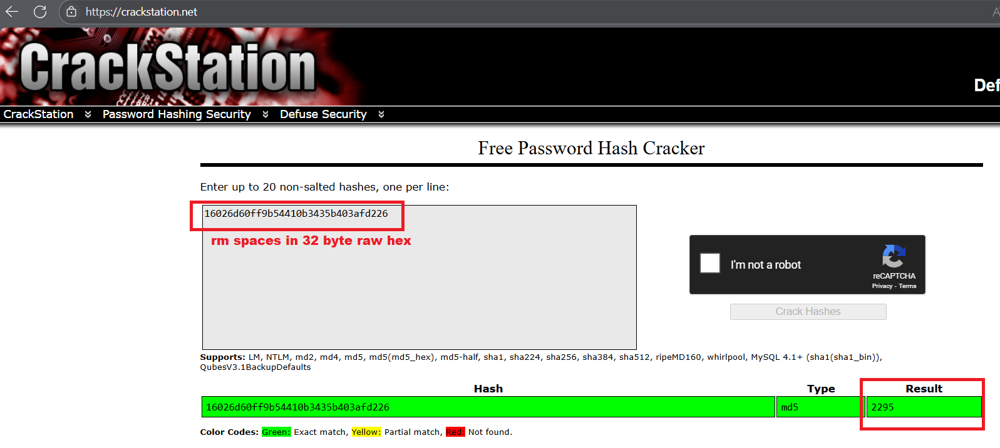

# picoGym Level 0247: PW Crack 3 🧠🧠🧠🧠🧠
Source: https://play.picoctf.org/practice/challenge/247

## Goal
Can you crack the password to get the flag?<br>
Download the password checker here and you'll need the encrypted flag and the hash in the same directory too.<br>
There are 7 potential passwords with <b>1 being correct</b>. You can find these by examining the password checker script.

## What I learned
```
python3 f strings ❤️❤️❤️❤️❤️

CrackStation: https://crackstation.net/ ⭐⭐⭐⭐⭐

⚠️ objdump meant for object files like executables (ELF, PE, Mach-O)
    ELF (Executable and Linkable Format)                        Linux & most UNIX systems
    PE/COFF (Portable Executable / Common Object File Format)   Windows .exe, .dll
    Mach-O                                                      macOS executables and libraries
    PPC PEF (Preferred Executable Format)                       Older macOS (Classic / pre-OSX)

Cryptographic hash functions, NOT encryption
Produces a fixed-length output called (output/hash)
    MD5 → Message-Digest Algorithm 5    128 bits (16 bytes → 32 hex characters)
    SHA-1 → Secure Hash Algorithm 1     160 bits (20 bytes → 40 hex characters)

MD5 produces a 128-bit digest       16 bytes (raw form) ❤️❤️❤️
SHA-1                               20 bytes
SHA-256                             32 bytes
SHA-512                             64 bytes

How to count bytes 🧠
00000000: 16 02 6d 60 ff 9b 54 41 0b 34 35 b4 03 af d2 26  ..m`..TA.45....&
    Each pair of hex digits (16) = 1 byte
    There 16 pairs = 16 bytes

Byte = 8 bits
Hexadecimal writen in 4 bits (2 Bytes)
    Decimal         65
    Binary          0100    0001
    Hexadecimal     4       1

MD5 digest = 16 bytes
So this bin file is MD5 hash in raw binary form can be converted to MD5 hash in hex string form (remove space)

# using md5sum re-encoded as base64 (will see = at end most time)
```



## Solution
```
https://webshell.picoctf.org/

AsianHacker-picoctf@webshell:~$ cd /tmp/ ⌨️
AsianHacker-picoctf@webshell:/tmp$ wget https://artifacts.picoctf.net/c/18/level3.py https://artifacts.picoctf.net/c/18/level3.flag.txt.enc https://artifacts.picoctf.net/c/18/level3.hash.bin ⌨️

--2025-08-19 17:38:25--  https://artifacts.picoctf.net/c/18/level3.py
Resolving artifacts.picoctf.net (artifacts.picoctf.net)... 3.160.5.42, 3.160.5.71, 3.160.5.93, ...
Connecting to artifacts.picoctf.net (artifacts.picoctf.net)|3.160.5.42|:443... connected.
HTTP request sent, awaiting response... 200 OK
Length: 1337 (1.3K) [application/octet-stream]
Saving to: 'level3.py'

level3.py                                                  100%[======================================================================================================================================>]   1.31K  --.-KB/s    in 0s      

2025-08-19 17:38:25 (34.6 MB/s) - 'level3.py' saved [1337/1337]

--2025-08-19 17:38:25--  https://artifacts.picoctf.net/c/18/level3.flag.txt.enc
Reusing existing connection to artifacts.picoctf.net:443.
HTTP request sent, awaiting response... 200 OK
Length: 31 [application/octet-stream]
Saving to: 'level3.flag.txt.enc'

level3.flag.txt.enc                                        100%[======================================================================================================================================>]      31  --.-KB/s    in 0s      

2025-08-19 17:38:25 (14.4 MB/s) - 'level3.flag.txt.enc' saved [31/31]

--2025-08-19 17:38:25--  https://artifacts.picoctf.net/c/18/level3.hash.bin
Reusing existing connection to artifacts.picoctf.net:443.
HTTP request sent, awaiting response... 200 OK
Length: 16 [application/octet-stream]
Saving to: 'level3.hash.bin'

level3.hash.bin                                            100%[======================================================================================================================================>]      16  --.-KB/s    in 0s      

2025-08-19 17:38:25 (3.34 MB/s) - 'level3.hash.bin' saved [16/16]

FINISHED --2025-08-19 17:38:25--
Total wall clock time: 0.3s
Downloaded: 3 files, 1.4K in 0s (30.4 MB/s)

AsianHacker-picoctf@webshell:/tmp$ cat level3.py ⌨️
import hashlib

### THIS FUNCTION WILL NOT HELP YOU FIND THE FLAG --LT ########################
def str_xor(secret, key):
    #extend key to secret length
    new_key = key
    i = 0
    while len(new_key) < len(secret):
        new_key = new_key + key[i]
        i = (i + 1) % len(key)        
    return "".join([chr(ord(secret_c) ^ ord(new_key_c)) for (secret_c,new_key_c) in zip(secret,new_key)])
###############################################################################

flag_enc = open('level3.flag.txt.enc', 'rb').read()
correct_pw_hash = open('level3.hash.bin', 'rb').read()

def hash_pw(pw_str):
    pw_bytes = bytearray()
    pw_bytes.extend(pw_str.encode())
    m = hashlib.md5()
    m.update(pw_bytes)
    return m.digest()

def level_3_pw_check():
    user_pw = input("Please enter correct password for flag: ")
    user_pw_hash = hash_pw(user_pw)
    
    if( user_pw_hash == correct_pw_hash ):
        print("Welcome back... your flag, user:")
        decryption = str_xor(flag_enc.decode(), user_pw)
        print(decryption)
        return
    print("That password is incorrect")

level_3_pw_check()

# The strings below are 7 possibilities for the correct password. 
#   (Only 1 is correct)
pos_pw_list = ["8799", "d3ab", "1ea2", "acaf", "2295", "a9de", "6f3d"] 👀

# Method 1: Hash Analysis of bin file
AsianHacker-picoctf@webshell:/tmp$ whatis bvi objdump xxd hexdump ⌨️
bvi (1)              - visual editor for binary files
objdump (1)          - display information from object files
xxd (1)              - make a hexdump or do the reverse.
hexdump (1)          - display file contents in hexadecimal, decimal, octal, or ascii
AsianHacker-picoctf@webshell:/tmp$ bvi level3.hash.bin ⌨️

bvi version 1.4.0 Copyright (C) 1996-2014 by Gerhard Buergmann
00000000  16 02 6D 60 FF 9B 54 41 0B 34 35 B4 03 AF D2 26                                     ..m`..TA.45....&
AsianHacker-picoctf@webshell:/tmp$ xxd level3.hash.bin ⌨️                                    # xxd -p (converts to hex string)
00000000: 1602 6d60 ff9b 5441 0b34 35b4 03af d226  ..m`..TA.45....&
AsianHacker-picoctf@webshell:/tmp$ hexdump -C level3.hash.bin ⌨️
00000000  16 02 6d 60 ff 9b 54 41  0b 34 35 b4 03 af d2 26  |..m`..TA.45....&|
00000010

# Confirm it is 16 bytes (MD5)
AsianHacker-picoctf@webshell:/tmp$ ls -la ⌨️
total 12
drwxrwxrwt 1 root                root                  89 Aug 19 20:18 .
drwxr-xr-x 1 root                root                  70 Aug 19 20:18 ..
drwx------ 3 root                root                  41 Mar  5 02:13 .wine-0
drwxr-xr-x 2 root                root                   6 Mar  5 02:09 hsperfdata_root
-rw-rw-r-- 1 AsianHacker-picoctf AsianHacker-picoctf   31 Mar 16  2023 level3.flag.txt.enc
-rw-rw-r-- 1 AsianHacker-picoctf AsianHacker-picoctf   16👀 Mar 16  2023 level3.hash.bin
-rw-rw-r-- 1 AsianHacker-picoctf AsianHacker-picoctf 1337 Mar 16  2023 level3.py
drwxr-xr-x 3 root                root                  45 Mar  5 02:13 node-compile-cache

# After confirm, make hex string
AsianHacker-picoctf@webshell:/tmp$ echo "16 02 6d 60 ff 9b 54 41  0b 34 35 b4 03 af d2 26" | tr -d " " ⌨️
16026d60ff9b54410b3435b403afd226
# hashcat would fail since use alot of memory so do CrackStation ⚠️
AsianHacker-picoctf@webshell:/tmp$ echo "16026d60ff9b54410b3435b403afd226" > hash.txt ⌨️
AsianHacker-picoctf@webshell:/tmp$ hashcat -m 0 -a 3 hash.txt ?d?d?d?d ⌨️
hashcat (v6.2.5) starting

OpenCL API (OpenCL 2.0 pocl 1.8  Linux, None+Asserts, RELOC, LLVM 11.1.0, SLEEF, DISTRO, POCL_DEBUG) - Platform #1 [The pocl project]
=====================================================================================================================================
* Device #1: pthread-Intel(R) Xeon(R) Platinum 8259CL CPU @ 2.50GHz, 2862/5788 MB (1024 MB allocatable), 2MCU

Minimum password length supported by kernel: 0
Maximum password length supported by kernel: 256

Generated bitmap tablesKilled ⚠️

# Decrypt and use code from CrackStation
AsianHacker-picoctf@webshell:/tmp$ python3 level3.py ⌨️
Please enter correct password for flag: 2295 ⌨️
Welcome back... your flag, user:
picoCTF{m45h_fl1ng1ng_6f98a49f} 🔐

# Method 2: Brute Force changing Python script
AsianHacker-picoctf@webshell:/tmp$ cat level3.py  ⌨️
import hashlib

# Made this global
pos_pw_list = ["8799", "d3ab", "1ea2", "acaf", "2295", "a9de", "6f3d"] 👀

### THIS FUNCTION WILL NOT HELP YOU FIND THE FLAG --LT ########################
def str_xor(secret, key):
    #extend key to secret length
    new_key = key
    i = 0
    while len(new_key) < len(secret):
        new_key = new_key + key[i]
        i = (i + 1) % len(key)        
    return "".join([chr(ord(secret_c) ^ ord(new_key_c)) for (secret_c,new_key_c) in zip(secret,new_key)])
###############################################################################

flag_enc = open('level3.flag.txt.enc', 'rb').read()
correct_pw_hash = open('level3.hash.bin', 'rb').read()              # Either crack this and find what checking against

def hash_pw(pw_str):
    pw_bytes = bytearray()
    pw_bytes.extend(pw_str.encode())
    m = hashlib.md5()
    m.update(pw_bytes)
    return m.digest()

def level_3_pw_check():
    # user_pw = input("Please enter correct password for flag: ")
    for user_pw in pos_pw_list: 👀                                 # Brute Force Method
        user_pw_hash = hash_pw(user_pw)
        print(f"{user_pw}: {user_pw_hash.hex()}") 👀❤️❤️❤️❤️❤️  # python f-strings

        if( user_pw_hash == correct_pw_hash ):
            print("Welcome back... your flag, user:")
            decryption = str_xor(flag_enc.decode(), user_pw)
            print(decryption)
            return
        print("That password is incorrect")

level_3_pw_check()                                                  # main fx

# The strings below are 7 possibilities for the correct password. 
#   (Only 1 is correct)
# pos_pw_list = ["8799", "d3ab", "1ea2", "acaf", "2295", "a9de", "6f3d"]

AsianHacker-picoctf@webshell:/tmp$ python3 level3.py  ⌨️
8799: e6051b3bfe716cc4a38c2f39ec199873
That password is incorrect
d3ab: 2b268941ebe6a029484266060fa70243
That password is incorrect
1ea2: 8f60458cc64243ba3b88f8bfcfa269eb
That password is incorrect
acaf: 3df13964fd043dad82ac80b931a71f2d
That password is incorrect
2295: 16026d60ff9b54410b3435b403afd226
Welcome back... your flag, user:
picoCTF{m45h_fl1ng1ng_6f98a49f} 🔐
```

## Flag
picoCTF{m45h_fl1ng1ng_6f98a49f}

## Continue
[Continue](./picoGym0248.md)