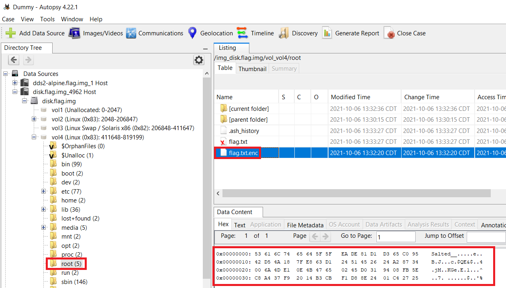

# picoGym Level 0285: Operation Orchid
Source: https://play.picoctf.org/practice/challenge/285

## Goal
Download disk image and find the flag

## What I learned
```
Autopsy: https://www.autopsy.com/download/

man openssl
openssl aes256 -salt -in flag.txt -out flag.txt.enc -k unbreakablepassword1234567
openssl aes-256-cbc -d -salt -in flag.txt.enc -out flag_decrypted.txt -k unbreakablepassword1234567
```



## Solution
```
https://webshell.picoctf.org/

AsianHacker-picoctf@webshell:~$ cd /tmp/ ⌨️
AsianHacker-picoctf@webshell:/tmp$ wget https://artifacts.picoctf.net/c/213/disk.flag.img.gz ⌨️
--2025-08-18 15:27:19--  https://artifacts.picoctf.net/c/213/disk.flag.img.gz
Resolving artifacts.picoctf.net (artifacts.picoctf.net)... 3.160.22.16, 3.160.22.43, 3.160.22.128, ...
Connecting to artifacts.picoctf.net (artifacts.picoctf.net)|3.160.22.16|:443... connected.
HTTP request sent, awaiting response... 200 OK
Length: 44360922 (42M) [application/octet-stream]
Saving to: 'disk.flag.img.gz'

disk.flag.img.gz                                           100%[======================================================================================================================================>]  42.31M  1.82MB/s    in 23s     

2025-08-18 15:27:43 (1.81 MB/s) - 'disk.flag.img.gz' saved [44360922/44360922]
AsianHacker-picoctf@webshell:/tmp$ gunzip disk.flag.img.gz ⌨️
AsianHacker-picoctf@webshell:/tmp$ mmls disk.flag.img ⌨️
DOS Partition Table
Offset Sector: 0
Units are in 512-byte sectors

      Slot      Start        End          Length       Description
000:  Meta      0000000000   0000000000   0000000001   Primary Table (#0)
001:  -------   0000000000   0000002047   0000002048   Unallocated
002:  000:000   0000002048   0000206847   0000204800   Linux (0x83)
003:  000:001   0000206848   0000411647   0000204800   Linux Swap / Solaris x86 (0x82)
004:  000:002   0000411648👀 0000819199   0000407552   Linux (0x83)
AsianHacker-picoctf@webshell:/tmp$ fls -o 411648 disk.flag.img ⌨️
d/d 460:        home
d/d 11: lost+found
d/d 12: boot
d/d 13: etc
d/d 81: proc
d/d 82: dev
d/d 83: tmp
d/d 84: lib
d/d 87: var
d/d 96: usr
d/d 106:        bin
d/d 120:        sbin
d/d 466:        media
d/d 470:        mnt
d/d 471:        opt
d/d 472👀:     root
d/d 473:        run
d/d 475:        srv
d/d 476:        sys
d/d 2041:       swap
V/V 51001:      $OrphanFiles
AsianHacker-picoctf@webshell:/tmp$ fls -o 411648 disk.flag.img 472 ⌨️
r/r 1875👀:     .ash_history
r/r * 1876(realloc):    flag.txt
r/r 1782👀:     flag.txt.enc
AsianHacker-picoctf@webshell:/tmp$ icat -o 411648 disk.flag.img 1782 ⌨️
Salted__ށeBJc$QE&$4jMKGeE^Ȥ7 ؎$'% 👀
AsianHacker-picoctf@webshell:/tmp$ icat -o 411648 disk.flag.img 1875 ⌨️
touch flag.txt
nano flag.txt 
apk get nano
apk --help
apk add nano
nano flag.txt 
openssl
openssl aes256 -salt -in flag.txt -out flag.txt.enc -k unbreakablepassword1234567 👀
shred -u flag.txt
ls -al
halt
AsianHacker-picoctf@webshell:/tmp$ whatis shred openssl ⌨️
shred (1)            - overwrite a file to hide its contents, and optionally delete it
openssl (1ssl)       - OpenSSL command line program

# Extract from image hard drive to file
AsianHacker-picoctf@webshell:/tmp$ icat -o 411648 disk.flag.img 1782 > flag.txt.enc ⌨️

# Decrypt using ChatGPT
AsianHacker-picoctf@webshell:/tmp$ openssl aes-256-cbc -d -salt -in flag.txt.enc -out flag_decrypted.txt -k unbreakablepassword1234567 ⌨️
*** WARNING : deprecated key derivation used.
Using -iter or -pbkdf2 would be better.
bad decrypt
805B71BF7A7F0000:error:1C800064:Provider routines:ossl_cipher_unpadblock:bad decrypt:../providers/implementations/ciphers/ciphercommon_block.c:124:
AsianHacker-picoctf@webshell:/tmp$ cat flag_decrypted.txt ⌨️
picoCTF{h4un71ng_p457_5113beab} 🔐
```

## Flag
picoCTF{h4un71ng_p457_5113beab}

## Continue
[Continue](./picoGym0286.md)