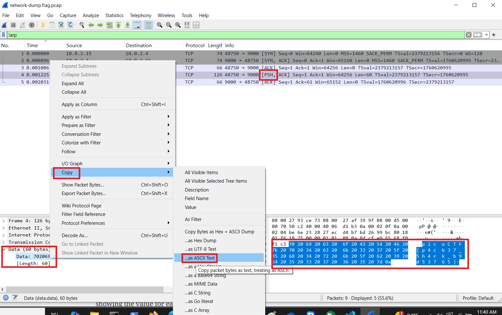

# picoGym Level 0286: Packets Primer
Source: https://play.picoctf.org/practice/challenge/286

## Goal
Download the packet capture file and use packet analysis software to find the flag<br>
Packet Capture File: https://artifacts.picoctf.net/c/195/network-dump.flag.pcap

## What I learned
```
Packet analysis
Wireshark: https://www.wireshark.org/
Filter	      Description
arp	            Show only ARP packets (Address Resolution Protocol)
tcp	            Show only TCP packets
udp	            Show only UDP packets
icmp	            Show only ICMP packets (ping, traceroute)
http	            Show only HTTP traffic
dns	            Show only DNS queries/responses
dhcp	            Show only DHCP packets
tls / ssl	      Show encrypted TLS/SSL traffic
ip	            Show all IPv4 traffic
ipv6	            Show all IPv6 traffic
eth	            Show all Ethernet frames

TCP Flags Overview
Flag	            Meaning
SYN	            Start a new TCP connection
ACK	            Acknowledgment for received data
FIN	            Finish/close a connection
RST	            Reset connection (abort)
PSH	            Push data immediately to the receiving application 👀
URG	            Urgent data in this packet
ECE / CWR	      Congestion control flags

tcpdump
      # Note: Not really installed on picoCTF so not using for picoCTF

      # Capture all traffic to a file
      sudo tcpdump -i eth0 -w capture.pcap

      # Capture only TCP traffic on port 80
      sudo tcpdump -i eth0 tcp port 80 -w capture_http.pcap

      # Read a capture file
      tcpdump -r capture.pcap
```

<table border="1" cellpadding="8" cellspacing="0">
  <tr>
    <th>Layer</th>
    <th>Responsibility</th>
    <th>Examples of Services / Protocols</th>
  </tr>
  <tr>
    <td><b>5 Application</b></td>
    <td>Handles communication between applications</td>
    <td>HTTP, HTTPS, FTP, DNS, SMTP, SSH</td>
  </tr>
  <tr>
    <td><b>4 Transport</b></td>
    <td>Ensures reliable or fast delivery btw applications (ports)</td>
    <td>3 TCP (reliable), UDP (fast, no guarantee)</td>
  </tr>
  <tr>
    <td><b>3 Network</b></td>
    <td>Provides logical addressing and routing</td>
    <td>IP (IPv4, IPv6), ICMP, RIP, OSPF</td>
  </tr>
  <tr>
    <td><b>2 Data Link</b></td>
    <td>Transfers frames btw directly connected devices (local network)</td>
    <td>Ethernet, Wi-Fi (802.11), ARP, PPP</td>
  </tr>
  <tr>
    <td><b>1 Physical</b></td>
    <td>Transmits raw bits over a medium</td>
    <td>Cables (Ethernet, Fiber), Radio signals (Wi-Fi, Bluetooth)</td>
  </tr>
</table><br>



## Solution
```
https://webshell.picoctf.org/

# File: Open or double click .pcap file
1	0.000000	10.0.2.15	10.0.2.4	TCP	74	48750 → 9000 [SYN] Seq=0 Win=64240 Len=0 MSS=1460 SACK_PERM TSval=2379213156 TSecr=0 WS=128
2	0.000896	10.0.2.4	10.0.2.15	TCP	74	9000 → 48750 [SYN, ACK] Seq=0 Ack=1 Win=65160 Len=0 MSS=1460 SACK_PERM TSval=1760620995 TSecr=2379213156 WS=128
3	0.001006	10.0.2.15	10.0.2.4	TCP	66	48750 → 9000 [ACK] Seq=1 Ack=1 Win=64256 Len=0 TSval=2379213157 TSecr=1760620995
4	0.001225	10.0.2.15	10.0.2.4	TCP	126	48750 → 9000 [PSH, ACK] Seq=1 Ack=1 Win=64256 Len=60 TSval=2379213157 TSecr=1760620995
5	0.002031	10.0.2.4	10.0.2.15	TCP	66	9000 → 48750 [ACK] Seq=1 Ack=61 Win=65152 Len=0 TSval=1760620996 TSecr=2379213157
6	5.020406	PCSSystemtec_93:ce:73	PCSSystemtec_af:39:9f	ARP	60	Who has 10.0.2.15? Tell 10.0.2.4
7	5.020454	PCSSystemtec_af:39:9f	PCSSystemtec_93:ce:73	ARP	42	10.0.2.15 is at 08:00:27:af:39:9f
8	5.031936	PCSSystemtec_af:39:9f	PCSSystemtec_93:ce:73	ARP	42	Who has 10.0.2.4? Tell 10.0.2.15
9	5.032822	PCSSystemtec_93:ce:73	PCSSystemtec_af:39:9f	ARP	60	10.0.2.4 is at 08:00:27:93:ce:73

# Filter: !arp
1	0.000000	10.0.2.15	10.0.2.4	TCP	74	48750 → 9000 [SYN] Seq=0 Win=64240 Len=0 MSS=1460 SACK_PERM TSval=2379213156 TSecr=0 WS=128
2	0.000896	10.0.2.4	10.0.2.15	TCP	74	9000 → 48750 [SYN, ACK] Seq=0 Ack=1 Win=65160 Len=0 MSS=1460 SACK_PERM TSval=1760620995 TSecr=2379213156 WS=128
3	0.001006	10.0.2.15	10.0.2.4	TCP	66	48750 → 9000 [ACK] Seq=1 Ack=1 Win=64256 Len=0 TSval=2379213157 TSecr=1760620995
4	0.001225	10.0.2.15	10.0.2.4	TCP	126	48750 → 9000 [👀PSH, ACK] Seq=1 Ack=1 Win=64256 Len=60 TSval=2379213157 TSecr=1760620995
5	0.002031	10.0.2.4	10.0.2.15	TCP	66	9000 → 48750 [ACK] Seq=1 Ack=61 Win=65152 Len=0 TSval=1760620996 TSecr=2379213157

# Copy as hex dump
0000   70 20 69 20 63 20 6f 20 43 20 54 20 46 20 7b 20
0010   70 20 34 20 63 20 6b 20 33 20 37 20 5f 20 35 20
0020   68 20 34 20 72 20 6b 20 5f 20 62 20 39 20 64 20
0030   35 20 33 20 37 20 36 20 35 20 7d 0a

# Copy as ASCII Text
p i c o C T F { p 4 c k 3 7 _ 5 h 4 r k _ b 9 d 5 3 7 6 5 } 👀

AsianHacker-picoctf@webshell:~$ echo "p i c o C T F { p 4 c k 3 7 _ 5 h 4 r k _ b 9 d 5 3 7 6 5 }" | tr -d " "
picoCTF{p4ck37_5h4rk_b9d53765} 🔐
```

## Flag
picoCTF{p4ck37_5h4rk_b9d53765}

## Continue
[Continue](./picoGym0471.md)