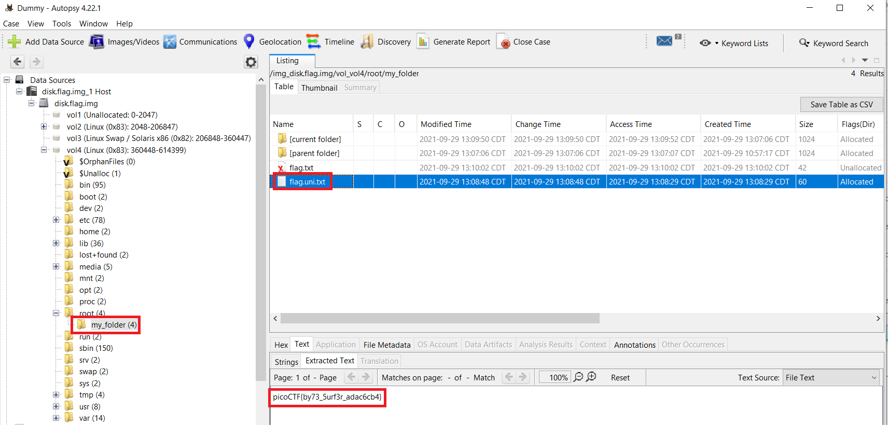

# picoGym Level 0300: Sleuthkit Apprentice
Source: https://play.picoctf.org/practice/challenge/300

## Goal
Download disk image and find the flag

## What I learned
```
Autopsy: https://www.autopsy.com/download/
man fls
man icat
man iconv

.ash_history
```



## Solution
```
https://webshell.picoctf.org/

AsianHacker-picoctf@webshell:~$ cd /tmp/ ⌨️
AsianHacker-picoctf@webshell:/tmp$ wget https://artifacts.picoctf.net/c/137/disk.flag.img.gz ⌨️
--2025-08-17 15:14:26--  https://artifacts.picoctf.net/c/137/disk.flag.img.gz
Resolving artifacts.picoctf.net (artifacts.picoctf.net)... 3.160.22.43, 3.160.22.92, 3.160.22.128, ...
Connecting to artifacts.picoctf.net (artifacts.picoctf.net)|3.160.22.43|:443... connected.
HTTP request sent, awaiting response... 200 OK
Length: 47534568 (45M) [application/octet-stream]
Saving to: 'disk.flag.img.gz'

disk.flag.img.gz                                           100%[======================================================================================================================================>]  45.33M  1.82MB/s    in 25s     

2025-08-17 15:14:51 (1.82 MB/s) - 'disk.flag.img.gz' saved [47534568/47534568]
AsianHacker-picoctf@webshell:/tmp$ gunzip disk.flag.img.gz ⌨️
AsianHacker-picoctf@webshell:/tmp$ mmls disk.flag.img ⌨️
DOS Partition Table
Offset Sector: 0
Units are in 512-byte sectors

      Slot      Start        End          Length       Description
000:  Meta      0000000000   0000000000   0000000001   Primary Table (#0)
001:  -------   0000000000   0000002047   0000002048   Unallocated
002:  000:000   0000002048   0000206847   0000204800   Linux (0x83)
003:  000:001   0000206848   0000360447   0000153600   Linux Swap / Solaris x86 (0x82)
004:  000:002   0000360448👀 0000614399   0000253952   Linux (0x83)
AsianHacker-picoctf@webshell:/tmp$ whatis blkcat mmls fls icat ⌨️
blkcat (1)           - Display the contents of file system data unit in a disk image.
mmls (1)             - Display the partition layout of a volume system (partition tables)
fls (1)              - List file and directory names in a disk image.
icat (1)             - Output the contents of a file based on its inode number.
AsianHacker-picoctf@webshell:/tmp$ fls ⌨️
Missing image name
AsianHacker-picoctf@webshell:/tmp$ fls -o 360448 disk.flag.img ⌨️
d/d 451:        home
d/d 11: lost+found
d/d 12: boot
d/d 1985:       etc
d/d 1986:       proc
d/d 1987:       dev
d/d 1988:       tmp
d/d 1989:       lib
d/d 1990:       var
d/d 3969:       usr
d/d 3970:       bin
d/d 1991:       sbin
d/d 1992:       media
d/d 1993:       mnt
d/d 1994:       opt
d/d 1995👀:    root
d/d 1996:       run
d/d 1997:       srv
d/d 1998:       sys
d/d 2358:       swap
V/V 31745:      $OrphanFiles
AsianHacker-picoctf@webshell:/tmp$ fls -o 360448 disk.flag.img 1995 ⌨️
r/r 2363👀:    .ash_history
d/d 3981:       my_folder
AsianHacker-picoctf@webshell:/tmp$ fls -o 360448 disk.flag.img 3981 ⌨️
r/r * 2082(realloc):    flag.txt
r/r 2371👀:    flag.uni.txt
AsianHacker-picoctf@webshell:/tmp$ icat -o 360448 disk.flag.img 3981 ⌨️

..flag.txtC
                flag.uni.txt
                            qU
AsianHacker-picoctf@webshell:/tmp$ icat -o 360448 disk.flag.img 2363 ⌨️
apk add nano
mkdir my_folder
cd my_folder/
nano flag.txt
ls -al
iconv -f ascii -t utf16 > flag.uni.txt 👀 
l
ls -al
iconv -f ascii -t utf16 flag.txt > flag.uni.txt 👀
ls -al
shred 👀
shred -zu flag.txt 👀 
ls -al
halt
AsianHacker-picoctf@webshell:/tmp$ whatis iconv ⌨️2
iconv (1posix)       - codeset conversion
iconv (1)            - convert text from one character encoding to another
iconv (3posix)       - codeset conversion function
iconv (3)            - perform character set conversion

# Extract flag.uni.txt from img file
AsianHacker-picoctf@webshell:/tmp$ icat -o 360448 disk.flag.img 2371 > flag.uni.txt ⌨️
AsianHacker-picoctf@webshell:/tmp$ file flag.uni.txt ⌨️
flag.uni.txt: data
AsianHacker-picoctf@webshell:/tmp$ cat flag.uni.txt ⌨️
picoCTF{by73_5urf3r_adac6cb4} 🔐
AsianHacker-picoctf@webshell:/tmp$ xxd flag.uni.txt | head ⌨️ 
00000000: 0070 0069 0063 006f 0043 0054 0046 007b  .p.i.c.o.C.T.F.{
00000010: 0062 0079 0037 0033 005f 0035 0075 0072  .b.y.7.3._.5.u.r
00000020: 0066 0033 0072 005f 0061 0064 0061 0063  .f.3.r._.a.d.a.c
00000030: 0036 0063 0062 0034 007d 000a            .6.c.b.4.}.. 🔐

Note: xxd look at first few bytes
    ff fe                                       UTF-16 Little Endian
    fe ff                                       UTF-16 Big Endian
    Plain ASCII (like 70 69 63 6f → pico)       Human Readable
```

## Flag
picoCTF{by73_5urf3r_adac6cb4}

## Continue
[Continue](./picoGym0137.md)