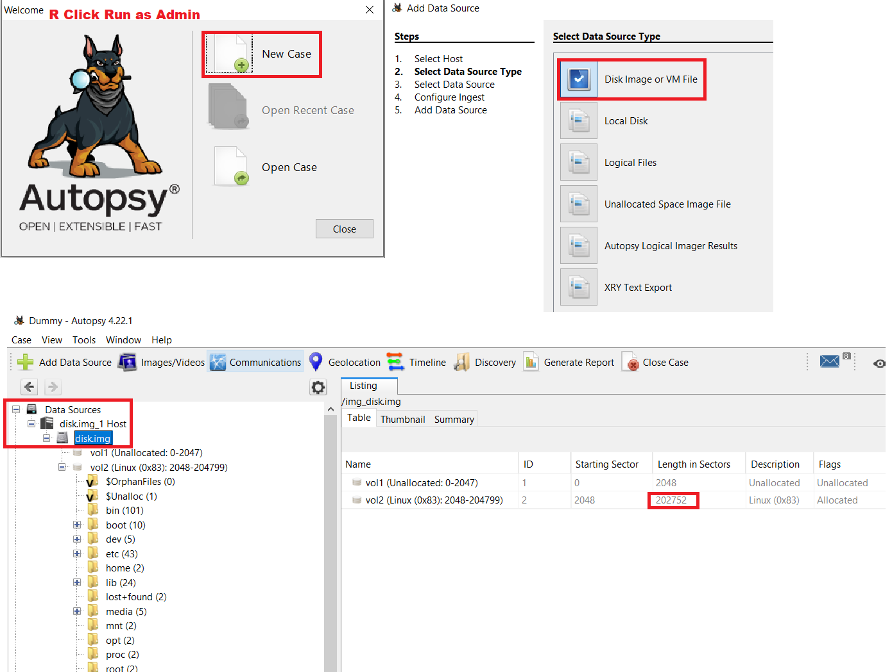

# picoGym Level 0301: Sleuthkit Intro
Source: https://play.picoctf.org/practice/challenge/301

## Goal
Download disk image and use <b>mmls</b> on it to find the <b>size of the Linux partition</b><br>
<b>Connect to remote checker service</b> to check your answer and get the flag

## What I learned
```
Disk Analysis
Autopsy: https://www.autopsy.com/download/
man mmls
```

## Side Quest ❤️❤️❤️❤️❤️Create a forensic image (.img) of a hard drive
```
# Identify the drive, Note: Don’t confuse w/ system drive (often /dev/sda)
sudo fdisk -l ⌨️
# Use dd to make a raw disk image
sudo dd if=/dev/sdX of=/path/to/output.img bs=4M status=progress ⌨️
    if                  input file (source drive, /dev/sdb)
    of                  output file (dest drive of .img, /mnt/data/drive.img)
    bs=4M               block size (speeds up copying)
    status=progress     shows progress (OPTIONAL)
    Example: sudo dd if=/dev/sdb of=~/forensics/drive.img bs=4M status=progress
# Optional: Generate an MD5 or SHA1 hash of original drive and the image, Note: should match
sudo md5sum /dev/sdb ⌨️
sudo md5sum ~/forensics/drive.img ⌨️
# Optinal: dcfldd like dd but supports hashing during imaging
sudo apt install dcfldd ⌨️
sudo dcfldd if=/dev/sdb of=~/forensics/drive.img hash=md5,sha256 hashlog=hashes.txt ⌨️
    Generate image and log hashes in hashes.txt
```



## Solution
```
https://webshell.picoctf.org/

AsianHacker-picoctf@webshell:~$ cd /tmp/ ⌨️
AsianHacker-picoctf@webshell:/tmp$ wget https://artifacts.picoctf.net/c/164/disk.img.gz ⌨️
--2025-08-17 14:37:58--  https://artifacts.picoctf.net/c/164/disk.img.gz ⌨️
Resolving artifacts.picoctf.net (artifacts.picoctf.net)... 3.160.22.16, 3.160.22.43, 3.160.22.128, ...
Connecting to artifacts.picoctf.net (artifacts.picoctf.net)|3.160.22.16|:443... connected.
HTTP request sent, awaiting response... 200 OK
Length: 29714372 (28M) [application/octet-stream]
Saving to: 'disk.img.gz'

disk.img.gz                                                100%[======================================================================================================================================>]  28.34M  1.82MB/s    in 16s     

2025-08-17 14:38:14 (1.82 MB/s) - 'disk.img.gz' saved [29714372/29714372]
AsianHacker-picoctf@webshell:/tmp$ file disk.img.gz 
disk.img.gz: gzip compressed data, was "disk.img", last modified: Tue Sep 21 19:34:53 2021, from Unix, original size modulo 2^32 104857600
AsianHacker-picoctf@webshell:/tmp$ gunzip disk.img.gz ⌨️
AsianHacker-picoctf@webshell:/tmp$ mmls disk.img ⌨️
DOS Partition Table
Offset Sector: 0
Units are in 512-byte sectors

      Slot      Start        End          Length       Description
000:  Meta      0000000000   0000000000   0000000001   Primary Table (#0)
001:  -------   0000000000   0000002047   0000002048   Unallocated
002:  000:000   0000002048   0000204799   0000202752👀 Linux (0x83)
AsianHacker-picoctf@webshell:/tmp$ rm disk.img ⌨️

Launch Instance on picoCTF:
    Access checker program: nc saturn.picoctf.net 61923

AsianHacker-picoctf@webshell:/tmp$ nc saturn.picoctf.net 61923 ⌨️
What is the size of the Linux partition in the given disk image?
Length in sectors: 202752 ⌨️
202752
Great work!
picoCTF{mm15_f7w!} 🔐
exit ⌨️
```

## Flag
picoCTF{mm15_f7w!}

## Continue
[Continue](./picoGym0300.md)