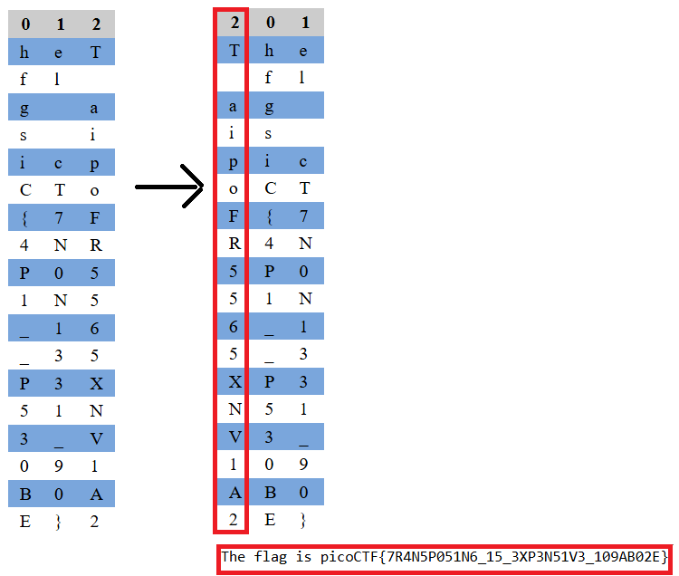

# picoGym Level 312: transposition-trial
Source: https://play.picoctf.org/practice/challenge/312

## Goal
Our data got corrupted on the way here. Luckily, nothing got replaced, but every block of 3 got scrambled around!<br>
The first word seems to be three letters long, maybe you can use that to recover the rest of the message<br>
Download the corrupted message here.<br>
https://artifacts.picoctf.net/c/192/message.txt

## What I learned
```
Block of 3 (Manual)

heT
fl 
g a
s i
icp
CTo
{7F
4NR
P05
1N5
_16
_35
P3X
51N
3_V
091
B0A
E}2   
```



## Solution
```
https://webshell.picoctf.org/

AsianHacker-picoctf@webshell:~$ cd /tmp/ ⌨️
AsianHacker-picoctf@webshell:/tmp$ wget https://artifacts.picoctf.net/c/192/message.txt ⌨️
--2025-09-08 23:41:27--  https://artifacts.picoctf.net/c/192/message.txt
Resolving artifacts.picoctf.net (artifacts.picoctf.net)... 3.170.131.33, 3.170.131.72, 3.170.131.77, ...
Connecting to artifacts.picoctf.net (artifacts.picoctf.net)|3.170.131.33|:443... connected.
HTTP request sent, awaiting response... 200 OK
Length: 54 [application/octet-stream]
Saving to: 'message.txt'

message.txt                                                100%[======================================================================================================================================>]      54  --.-KB/s    in 0s      

2025-09-08 23:41:27 (29.2 MB/s) - 'message.txt' saved [54/54]

AsianHacker-picoctf@webshell:/tmp$ cat message.txt ⌨️
heTfl g as iicpCTo{7F4NRP051N5_16_35P3X51N3_V091B0AE}2 👀

# Method 1:
AsianHacker-picoctf@webshell:/tmp$ vi pythonScript.py ⌨️
AsianHacker-picoctf@webshell:/tmp$ cat pythonScript.py ⌨️
def main():
    f = open("message.txt", "r", encoding="UTF-8")
    txt = f.read()

    n=3
    txt3gram = [txt[i:i+n] for i in range(0, len(txt), n)]
    decode_lst = []

    for i in range(len(txt3gram)):
        decode_lst.append(txt3gram[i][2]+txt3gram[i][0]+txt3gram[i][1])

    print(''.join(decode_lst))

if __name__ == '__main__':
    main()
AsianHacker-picoctf@webshell:/tmp$ python3 pythonScript.py ⌨️
The flag is picoCTF{7R4N5P051N6_15_3XP3N51V3_109AB02E} 🔐

Method 2:
AsianHacker-picoctf@webshell:/tmp$ vi pythonScript.py ⌨️
AsianHacker-picoctf@webshell:/tmp$ cat pythonScript.py ⌨️
def main() -> None:
    enc_flag = "heTfl g as iicpCTo{7F4NRP051N5_16_35P3X51N3_V091B0AE}2"
    flag = ""

    blocks_of_3 = [enc_flag[i:i+3] for i in range(0, len(enc_flag), 3)]

    for block in blocks_of_3:
        if len(block) == 3:
            flag += block[2] + block[0] + block[1]
        else:
            flag += block  # keep leftover chars unchanged

    print(flag)

if __name__ == "__main__":
    main()

AsianHacker-picoctf@webshell:/tmp$ python3 pythonScript.py ⌨️
The flag is picoCTF{7R4N5P051N6_15_3XP3N51V3_109AB02E} 🔐

Method 3:
AsianHacker-picoctf@webshell:/tmp$ cat pythonScript.py ⌨️
#!/usr/bin/env python3

def main() -> None:
    with open("message.txt") as fileptr:
        contents = fileptr.read()

    # print(contents)

    flag = []
    for i in range(0, len(contents), 3):
        # print(i)
        chunk = contents[i: i+3]
        # print(chunk)
        col0, col1, col2 = chunk
        # print(col2, col0, col1)
        print(col2 + col0 + col1, end="")
        flag.append(col2 + col0 + col1)
    print()

    # flag = "".join(flag).split()              # ['The', 'flag', 'is', 'picoCTF{7R4N5P051N6_15_3XP3N51V3_109AB02E}']
    flag = "".join(flag).split()[-1]
    print(flag)

if __name__ == "__main__":
    main()
AsianHacker-picoctf@webshell:/tmp$ python3 pythonScript.py ⌨️
The flag is picoCTF{7R4N5P051N6_15_3XP3N51V3_109AB02E} 🔐
picoCTF{7R4N5P051N6_15_3XP3N51V3_109AB02E} 🔐

Method 4:
https://tholman.com/other/transposition/
The flag is picoCTF{7R4N5P051N6_15_3XP3N51V3_109AB02E} 🔐
```

## Flag
picoCTF{7R4N5P051N6_15_3XP3N51V3_109AB02E}

## Continue
[Continue](./picoGym0351.md)