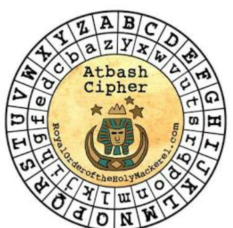

# picoGym Level 351: HideToSee
Source: https://play.picoctf.org/practice/challenge/351

## Goal
How about some hide and seek heh?<br>
Look at this image here<br>
https://artifacts.picoctf.net/c/240/atbash.jpg

## What I learned
```
steghide
```



## Solution
```
https://webshell.picoctf.org/

AsianHacker-picoctf@webshell:~$ cd /tmp/ ⌨️
AsianHacker-picoctf@webshell:/tmp$ wget https://artifacts.picoctf.net/c/240/atbash.jpg ⌨️
--2025-09-09 03:36:06--  https://artifacts.picoctf.net/c/240/atbash.jpg
Resolving artifacts.picoctf.net (artifacts.picoctf.net)... 3.170.131.33, 3.170.131.77, 3.170.131.72, ...
Connecting to artifacts.picoctf.net (artifacts.picoctf.net)|3.170.131.33|:443... connected.
HTTP request sent, awaiting response... 200 OK
Length: 51508 (50K) [application/octet-stream]
Saving to: 'atbash.jpg'

atbash.jpg                                                 100%[======================================================================================================================================>]  50.30K  --.-KB/s    in 0.02s   

2025-09-09 03:36:06 (2.12 MB/s) - 'atbash.jpg' saved [51508/51508]

AsianHacker-picoctf@webshell:/tmp$ steghide extract -sf atbash.jpg ⌨️
Enter passphrase: ⌨️
wrote extracted data to "encrypted.txt". 👀
AsianHacker-picoctf@webshell:/tmp$ cat encrypted.txt ⌨️
krxlXGU{zgyzhs_xizxp_xz00558y} 👀

# Cipher Identifier 
https://www.dcode.fr/cipher-identifier
    Atbash Cipher 👀
    Mono-alphabetic Substitution 👀
    Cipher Disk/Wheel

# Method 1: Atbash Cipher
https://www.dcode.fr/atbash-cipher
picoCTF{atbash_crack_ca00558b} 🔐

# Method 2: Monoalphabetic Substitution Decoder
https://www.dcode.fr/monoalphabetic-substitution
Monoalphabetic Substitution Decoder
Alphabetic substitution ciphertext
krxlXGU{zgyzhs_xizxp_xz00558y} ⌨️

Other decryption methods
Knowing the substitution alphabet
zYXWVUTSRQPONMLKJIHGFEDCBA ⌨️                 # From picture
DECRYPT
picoCTF{atbash_crack_ca00558b} 🔐
```

## Flag
picoCTF{atbash_crack_ca00558b}

## Continue
[Continue](./picoGym0289.md)