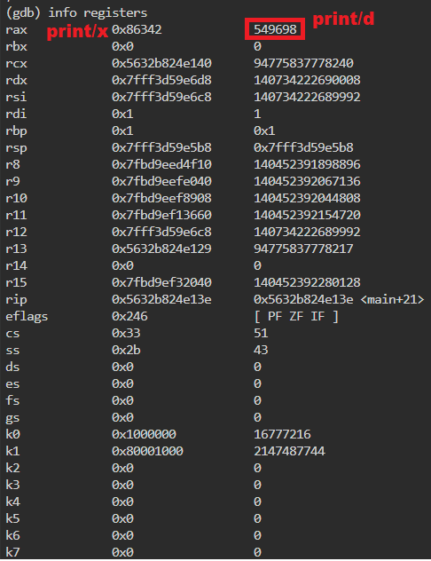

# picoGym Level 395: GDB baby step 1
Source: https://play.picoctf.org/practice/challenge/395

## Goal
Can you figure out what is in the eax register at the end of the main function?<br>
Put your answer in the picoCTF flag format: picoCTF{n} where n is the contents of the eax register in the decimal number base.<br>
If the answer was 0x11 your flag would be picoCTF{17}.<br>
Disassemble this.<br>
https://artifacts.picoctf.net/c/512/debugger0_a

## What I learned
```
Reverse Engineering
gdb
    info functions
    print/d $eax            p/d 0x86342
```

## Solution
```
https://webshell.picoctf.org/

AsianHacker-picoctf@webshell:~$ wget https://artifacts.picoctf.net/c/512/debugger0_a ⌨️
--2025-09-27 06:55:32--  https://artifacts.picoctf.net/c/512/debugger0_a
Resolving artifacts.picoctf.net (artifacts.picoctf.net)... 3.170.131.77, 3.170.131.72, 3.170.131.33, ...
Connecting to artifacts.picoctf.net (artifacts.picoctf.net)|3.170.131.77|:443... connected.
HTTP request sent, awaiting response... 200 OK
Length: 16472 (16K) [application/octet-stream]
Saving to: 'debugger0_a'

debugger0_a                                                100%[======================================================================================================================================>]  16.09K  --.-KB/s    in 0s      

2025-09-27 06:55:32 (191 MB/s) - 'debugger0_a' saved [16472/16472]

AsianHacker-picoctf@webshell:~$ file debugger0_a ⌨️
debugger0_a: ELF 64-bit LSB pie executable, x86-64, version 1 (SYSV), dynamically linked, interpreter /lib64/ld-linux-x86-64.so.2, BuildID[sha1]=15a10290db2cd2ec0c123cf80b88ed7d7f5cf9ff, for GNU/Linux 3.2.0, not stripped
AsianHacker-picoctf@webshell:~$ chmod +x debugger0_a ⌨️ 

AsianHacker-picoctf@webshell:~$ gdb -q debugger_a ⌨️
Reading symbols from debugger_a...
(No debugging symbols found in debugger_a)
(gdb) info functions ⌨️
All defined functions:
Non-debugging symbols:
0x0000000000001000 _init
0x0000000000001030 __cxa_finalize@plt
0x0000000000001040 _start
0x0000000000001070 deregister_tm_clones
0x00000000000010a0 register_tm_clones
0x00000000000010e0 __do_global_dtors_aux
0x0000000000001120 frame_dummy
0x0000000000001129 main 👀
000000000000001140 __libc_csu_init
000000000000001160 __libc_csu_fini
0x00000000000011b8 _fini
(gdb) set disassembly-flavor intel ⌨️
(gdb) disassemble main ⌨️
Dump of assembler code for function main:
00000000000001129 <+0>:     endbr64
0x000000000000112d <+4>:    push    rbp
0x000000000000112e <+5>:    mov     rbp, rsp
0x0000000000001131 <+8>:    mov     DWORD PTR [rbp-0x4], edi
00000000000001134 <+11>:    mov     QWORD PTR [rbp-0x10],rsi
0x0000000000001138 <+15>:   mov     eax,0x86342 👀
0x000000000000113d <+20>:   pop     rbp
0x000000000000113e <+21>:   ret 👀
End of assembler dump.

(gdb) break *(main+21) ⌨️
Breakpoint 1 at 0x113e
(gdb) run ⌨️
Starting program: /home/AsianHacker-picoctf/debugger_a
warning: Error disabling address space randomization: Operation not permitted [Thread debugging using libthread_db enabled]
Using host libthread_db library "/lib/x86_64-linux-gnu/libthread_db.so.1".

Breakpoint 1, 0x00005632b824e13e in main ()
(gdb) print/x $eax ⌨️
$1 = 0x86342
(gdb) print/d $eax ⌨️                              (gdb) p/d 0x86342 ⌨️
$2 = 549698 🔐
```



## Flag
picoCTF{549698}

## Continue
[Continue](./picoGym0396.md)