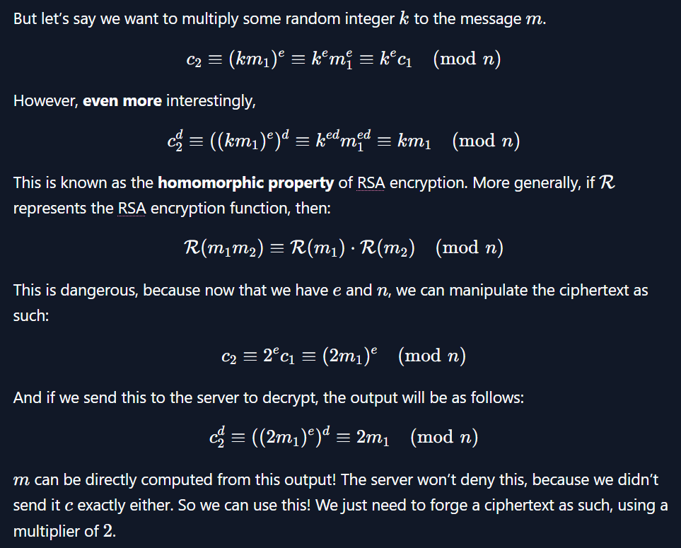

# picoGym Level 422: rsa_oracle
Source: https://play.picoctf.org/practice/challenge/422

## Goal
Can you abuse the oracle?<br>
An attacker was able to intercept communications between a bank and a fintech company. They managed to get the message (ciphertext) and the password that was used to encrypt the message.<br>
message: https://artifacts.picoctf.net/c_titan/151/secret.enc<br>
password: https://artifacts.picoctf.net/c_titan/151/password.enc<br>
After some intensive reconassainance they found out that the bank has an oracle that was used to encrypt the password and can be found here nc titan.picoctf.net 60565. Decrypt the password and use it to decrypt the message. The oracle can decrypt anything except the password.

## What I learned
```
password.enc is an encrypted password for the secret.enc file

Given c(ciphertext) oracle refuses to decrypt
most common public exponent used RSA e=65537
n is modulus we trying solve

openssl enc -aes-256-cbc -d -in secret.enc ⌨️

c≡m^e (modn)
    m^e written as c+kn, where k is some unknown integer
    m^e −c = kn
    m^e −c ≡ 0(modn)

RSA encryption is defined as:
    c≡m^e(modn)
RSA decyption is defined as:
    c^d≡m(modn)

How to solve since original filtered: 
Program Decrypt since original filtered: 2^e mod n * m^e mod n = (2m)^e mod n 👀
Divide by 2 👀
```



## Solution
```
https://webshell.picoctf.org/

AsianHacker-picoctf@webshell:~$ cd /tmp/ ⌨️
AsianHacker-picoctf@webshell:/tmp$ wget https://artifacts.picoctf.net/c_titan/151/password.enc https://artifacts.picoctf.net/c_titan/151/secret.enc ⌨️
--2025-09-12 20:34:19--  https://artifacts.picoctf.net/c_titan/151/password.enc
Resolving artifacts.picoctf.net (artifacts.picoctf.net)... 3.170.131.77, 3.170.131.72, 3.170.131.33, ...
Connecting to artifacts.picoctf.net (artifacts.picoctf.net)|3.170.131.77|:443... connected.
HTTP request sent, awaiting response... 200 OK
Length: 154 [application/octet-stream]
Saving to: 'password.enc.1'

password.enc.1                                             100%[======================================================================================================================================>]     154  --.-KB/s    in 0s      

2025-09-12 20:34:19 (124 MB/s) - 'password.enc.1' saved [154/154]

--2025-09-12 20:34:19--  https://artifacts.picoctf.net/c_titan/151/secret.enc
Reusing existing connection to artifacts.picoctf.net:443.
HTTP request sent, awaiting response... 200 OK
Length: 64 [application/octet-stream]
Saving to: 'secret.enc.1'

secret.enc.1                                               100%[======================================================================================================================================>]      64  --.-KB/s    in 0s      

2025-09-12 20:34:19 (65.6 MB/s) - 'secret.enc.1' saved [64/64]

FINISHED --2025-09-12 20:34:19--
Total wall clock time: 0.2s
Downloaded: 2 files, 218 in 0s (98.4 MB/s)

AsianHacker-picoctf@webshell:/tmp$ file password.enc ⌨️
password.enc: ASCII text, with no line terminators
AsianHacker-picoctf@webshell:/tmp$ cat password.enc ⌨️
4228273471152570993857755209040611143227336245190875847649142807501848960847851973658239485570030833999780269457000091948785164374915942471027917017922546
AsianHacker-picoctf@webshell:/tmp$ file secret.enc ⌨️
secret.enc: openssl enc'd data with salted password 👀
AsianHacker-picoctf@webshell:/tmp$ cat secret.enc ⌨️
Salted__rF7]{Oe3LbAh,Ո;u{^aX70ծ02|l8O&7
AsianHacker-picoctf@webshell:/tmp$ nc titan.picoctf.net 60565 ⌨️
*****************************************
****************THE ORACLE***************
*****************************************
E --> encrypt D --> decrypt. 
E ⌨️
enter text to encrypt (encoded length must be less than keysize): a ⌨️
a

encoded cleartext as Hex m: 61

ciphertext (m ^ e mod n) 🕵️‍♀️ 1894792376935242028465556366618011019548511575881945413668351305441716829547731248120542989065588556431978903597240454296152579184569578379625520200356186

what should we do for you? 
E --> encrypt D --> decrypt. 
D ⌨️
Enter text to decrypt: 1894792376935242028465556366618011019548511575881945413668351305441716829547731248120542989065588556431978903597240454296152579184569578379625520200356186 ⌨️
decrypted ciphertext as hex (c ^ d mod n): 61
decrypted ciphertext: a
what should we do for you? 
E --> encrypt D --> decrypt. 
D ⌨️
Enter text to decrypt: 4228273471152570993857755209040611143227336245190875847649142807501848960847851973658239485570030833999780269457000091948785164374915942471027917017922546
Lol, good try, can't decrypt that for you. Be creative and good luck

Method 1:
AsianHacker-picoctf@webshell:/tmp$ cat pythonScript.py ⌨️
from pwn import *
from gmpy2 import mpz, gcd
from functools import reduce

HOST = "titan.picoctf.net"
PORT = 60565

server = remote(HOST, PORT)

context.log_level = "debug"
C = []

for i in range(48, 58):
    server.recvuntil(b'E --> encrypt D --> decrypt. \n')
    server.sendline(b'E')
    server.recvuntil(b'enter text to encrypt (encoded length must be less than keysize): ')
    server.sendline(chr(i).encode())
    trashcan = [server.recvline() for i in range(4)]
    c = int(server.recvline().decode().strip().split()[-1])
    C.append(c)

# "zeroes" because these are 0 mod n
zeroes = []
e = 0x10001

for i in range(10):
    zeroes.append(mpz((i+48)**e - C[i]))

# Apply gcd() to each pair in zeroes
n = reduce(gcd, zeroes)
print(f"{n = }")
AsianHacker-picoctf@webshell:/tmp$ python3 pythonScript.py 
[+] Opening connection to titan.picoctf.net on port 60565: Done
[DEBUG] Received 0xb8 bytes:
    b'*****************************************\n'
    b'****************THE ORACLE***************\n'
    b'*****************************************\n'
    b'what should we do for you? \n'
    b'E --> encrypt D --> decrypt. \n'
[DEBUG] Sent 0x2 bytes:
    b'E\n'
[DEBUG] Received 0x42 bytes:
    b'enter text to encrypt (encoded length must be less than keysize): '
[DEBUG] Sent 0x2 bytes:
    b'0\n'
[DEBUG] Received 0x112 bytes:
    b'0\n'
    b'\n'
    b'encoded cleartext as Hex m: 30\n'
    b'\n'
    b'ciphertext (m ^ e mod n) 1243958178683320908070161277021530462031994559804812917604345413992816962699847617028301295671668162470014721804001815030262979327683265430847247544407395\n'
    b'\n'
    b'what should we do for you? \n'
    b'E --> encrypt D --> decrypt. \n'
[DEBUG] Sent 0x2 bytes:
    b'E\n'
[DEBUG] Received 0x42 bytes:
    b'enter text to encrypt (encoded length must be less than keysize): '
[DEBUG] Sent 0x2 bytes:
    b'1\n'
[DEBUG] Received 0x112 bytes:
    b'1\n'
    b'\n'
    b'encoded cleartext as Hex m: 31\n'
    b'\n'
    b'ciphertext (m ^ e mod n) 4374671741411819653095065203638363839705760144524191633605358134684143978321095859047126585649272872908765432040943055399247499744070371810470682366100689\n'
    b'\n'
    b'what should we do for you? \n'
    b'E --> encrypt D --> decrypt. \n'
[DEBUG] Sent 0x2 bytes:
    b'E\n'
[DEBUG] Received 0x42 bytes:
    b'enter text to encrypt (encoded length must be less than keysize): '
[DEBUG] Sent 0x2 bytes:
    b'2\n'
[DEBUG] Received 0x112 bytes:
    b'2\n'
    b'\n'
    b'encoded cleartext as Hex m: 32\n'
    b'\n'
    b'ciphertext (m ^ e mod n) 4707619883686427763240856106433203231481313994680729548861877810439954027216515481620077982254465432294427487895036699854948548980054737181231034760249505\n'
    b'\n'
    b'what should we do for you? \n'
    b'E --> encrypt D --> decrypt. \n'
[DEBUG] Sent 0x2 bytes:
    b'E\n'
[DEBUG] Received 0x42 bytes:
    b'enter text to encrypt (encoded length must be less than keysize): '
[DEBUG] Sent 0x2 bytes:
    b'3\n'
[DEBUG] Received 0x112 bytes:
    b'3\n'
    b'\n'
    b'encoded cleartext as Hex m: 33\n'
    b'\n'
    b'ciphertext (m ^ e mod n) 1998517197048216725617978890728205902760633363770165103499700157925986170022682604311921651991344892635565706489644418147980643978563559991322776155635395\n'
    b'\n'
    b'what should we do for you? \n'
    b'E --> encrypt D --> decrypt. \n'
[DEBUG] Sent 0x2 bytes:
    b'E\n'
[DEBUG] Received 0x42 bytes:
    b'enter text to encrypt (encoded length must be less than keysize): '
[DEBUG] Sent 0x2 bytes:
    b'4\n'
[DEBUG] Received 0x112 bytes:
    b'4\n'
    b'\n'
    b'encoded cleartext as Hex m: 34\n'
    b'\n'
    b'ciphertext (m ^ e mod n) 3993239489061277327472930109138093827255646312769901312414509207541733524779884801267968848884701166599834406248783129646083261476137481855550108336137485\n'
    b'\n'
    b'what should we do for you? \n'
    b'E --> encrypt D --> decrypt. \n'
[DEBUG] Sent 0x2 bytes:
    b'E\n'
[DEBUG] Received 0x42 bytes:
    b'enter text to encrypt (encoded length must be less than keysize): '
[DEBUG] Sent 0x2 bytes:
    b'5\n'
[DEBUG] Received 0x111 bytes:
    b'5\n'
    b'\n'
    b'encoded cleartext as Hex m: 35\n'
    b'\n'
    b'ciphertext (m ^ e mod n) 328779559998814913351140854640801391504762517581365098951033961875402256487125183765198160515443022459576165533710527230789639796593595281878338659777623\n'
    b'\n'
    b'what should we do for you? \n'
    b'E --> encrypt D --> decrypt. \n'
[DEBUG] Sent 0x2 bytes:
    b'E\n'
[DEBUG] Received 0x42 bytes:
    b'enter text to encrypt (encoded length must be less than keysize): '
[DEBUG] Sent 0x2 bytes:
    b'6\n'
[DEBUG] Received 0x111 bytes:
    b'6\n'
    b'\n'
    b'encoded cleartext as Hex m: 36\n'
    b'\n'
    b'ciphertext (m ^ e mod n) 508360559793312228361545941076593796079256051359377890404057392041173201350679527907093749381195342508061459153102529554871397740660835126208934293942761\n'
    b'\n'
    b'what should we do for you? \n'
    b'E --> encrypt D --> decrypt. \n'
[DEBUG] Sent 0x2 bytes:
    b'E\n'
[DEBUG] Received 0x42 bytes:
    b'enter text to encrypt (encoded length must be less than keysize): '
[DEBUG] Sent 0x2 bytes:
    b'7\n'
[DEBUG] Received 0x112 bytes:
    b'7\n'
    b'\n'
    b'encoded cleartext as Hex m: 37\n'
    b'\n'
    b'ciphertext (m ^ e mod n) 5002474138330219243112096565143863705755054111442789206919780309403667384723154971505517469253117259353073951256973243424364195182593342002580198985676409\n'
    b'\n'
    b'what should we do for you? \n'
    b'E --> encrypt D --> decrypt. \n'
[DEBUG] Sent 0x2 bytes:
    b'E\n'
[DEBUG] Received 0x42 bytes:
    b'enter text to encrypt (encoded length must be less than keysize): '
[DEBUG] Sent 0x2 bytes:
    b'8\n'
[DEBUG] Received 0x112 bytes:
    b'8\n'
    b'\n'
    b'encoded cleartext as Hex m: 38\n'
    b'\n'
    b'ciphertext (m ^ e mod n) 3962885747032237048563203266800808330175112247333732321735351753169232054702982661805998750558285796048093739565189037282097606094213598364139769992243261\n'
    b'\n'
    b'what should we do for you? \n'
    b'E --> encrypt D --> decrypt. \n'
[DEBUG] Sent 0x2 bytes:
    b'E\n'
[DEBUG] Received 0x42 bytes:
    b'enter text to encrypt (encoded length must be less than keysize): '
[DEBUG] Sent 0x2 bytes:
    b'9\n'
[DEBUG] Received 0x112 bytes:
    b'9\n'
    b'\n'
    b'encoded cleartext as Hex m: 39\n'
    b'\n'
    b'ciphertext (m ^ e mod n) 3976927781175722497080224681014184429139781651342831929998436691450478467979974323760666152112741594655056439629116772185373232335940310348857668827068052\n'
    b'\n'
    b'what should we do for you? \n'
    b'E --> encrypt D --> decrypt. \n'
n = mpz(5507598452356422225755194020880876452588463543445995226287547479009566151786764261801368190219042978883834809435145954028371516656752643743433517325277971)
[*] Closed connection to titan.picoctf.net port 60565

AsianHacker-picoctf@webshell:/tmp$ cat pythonScript.py ⌨️
from pwn import *       # need this for remote() function

HOST = "titan.picoctf.net"
PORT = 60565

server = remote(HOST, PORT)

c = 4228273471152570993857755209040611143227336245190875847649142807501848960847851973658239485570030833999780269457000091948785164374915942471027917017922546
e = 65537
n_solved = 5507598452356422225755194020880876452588463543445995226287547479009566151786764261801368190219042978883834809435145954028371516656752643743433517325277971
cprime = c * pow(2, e, n_solved) % n_solved

server.recvuntil(b'E --> encrypt D --> decrypt. \n')
server.sendline(b'D')
server.recvuntil(b'Enter text to decrypt: ')
server.sendline(str(cprime).encode())
c2 = int(server.recvline().decode().strip().split()[-1], 16)

print(bytes.fromhex(format(c2//2, "x")))
AsianHacker-picoctf@webshell:/tmp$ python3 pythonScript.py 
[+] Opening connection to titan.picoctf.net on port 60565: Done
b'da099' 👀
[*] Closed connection to titan.picoctf.net port 60565
# Note: encryption password was da099

AsianHacker-picoctf@webshell:/tmp$ openssl enc -aes-256-cbc -d -in secret.enc ⌨️
enter AES-256-CBC decryption password: ⌨️
*** WARNING : deprecated key derivation used.
Using -iter or -pbkdf2 would be better.
picoCTF{su((3ss_(r@ck1ng_r3@_da099d93} 🔐
```

## Flag
picoCTF{su((3ss_(r@ck1ng_r3@_da099d93}

## Continue
[Continue](./picoGym0186.md)