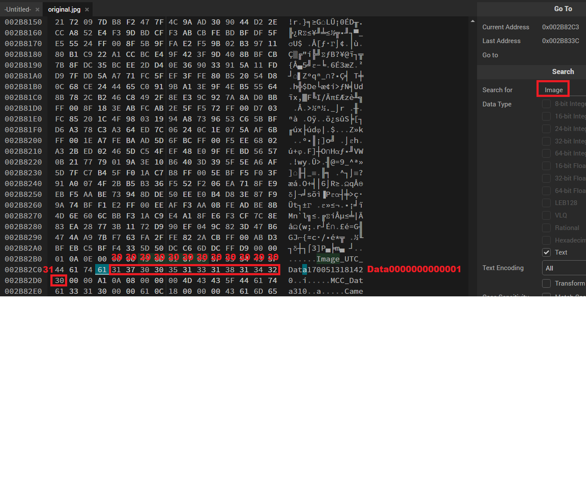

# picoGym Level 432: Blast from the past
Source: https://play.picoctf.org/practice/challenge/432

## Goal
The judge for these pictures is a real fan of antiques. Can you age this photo to the specifications?<br>
Set the timestamps on this picture to 1970:01:01 00:00:00.001+00:00 with as much precision as possible for each timestamp.<br>
In this example, +00:00 is a timezone adjustment. Any timezone is acceptable as long as the time is equivalent.<br>
As an example, this timestamp is acceptable as well: 1969:12:31 19:00:00.001-05:00.<br>
For timestamps without a timezone adjustment, put them in GMT time (+00:00). The checker program provides the timestamp needed for each.<br>
Use this picture.<br>
https://artifacts.picoctf.net/c_mimas/89/original.jpg<br>
Submit your modified picture here:<br>
nc -w 2 mimas.picoctf.net 52040 < original_modified.jpg<br>
Check your modified picture here:<br>
nc mimas.picoctf.net 65304

## What I learned
```
https://stackoverflow.com/questions/78185037/how-to-edit-the-samsung-trailer-tag-timestamp
According to documentation, the TimeStamp tag is located 13 bytes after the first 14 bytes of [Image_UTC_Data]

exiftool -Samsung:Timestamp original.jpg

HexEd.it
```

## Solution
```
https://webshell.picoctf.org/

AsianHacker-picoctf@webshell:~$ wget https://artifacts.picoctf.net/c_mimas/89/original.jpg ⌨️
--2025-09-24 03:03:21--  https://artifacts.picoctf.net/c_mimas/89/original.jpg
Resolving artifacts.picoctf.net (artifacts.picoctf.net)... 3.170.131.18, 3.170.131.77, 3.170.131.72, ...
Connecting to artifacts.picoctf.net (artifacts.picoctf.net)|3.170.131.18|:443... connected.
HTTP request sent, awaiting response... 200 OK
Length: 2851929 (2.7M) [application/octet-stream]
Saving to: 'original.jpg'

original.jpg                                               100%[======================================================================================================================================>]   2.72M  1.82MB/s    in 1.5s    

2025-09-24 03:03:23 (1.82 MB/s) - 'original.jpg' saved [2851929/2851929]

AsianHacker-picoctf@webshell:~$ file original.jpg 
original.jpg: JPEG image data, Exif standard: [TIFF image data, little-endian, direntries=19, height=3000, description=, manufacturer=samsung, model=SM-A326U, orientation=upper-right, xresolution=338, yresolution=346, resolutionunit=2, software=MediaTek Camera Application, datetime=2023:11:20 15:46:23, width=4000], baseline, precision 8, 4000x3000, components 3
AsianHacker-picoctf@webshell:~$ binwalk original.jpg ⌨️

DECIMAL       HEXADECIMAL     DESCRIPTION
--------------------------------------------------------------------------------
0             0x0             JPEG image data, EXIF standard
12            0xC             TIFF image data, little-endian offset of first image directory: 8
1408          0x580           JPEG image data, JFIF standard 1.01

AsianHacker-picoctf@webshell:~$ exiftool original.jpg ⌨️
ExifTool Version Number         : 12.40
File Name                       : original.jpg
Directory                       : .
File Size                       : 2.7 MiB
File Modification Date/Time     : 2024:03:13 17:45:08+00:00
File Access Date/Time           : 2025:09:24 03:03:32+00:00
File Inode Change Date/Time     : 2025:09:24 03:03:23+00:00
File Permissions                : -rw-rw-r--
File Type                       : JPEG
File Type Extension             : jpg
MIME Type                       : image/jpeg
Exif Byte Order                 : Little-endian (Intel, II)
Image Description               : 
Make                            : samsung
Camera Model Name               : SM-A326U
Orientation                     : Rotate 90 CW
X Resolution                    : 72
Y Resolution                    : 72
Resolution Unit                 : inches
Software                        : MediaTek Camera Application
Modify Date                     : 2023:11:20 15:46:23
Y Cb Cr Positioning             : Co-sited
Exposure Time                   : 1/24
F Number                        : 1.8
Exposure Program                : Program AE
ISO                             : 500
Sensitivity Type                : Unknown
Recommended Exposure Index      : 0
Exif Version                    : 0220
Date/Time Original              : 2023:11:20 15:46:23
Create Date                     : 2023:11:20 15:46:23
Components Configuration        : Y, Cb, Cr, -
Shutter Speed Value             : 1/24
Aperture Value                  : 1.9
Brightness Value                : 3
Exposure Compensation           : 0
Max Aperture Value              : 1.8
Metering Mode                   : Center-weighted average
Light Source                    : Other
Flash                           : On, Fired
Focal Length                    : 4.6 mm
Sub Sec Time                    : 703
Sub Sec Time Original           : 703
Sub Sec Time Digitized          : 703
Flashpix Version                : 0100
Color Space                     : sRGB
Exif Image Width                : 4000
Exif Image Height               : 3000
Interoperability Index          : R98 - DCF basic file (sRGB)
Interoperability Version        : 0100
Exposure Mode                   : Auto
White Balance                   : Auto
Digital Zoom Ratio              : 1
Focal Length In 35mm Format     : 25 mm
Scene Capture Type              : Standard
Compression                     : JPEG (old-style)
Thumbnail Offset                : 1408
Thumbnail Length                : 64000
Image Width                     : 4000
Image Height                    : 3000
Encoding Process                : Baseline DCT, Huffman coding
Bits Per Sample                 : 8
Color Components                : 3
Y Cb Cr Sub Sampling            : YCbCr4:2:0 (2 2)
Time Stamp                      : 2023:11:20 20:46:21+00:00 👀
MCC Data                        : 310
Aperture                        : 1.8
Image Size                      : 4000x3000
Megapixels                      : 12.0
Scale Factor To 35 mm Equivalent: 5.4
Shutter Speed                   : 1/24
Create Date                     : 2023:11:20 15:46:23.703
Date/Time Original              : 2023:11:20 15:46:23.703
Modify Date                     : 2023:11:20 15:46:23.703
Thumbnail Image                 : (Binary data 64000 bytes, use -b option to extract)
Circle Of Confusion             : 0.006 mm
Field Of View                   : 71.5 deg
Focal Length                    : 4.6 mm (35 mm equivalent: 25.0 mm)
Hyperfocal Distance             : 2.13 m
Light Value                     : 4.0

# Optional: list tags in exiftool and grep for the relevant ones
$ exiftool -list -EXIF:All original.jpg | grep -i -e time -e date ⌨️

# Method 1: exiftool -AllDates="1970:01:01 00:00:00.001+00:00" original_nulled.jpg
AsianHacker-picoctf@webshell:~$ exiftool -AllDates="1970:01:01 00:00:00.001" \
> -SubSecCreateDate="1970:01:01 00:00:00.001" \
> -SubSecDateTimeOriginal="1970:01:01 00:00:00.001" \
> -SubSecModifyDate="1970:01:01 00:00:00.001" original.jpg ⌨️
    1 image files updated

AsianHacker-picoctf@webshell:~$ exiftool original.jpg ⌨️
ExifTool Version Number         : 12.40
File Name                       : original.jpg
Directory                       : .
File Size                       : 2.7 MiB
File Modification Date/Time     : 2025:09:24 03:10:51+00:00
File Access Date/Time           : 2025:09:24 03:10:51+00:00
File Inode Change Date/Time     : 2025:09:24 03:10:51+00:00
File Permissions                : -rw-rw-r--
File Type                       : JPEG
File Type Extension             : jpg
MIME Type                       : image/jpeg
Exif Byte Order                 : Little-endian (Intel, II)
Image Description               : 
Make                            : samsung
Camera Model Name               : SM-A326U
Orientation                     : Rotate 90 CW
X Resolution                    : 72
Y Resolution                    : 72
Resolution Unit                 : inches
Software                        : MediaTek Camera Application
Modify Date                     : 1970:01:01 00:00:00
Y Cb Cr Positioning             : Co-sited
Exposure Time                   : 1/24
F Number                        : 1.8
Exposure Program                : Program AE
ISO                             : 500
Sensitivity Type                : Unknown
Recommended Exposure Index      : 0
Exif Version                    : 0220
Date/Time Original              : 1970:01:01 00:00:00
Create Date                     : 1970:01:01 00:00:00
Components Configuration        : Y, Cb, Cr, -
Shutter Speed Value             : 1/24
Aperture Value                  : 1.9
Brightness Value                : 3
Exposure Compensation           : 0
Max Aperture Value              : 1.8
Metering Mode                   : Center-weighted average
Light Source                    : Other
Flash                           : On, Fired
Focal Length                    : 4.6 mm
Sub Sec Time                    : 001
Sub Sec Time Original           : 001
Sub Sec Time Digitized          : 001
Flashpix Version                : 0100
Color Space                     : sRGB
Exif Image Width                : 4000
Exif Image Height               : 3000
Interoperability Index          : R98 - DCF basic file (sRGB)
Interoperability Version        : 0100
Exposure Mode                   : Auto
White Balance                   : Auto
Digital Zoom Ratio              : 1
Focal Length In 35mm Format     : 25 mm
Scene Capture Type              : Standard
Compression                     : JPEG (old-style)
Thumbnail Offset                : 1124
Thumbnail Length                : 64000
Image Width                     : 4000
Image Height                    : 3000
Encoding Process                : Baseline DCT, Huffman coding
Bits Per Sample                 : 8
Color Components                : 3
Y Cb Cr Sub Sampling            : YCbCr4:2:0 (2 2)
Time Stamp                      : 2023:11:20 20:46:21+00:00 👀
MCC Data                        : 310
Aperture                        : 1.8
Image Size                      : 4000x3000
Megapixels                      : 12.0
Scale Factor To 35 mm Equivalent: 5.4
Shutter Speed                   : 1/24
Create Date                     : 1970:01:01 00:00:00.001
Date/Time Original              : 1970:01:01 00:00:00.001
Modify Date                     : 1970:01:01 00:00:00.001
Thumbnail Image                 : (Binary data 64000 bytes, use -b option to extract)
Circle Of Confusion             : 0.006 mm
Field Of View                   : 71.5 deg
Focal Length                    : 4.6 mm (35 mm equivalent: 25.0 mm)
Hyperfocal Distance             : 2.13 m
Light Value                     : 4.0

# Note: TimeStamp field still retains its original value
AsianHacker-picoctf@webshell:~$ nc -w 2 mimas.picoctf.net 52040 < original.jpg ⌨️
AsianHacker-picoctf@webshell:~$ nc mimas.picoctf.net 65304 ⌨️
MD5 of your picture:
eb5ae92ce9f801b9d1aa8e4c800e9705  test.out

Checking tag 1/7
Looking at IFD0: ModifyDate 👀
Looking for '1970:01:01 00:00:00'
Found: 1970:01:01 00:00:00
Great job, you got that one!

Checking tag 2/7
Looking at ExifIFD: DateTimeOriginal 👀
Looking for '1970:01:01 00:00:00'
Found: 1970:01:01 00:00:00
Great job, you got that one!

Checking tag 3/7
Looking at ExifIFD: CreateDate 👀
Looking for '1970:01:01 00:00:00'
Found: 1970:01:01 00:00:00
Great job, you got that one!

Checking tag 4/7
Looking at Composite: SubSecCreateDate 👀
Looking for '1970:01:01 00:00:00.001'
Found: 1970:01:01 00:00:00.001
Great job, you got that one!

Checking tag 5/7
Looking at Composite: SubSecDateTimeOriginal 👀
Looking for '1970:01:01 00:00:00.001'
Found: 1970:01:01 00:00:00.001
Great job, you got that one!

Checking tag 6/7
Looking at Composite: SubSecModifyDate 👀
Looking for '1970:01:01 00:00:00.001'
Found: 1970:01:01 00:00:00.001
Great job, you got that one!

Checking tag 7/7
Timezones do not have to match, as long as it's the equivalent time.
Looking at Samsung: TimeStamp
Looking for '1970:01:01 00:00:00.001+00:00' 👀👀👀👀👀
Found: 2023:11:20 20:46:21.420+00:00
Oops! That tag isn't right. Please try again.

# Note: Can't edit Timestamp in exiftool
$ exiftool -AllDates="1970:01:01 00:00:00.001" -SubSecCreateDate="1970:01:01 00:00:00.001" -SubSecDateTimeOriginal="1970:01:01 00:00:00.001" -SubSecModifyDate="1970:01:01 00:00:00.001" -TimeStamp="1970:01:01 00:00:00.001" original_nulled.jpg ⌨️
Warning: Not an integer for XMP-apple-fi:TimeStamp ⚠️
    1 image files updated

# File's timestamp value was 1700513181420, stored in Unix epoch format
AsianHacker-picoctf@webshell:~$ exiftool original.jpg ⌨️

AsianHacker-picoctf@webshell:~$ strings original.jpg | grep Image ⌨️
Image_UTC_Data1700513181420 👀

# https://www.epochconverter.com/
Assuming that this timestamp is in milliseconds:
GMT: Monday, November 20, 2023 8:46:21.420 PM
Your time zone: Monday, November 20, 2023 2:46:21.420 PM GMT-06:00
Relative: 2 years ago

AsianHacker-picoctf@webshell:~$ sz original.jpg ⌨️
# https://hexed.it/

AsianHacker-picoctf@webshell:~$ rz ⌨️
AsianHacker-picoctf@webshell:~$ nc -w 2 mimas.picoctf.net 52040 < original.jpg ⌨️
AsianHacker-picoctf@webshell:~$ nc mimas.picoctf.net 65304 ⌨️
MD5 of your picture:
412331ca77b633d2529dc0e0ab5ad6eb  test.out

Checking tag 1/7
Looking at IFD0: ModifyDate
Looking for '1970:01:01 00:00:00'
Found: 1970:01:01 00:00:00
Great job, you got that one!

Checking tag 2/7
Looking at ExifIFD: DateTimeOriginal
Looking for '1970:01:01 00:00:00'
Found: 1970:01:01 00:00:00
Great job, you got that one!

Checking tag 3/7
Looking at ExifIFD: CreateDate
Looking for '1970:01:01 00:00:00'
Found: 1970:01:01 00:00:00
Great job, you got that one!

Checking tag 4/7
Looking at Composite: SubSecCreateDate
Looking for '1970:01:01 00:00:00.001'
Found: 1970:01:01 00:00:00.001
Great job, you got that one!

Checking tag 5/7
Looking at Composite: SubSecDateTimeOriginal
Looking for '1970:01:01 00:00:00.001'
Found: 1970:01:01 00:00:00.001
Great job, you got that one!

Checking tag 6/7
Looking at Composite: SubSecModifyDate
Looking for '1970:01:01 00:00:00.001'
Found: 1970:01:01 00:00:00.001
Great job, you got that one!

Checking tag 7/7
Timezones do not have to match, as long as it's the equivalent time.
Looking at Samsung: TimeStamp
Looking for '1970:01:01 00:00:00.001+00:00'
Found: 1970:01:01 00:00:00.001+00:00
Great job, you got that one!

You did it!
picoCTF{71m3_7r4v311ng_p1c7ur3_a25174ab}
```



## Flag
picoCTF{71m3_7r4v311ng_p1c7ur3_a25174ab}

## Continue
[Continue](./picoGym0472.md)