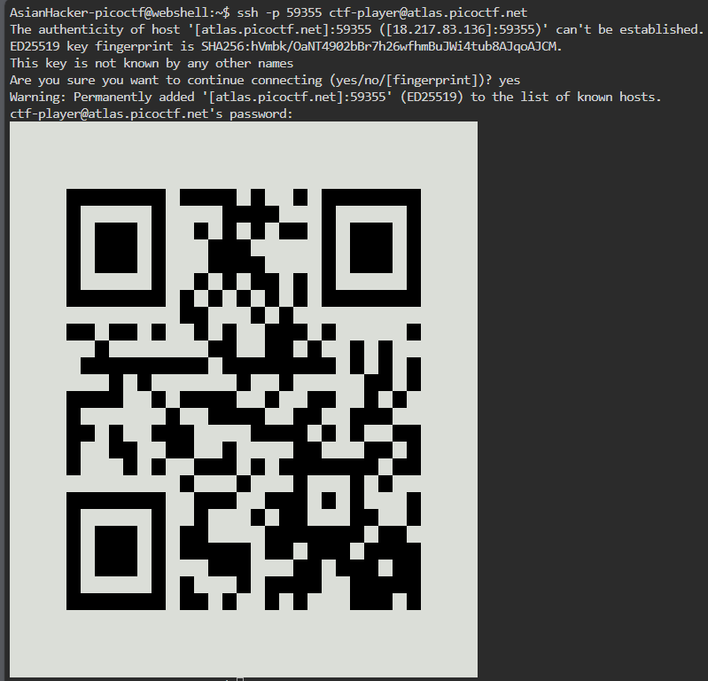

# picoGym Level 444: Scan Surprise
Source: https://play.picoctf.org/practice/challenge/444

## Goal
I've gotten bored of handing out flags as text. Wouldn't it be cool if they were an image instead?<br>
You can download the challenge files here: challenge.zip<br>
https://artifacts.picoctf.net/c_atlas/2/challenge.zip<br>
The same files are accessible via SSH here:<br>
ssh -p 59355 ctf-player@atlas.picoctf.net<br>
Using the password 1ad5be0d<br>
Accept the fingerprint with yes, and ls once connected to begin. Remember, in a shell, passwords are hidden!

## What I learned
```
online barcode viewers safer than mobile phone
```

## Solution
```
https://webshell.picoctf.org/

AsianHacker-picoctf@webshell:~$ wget https://artifacts.picoctf.net/c_atlas/2/challenge.zip ⌨️
--2025-09-13 00:09:54--  https://artifacts.picoctf.net/c_atlas/2/challenge.zip
Resolving artifacts.picoctf.net (artifacts.picoctf.net)... 3.170.131.33, 3.170.131.72, 3.170.131.18, ...
Connecting to artifacts.picoctf.net (artifacts.picoctf.net)|3.170.131.33|:443... connected.
HTTP request sent, awaiting response... 200 OK
Length: 736 [application/octet-stream]
Saving to: 'challenge.zip'

challenge.zip                                              100%[======================================================================================================================================>]     736  --.-KB/s    in 0s      

2025-09-13 00:09:54 (433 MB/s) - 'challenge.zip' saved [736/736]

AsianHacker-picoctf@webshell:~$ unzip challenge.zip ⌨️
Archive:  challenge.zip
   creating: home/ctf-player/drop-in/
 extracting: home/ctf-player/drop-in/flag.png  
AsianHacker-picoctf@webshell:~$ rm challenge.zip ⌨️
AsianHacker-picoctf@webshell:~$ cd home/ctf-player/drop-in/ ⌨️
AsianHacker-picoctf@webshell:~/home/ctf-player/drop-in$ ls ⌨️
flag.png
AsianHacker-picoctf@webshell:~/home/ctf-player/drop-in$ file flag.png ⌨️
flag.png: PNG image data, 99 x 99, 1-bit colormap, non-interlaced
AsianHacker-picoctf@webshell:~/home/ctf-player/drop-in$ binwalk flag.png ⌨️ 

DECIMAL       HEXADECIMAL     DESCRIPTION
--------------------------------------------------------------------------------
0             0x0             PNG image, 99 x 99, 1-bit colormap, non-interlaced
AsianHacker-picoctf@webshell:~/home/ctf-player/drop-in$ strings flag.png | grep -e "pico" ⌨️
AsianHacker-picoctf@webshell:~/home/ctf-player/drop-in$ xxd flag.png | grep -e "pico" ⌨️
AsianHacker-picoctf@webshell:~/home/ctf-player/drop-in$ exiftool flag.png ⌨️
ExifTool Version Number         : 12.40
File Name                       : flag.png
Directory                       : .
File Size                       : 346 bytes
File Modification Date/Time     : 2024:03:11 23:50:25+00:00
File Access Date/Time           : 2025:09:13 00:10:37+00:00
File Inode Change Date/Time     : 2025:09:13 00:09:58+00:00
File Permissions                : -rw-r--r--
File Type                       : PNG
File Type Extension             : png
MIME Type                       : image/png
Image Width                     : 99
Image Height                    : 99
Bit Depth                       : 1
Color Type                      : Palette
Compression                     : Deflate/Inflate
Filter                          : Adaptive
Interlace                       : Noninterlaced
Palette                         : (Binary data 6 bytes, use -b option to extract)
Transparency                    : 255 255
Pixels Per Unit X               : 2834
Pixels Per Unit Y               : 2834
Pixel Units                     : meters
Image Size                      : 99x99
Megapixels                      : 0.010
AsianHacker-picoctf@webshell:~/home/ctf-player/drop-in$ steghide extract -sf flag.png ⌨️
Enter passphrase: 
steghide: the file format of the file "flag.png" is not supported.
AsianHacker-picoctf@webshell:~/home/ctf-player/drop-in$ open flag.png ⌨️
Error: no "view" rule for type "image/png" passed its test case
       (for more information, add "--debug=1" on the command line)
AsianHacker-picoctf@webshell:~/home/ctf-player/drop-in$ sz flag.png ⌨️

# Note: Safer than using mobile phone
Google: qr code scanner online
https://qrscanner.net/
    TXT: picoCTF{p33k_@_b00_b5ce2572} 🔐

AsianHacker-picoctf@webshell:~$ ssh -p 59355 ctf-player@atlas.picoctf.net ⌨️
The authenticity of host '[atlas.picoctf.net]:59355 ([18.217.83.136]:59355)' can't be established.
This key is not known by any other names
Are you sure you want to continue connecting (yes/no/[fingerprint])? yes ⌨️
Warning: Permanently added '[atlas.picoctf.net]:59355' (ED25519) to the list of known hosts.
ctf-player@atlas.picoctf.net's password: ⌨️
```



## Flag
picoCTF{p33k_@_b00_b5ce2572}

## Continue
[Continue](./picoGym0450.md)