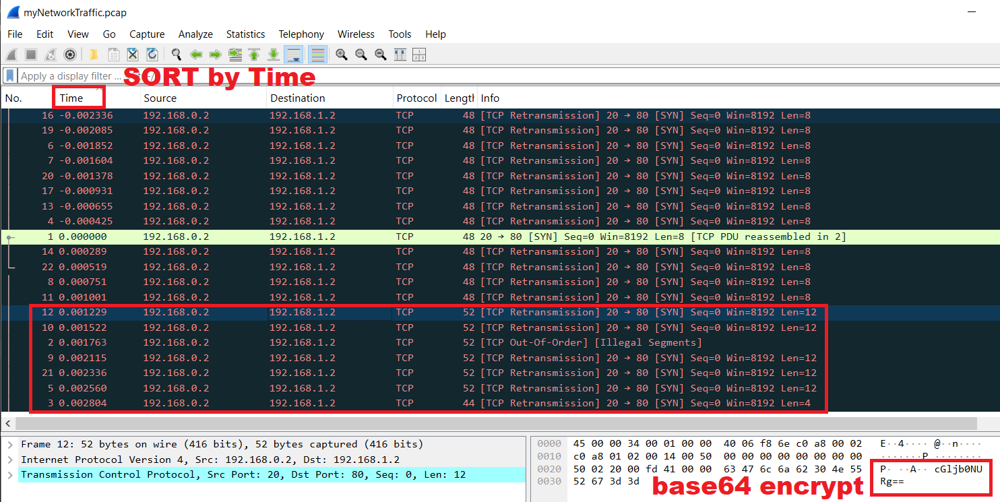

# picoGym Level 459: Ph4nt0m 1ntrud3r
Source: https://play.picoctf.org/practice/challenge/459

## Goal
A digital ghost has breached my defenses, and my sensitive data has been stolen! 😱💻<br>
Your mission is to uncover how this phantom intruder infiltrated my system and retrieve the hidden flag.<br>
To solve this challenge, you'll need to analyze the provided PCAP file and track down the attack method.<br>
The attacker has cleverly concealed his moves in well timely manner. Dive into the network traffic, <br>
apply the right filters and show off your forensic prowess and unmask the digital intruder!<br>
Find the PCAP file here Network Traffic PCAP file and try to get the flag.<br>
https://challenge-files.picoctf.net/c_verbal_sleep/586d0206891cc683bae1160ad6b0e05d7e10e7b2df122c0441ab06581038dd32/myNetworkTraffic.pcap

## What I learned
```
tshark
```

## Solution
```
https://webshell.picoctf.org/

--2025-09-13 06:46:47--  https://challenge-files.picoctf.net/c_verbal_sleep/586d0206891cc683bae1160ad6b0e05d7e10e7b2df122c0441ab06581038dd32/myNetworkTraffic.pcap ⌨️
Resolving challenge-files.picoctf.net (challenge-files.picoctf.net)... 3.160.5.18, 3.160.5.40, 3.160.5.95, ...
Connecting to challenge-files.picoctf.net (challenge-files.picoctf.net)|3.160.5.18|:443... connected.
HTTP request sent, awaiting response... 200 OK
Length: 1452 (1.4K) [application/octet-stream]
Saving to: 'myNetworkTraffic.pcap'

myNetworkTraffic.pcap                                      100%[======================================================================================================================================>]   1.42K  --.-KB/s    in 0s      

2025-09-13 06:46:47 (64.2 MB/s) - 'myNetworkTraffic.pcap' saved [1452/1452]

AsianHacker-picoctf@webshell:~$ strings myNetworkTraffic.pcap ⌨️
6wDoT88=A
bnRfdGg0dA==A
fQ==A
+TH2RiA=A
ZTFmZjA2Mw==A
KiZP+uA=A
mUKl4q4=A
BbzQg10=A
XzM0c3lfdA==A
ezF0X3c0cw==A
Qj9atMY=A
cGljb0NURg==A
UJddNj4=A
u1n7aWg=A
okKTBr8=A
ZDQkP3U=A
UBcZPyY=A
y88/pdA=A
MwbMYqQ=A
+RV8NVY=A
YmhfNHJfMg==A
lwFp5w0=

# Method 1: tshark
# Using tshark to sort by time stamp
AsianHacker-picoctf@webshell:~$ tshark -r myNetworkTraffic.pcap -Y "tcp && tcp.payload" -T fields -e frame.number -e frame.time_epoch -e tcp.payload \
> | sort -n -k2 \
> | awk -F$'\t' '{ if($3!="") print $1"\t"$3 }' \
> | while IFS=$'\t' read -r frame hex; do
>     ascii=$(echo "$hex" | xxd -r -p 2>/dev/null)
>     printf '%s\t%s\t%s\n' "$frame" "$hex" "$ascii"
>   done > sorted_payloads.tsv ⌨️
AsianHacker-picoctf@webshell:~$ cat sorted_payloads.tsv ⌨️ 
15      6f6b4b544272383d        okKTBr8=
18      7938382f7064413d        y88/pdA=
16      5a44516b5033553d        ZDQkP3U=
19      4d77624d5971513d        MwbMYqQ=
6       4b695a502b75413d        KiZP+uA=
7       6d554b6c3471343d        mUKl4q4=
20      2b5256384e56593d        +RV8NVY=
17      5542635a5079593d        UBcZPyY=
13      554a64644e6a343d        UJddNj4=
4       2b5448325269413d        +TH2RiA=
1       3677446f5438383d        6wDoT88=
14      75316e376157673d        u1n7aWg=
22      6c7746703577303d        lwFp5w0=
8       42627a516731303d        BbzQg10=
11      516a3961744d593d        Qj9atMY=
12      63476c6a62304e5552673d3d        cGljb0NURg== 👀
10      657a46305833633063773d3d        ezF0X3c0cw==
2       626e52666447673064413d3d        bnRfdGg0dA==
9       587a4d3063336c6664413d3d        XzM0c3lfdA==
21      596d68664e484a664d673d3d        YmhfNHJfMg==
5       5a54466d5a6a41324d773d3d        ZTFmZjA2Mw==
3       66513d3d                        fQ== 👀

# Used same order on CyberChef
https://cyberchef.io/#recipe=From_Base64('A-Za-z0-9%2B/%3D',true)&input=Y0dsamIwTlVSZz09CmV6RjBYM2MwY3c9PQpiblJmZEdnMGRBPT0KWHpNMGMzbGZkQT09ClltaGZOSEpmTWc9PQpaVEZtWmpBMk13PT0KZlE9PQ

picoCTF{1t_w4snt_th4t_34sy_tbh_4r_2e1ff063} 🔐

# Method 2: tshark 1 liner
    Filters only packets with lengths of 12 or 4 bytes
    Extracts the timestamp and TCP payload
    Sorts the packets based on timing
    Isolates the payloads
    Converts hex to raw bytes
    Decodes the base64 into plaintext
    tshark: Network protocol analyzer (similar to Wireshark, but command-line based)
    -r myNetworkTraffic.pcap: Read packets from the myNetworkTraffic.pcap file
    -Y "tcp.len==12 || tcp.len==4": Filter TCP packets with length 12 or 4 bytes
    -T fields: Output the specific fields
    -e frame.time: Display the timestamp of the frame
    -e tcp.segment_data: Extract the TCP segment data (payload)
    **sort -k4:**Sorts the output based on the 4th field (typically the timestamp )
    **awk '{print $6}':**Prints the 6th field from the sorted output, which is the actual segment data (TCP payload)
    **xxd -p -r:**Converts the data from a hex dump to binary (r reverses the hex dump), so the data is in its raw format
    **base64 -d:**Decodes the raw data from Base64 format back into its original binary form

AsianHacker-picoctf@webshell:~$ tshark -r myNetworkTraffic.pcap -Y "tcp.len==12 || tcp.len==4" -T fields -e frame.time -e tcp.segment_data | sort -k4 | awk '{print $6}' | xxd -p -r | base64 -d ⌨️
picoCTF{1t_w4snt_th4t_34sy_tbh_4r_2e1ff063} 🔐

# Method 3: tshark
# Extract data
AsianHacker-picoctf@webshell:~$ tshark -r myNetworkTraffic.pcap -T fields -e tcp.segment_data ⌨️
3677446f5438383d
626e52666447673064413d3d
66513d3d
2b5448325269413d
5a54466d5a6a41324d773d3d
4b695a502b75413d
6d554b6c3471343d
42627a516731303d
587a4d3063336c6664413d3d
657a46305833633063773d3d
516a3961744d593d
63476c6a62304e5552673d3d
554a64644e6a343d
75316e376157673d
6f6b4b544272383d
5a44516b5033553d
5542635a5079593d
7938382f7064413d
4d77624d5971513d
2b5256384e56593d
596d68664e484a664d673d3d
6c7746703577303d

# Extract data and convert hex
AsianHacker-picoctf@webshell:~$  tshark -r myNetworkTraffic.pcap -T fields -e tcp.segment_data | while read line; do echo $line | xxd -r -p; echo; done ⌨️
6wDoT88=
bnRfdGg0dA==
fQ==
+TH2RiA=
ZTFmZjA2Mw==
KiZP+uA=
mUKl4q4=
BbzQg10=
XzM0c3lfdA==
ezF0X3c0cw==
Qj9atMY=
cGljb0NURg==
UJddNj4=
u1n7aWg=
okKTBr8=
ZDQkP3U=
UBcZPyY=
y88/pdA=
MwbMYqQ=
+RV8NVY=
YmhfNHJfMg==
lwFp5w0=

# Extract data and conver to base64 strings
AsianHacker-picoctf@webshell:~$ tshark -r myNetworkTraffic.pcap -T fields -e tcp.segment_data | while read line; do echo $line | xxd -r -p | base64 -d; echo; done ⌨️
O
nt_th4t
}
1F 
e1ff063
*&O
B
Ѓ]
_34sy_t
{1t_w4s
B?Z
picoCTF
P]6>
Yih
B
d4$?u
P?&
?
3b
|5V
bh_4r_2
i

# Brute Force: Guess Answer (Horrible Method)
AsianHacker-picoctf@webshell:~$ tshark -r myNetworkTraffic.pcap -T fields -e frame.time -e tcp.payload | sort -n ⌨️
Mar  6, 2025 03:32:17.183957000 UTC     6f6b4b544272383d
Mar  6, 2025 03:32:17.184407000 UTC     7938382f7064413d
Mar  6, 2025 03:32:17.184651000 UTC     5a44516b5033553d
Mar  6, 2025 03:32:17.184902000 UTC     4d77624d5971513d
Mar  6, 2025 03:32:17.185135000 UTC     4b695a502b75413d
Mar  6, 2025 03:32:17.185383000 UTC     6d554b6c3471343d
Mar  6, 2025 03:32:17.185609000 UTC     2b5256384e56593d
Mar  6, 2025 03:32:17.186056000 UTC     5542635a5079593d
Mar  6, 2025 03:32:17.186332000 UTC     554a64644e6a343d
Mar  6, 2025 03:32:17.186562000 UTC     2b5448325269413d
Mar  6, 2025 03:32:17.186987000 UTC     3677446f5438383d
Mar  6, 2025 03:32:17.187276000 UTC     75316e376157673d
Mar  6, 2025 03:32:17.187506000 UTC     6c7746703577303d
Mar  6, 2025 03:32:17.187738000 UTC     42627a516731303d
Mar  6, 2025 03:32:17.187988000 UTC     516a3961744d593d
Mar  6, 2025 03:32:17.188216000 UTC     63476c6a62304e5552673d3d
Mar  6, 2025 03:32:17.188509000 UTC     657a46305833633063773d3d
Mar  6, 2025 03:32:17.188750000 UTC     626e52666447673064413d3d
Mar  6, 2025 03:32:17.189102000 UTC     587a4d3063336c6664413d3d
Mar  6, 2025 03:32:17.189323000 UTC     596d68664e484a664d673d3d
Mar  6, 2025 03:32:17.189547000 UTC     5a54466d5a6a41324d773d3d
Mar  6, 2025 03:32:17.189791000 UTC     66513d3d

# Method 4: Wireshark
Sort by Time
Look at ones w/ == at end
Use CyberChef to Decode
picoCTF{1t_w4snt_th4t_34sy_tbh_4r_2e1ff063} 🔐
```



## Flag
picoCTF{1t_w4snt_th4t_34sy_tbh_4r_2e1ff063}

## Continue
[Continue](./picoGym0505.md)