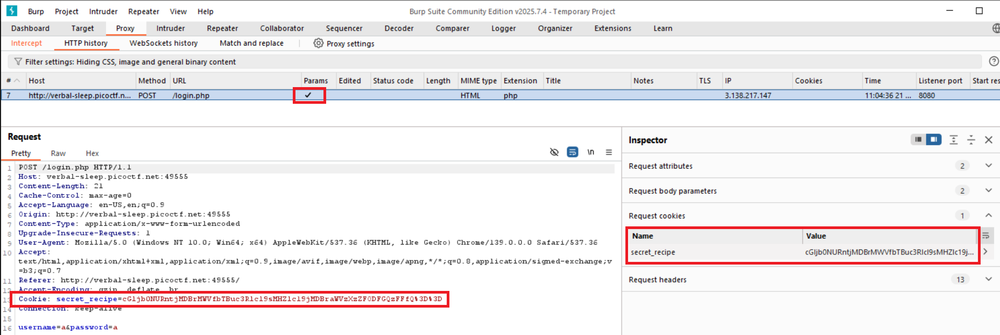

# picoGym Level 469: Cookie Monster Secret Recipe
Source: https://play.picoctf.org/practice/challenge/469

## Goal
Cookie Monster has hidden his top-secret cookie recipe somewhere on his website. As an aspiring cookie detective, your mission is to uncover this delectable secret. Can you outsmart Cookie Monster and find the hidden recipe?<br>
You can access the Cookie Monster here and good luck<br>
http://verbal-sleep.picoctf.net:63691/

## What I learned
```
Inspect → Application → Cookies
```



## Solution
```
https://webshell.picoctf.org/

# Note: Not all browsers can modify cookies
Method 1 (Faster): Inspect → Application → Cookies

Name                Value
secret_recipe       cGljb0NURntjMDBrMWVfbTBuc3Rlcl9sMHZlc19jMDBraWVzXzZFODFGQzFFfQ%3D%3D 👀

# Click Show URL-decoded
                    cGljb0NURntjMDBrMWVfbTBuc3Rlcl9sMHZlc19jMDBraWVzXzZFODFGQzFFfQ== 👀

# From Base64
https://cyberchef.io/#recipe=From_Base64('A-Za-z0-9%2B/%3D',true)&input=Y0dsamIwTlVSbnRqTURCck1XVmZiVEJ1YzNSbGNsOXNNSFpsYzE5ak1EQnJhV1Z6WHpaRk9ERkdRekZGZlE9PQ

AsianHacker-picoctf@webshell:~$ echo "cGljb0NURntjMDBrMWVfbTBuc3Rlcl9sMHZlc19jMDBraWVzXzZFODFGQzFFfQ==" | base64 -d ⌨️
picoCTF{c00k1e_m0nster_l0ves_c00kies_6E81FC1E} 🔐

Method 2: Burp Suite:
Proxy (Intercept on)
Browser: http://verbal-sleep.picoctf.net:63691/
Forward
Look for Cookies in Request (Look at image above)
```

## Flag
picoCTF{c00k1e_m0nster_l0ves_c00kies_6E81FC1E} 

## Continue
[Continue](./picoGym0406.md)