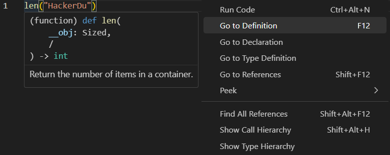

# Day 002
```python
class DataTypes:
    my_string: str = "Hacker"[0]                # Note: no char in python
    my_integer: int = 1_337_911
    my_float: float = 1_337.911
    my_bool: bool = False                       # Note: python values capital, C = 0|1, C++ true|false

if __name__ == "__main__":
    datatype = DataTypes()
    print(datatype)                             # <__main__.DataTypes object at 0x000002279E9E95D0>
    print(datatype.my_string.__class__)         # <class 'str'>, type(datatype.my_string)
    print(datatype.my_integer.__class__)
    print(datatype.my_float.__class__)
    print(datatype.my_bool.__class__)
    len(123)
```


# Side Quest: Function Definition in VSC
```
Hover over the function

Right Click > Go to Definition

Note: In pyCharm can click on link and redirected to docs.python.org
```

# Side Quest: built-in ↔ dunder mappings ❤️❤️❤️❤️❤️
```python
Built-in / Syntax	    Dunder Method
type(x)	                x.__class__
len(x)	                x.__len__()
str(x)	                x.__str__()
repr(x)	                x.__repr__()
hash(x)	                x.__hash__()
x + y	                x.__add__(y)
x - y	                x.__sub__(y)
x * y	                x.__mul__(y)
x == y	                x.__eq__(y)
x < y	                x.__lt__(y)
x[i]	                x.__getitem__(i)
x[i] = v	            x.__setitem__(i, v)
for x in y	            y.__iter__()
next(it)	            it.__next__()
callable(x)	            x.__call__()

# Best way I found alias
len()                                   # Hoover over len saw __obj: Sized
Sized                                   # Highligted and Ctrl + .   (Quick Fix to import correct library)
from collections.abc import Sized

# Go to definition
@runtime_checkable
class Sized(Protocol, metaclass=ABCMeta):
    @abstractmethod
    def __len__(self) -> int: ...
```

# Side Quest: arguments
```python
# Immutable = value cannot change in place
# Mutable = contents can change without rebinding
# Learn mutable: bytearray, list dict, set

sequence
    str                 (immutable)
    byte                (immutable)
    bytearray
    tuple               (immutable)
    list
    range               (immutable)
collection
    dict
    set
    frozenset           (immutable)
numbers
    int                 (immutable)
    float               (immutable)
    complex             (immutable)
    bool                (immutable)
callable objects
    function            (immutable)
    method              (immutable)
    lambda              (immutable)  
    class               (immutable)
Iterators & Generator types
    iterator            (immutable)
    generator           (immutable)
    range_iterator      (immutable)
    enumerate           (immutable)
    zip                 (immutable)
    map                 (immutable)
    filter              (immutable)
None
    NoneType            (immutable)
Exception types
    Exception           (immutable)
    ValueError          (immutable)
    TypeError           (immutable)
```

# Side Quest: Math
```python
print(5/3)              # Float Division
print(5//3)             # Int Division: Float Division first than truncation
print(5**2)             # power
print(5%3)              # modulus

def power(number: float, power: int) -> float:
    """
    Custom power function without using built-in **
    """
    ans = 1
    for _ in range(power):
        ans *= number
    return ans

print(power(2,4))

# Is it a function, method, or a property?
PS C:\Users\hackerdu> python -q
>>> dir(3.5)
['__abs__', '__add__', '__bool__', '__ceil__', '__class__', '__delattr__', '__dir__', '__divmod__', '__doc__', '__eq__', '__float__', '__floor__', '__floordiv__', '__format__', '__ge__', '__getattribute__', '__getformat__', '__getnewargs__', '__getstate__', '__gt__', '__hash__', '__init__', '__init_subclass__', '__int__', '__le__', '__lt__', '__mod__', '__mul__', '__ne__', '__neg__', '__new__', '__pos__', '__pow__', '__radd__', '__rdivmod__', '__reduce__', '__reduce_ex__', '__repr__', '__rfloordiv__', '__rmod__', '__rmul__', '__round__', '__rpow__', '__rsub__', '__rtruediv__', '__setattr__', '__sizeof__', '__str__', '__sub__', '__subclasshook__', '__truediv__', '__trunc__', 'as_integer_ratio', 'conjugate', 'fromhex', 'hex', 'imag', 'is_integer', 'real']
>>> 3.5.__round__
<built-in method __round__ of float object at 0x000001A95765A990>
>>> 3.5.__round__()
4 

# Hoover over __round__ and it a method not a property so uses () ⭐⭐⭐⭐⭐
(method) def __round__(
    __ndigits: None = None,
    /
) -> int

# Find correct library
ceil(3.5)                       # Ctrl + . or Right Click > Quick Fix
from math import ceil

# Hoover over ceil and it a function and returns something so need print
(function) def ceil(
    __x: _SupportsCeil[_T@ceil],
    /
) -> _T@ceil

print(ceil(3.5))
```

# Side Quest: American Tip and Bill Calculator
```python
Problem: You and 4 other friends go to a restaurant.  Your total bill comes out to be $180 and you want to give 15% tip then split the bill 5 ways.

Pseudo Code
print((182 * 0.26 + 180)/5)                     # print((47.32 + 180)/5)
45.464                                          # Note: need round because not human currency

def split_bill() -> float:
    bill_without_tip = 182
    tip = 26 / 100
    people = 5

    return round((182 * 0.26 + 180)/5, ndigits=2)

if __name__ == "__main__":
    print(split_bill())
```